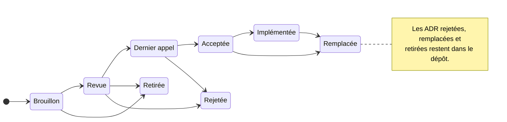

<picture>
  <source media="(prefers-color-scheme: dark)" srcset="https://cdn.openfsp.org/logo/openfsp-logo-inverse.svg">
  
</picture>

# ADR OpenFSP

Une ADR est la façon dont une décision sur OpenFSP est prise, et le compte rendu de la
raison pour laquelle elle l'a été. Une fois acceptées, les ADR de la voie Standards
*constituent* la spécification OpenFSP : il n'existe pas de document de spécification
distinct qu'elles alimenteraient.

Un opérateur de paiement qui implémente OpenFSP, ou une institution qui s'y fie, doit pouvoir
lire non seulement ce que le protocole dit mais pourquoi il le dit, et être assuré qu'il ne
changera pas sous ses pieds sans préavis. Une ADR qui ne consigne qu'une décision, sans son
raisonnement ni les alternatives écartées, n'a fait que la moitié de son travail.

## Voies

Chaque ADR déclare une voie.

| Voie | Ce qu'elle régit | Effet une fois acceptée |
|---|---|---|
| **Standards** | Le protocole sur le fil, le modèle de données, le modèle de capacités, la conformité | Normatif. Lie toute implémentation conforme. |
| **Informative** | Architecture, justification, recommandations, conseils de déploiement et d'exploitation | Non contraignant. Explique, n'exige pas. |
| **Processus** | Gouvernance, le processus ADR lui-même, les versions, la marque et les marques de conformité | Lie le projet, pas les implémentations. |

Seules les ADR de la voie Standards emploient les mots-clés d'exigence de la RFC 2119
(MUST, SHOULD, MAY). Les employer dans une ADR informative est un défaut : cela laisse
entendre une exigence que la conformité ne peut pas tester.

## Cycle de vie

| Statut | Signification |
|---|---|
| **Brouillon** | Ouverte à la discussion. Tout peut changer. Ne pas implémenter contre. |
| **Revue** | L'auteur la considère complète et demande un examen. Minimum **14 jours**. |
| **Dernier appel** | L'Éditeur a l'intention de l'accepter. Objections finales seulement. **7 jours**, annoncés. |
| **Acceptée** | Décidée. Normative si voie Standards. La changer exige désormais une nouvelle ADR. |
| **Implémentée** | Une implémentation conforme existe et passe la suite de conformité. |
| **Remplacée** | Remplacée par une ADR ultérieure, nommée dans l'en-tête. Conservée, jamais supprimée. |
| **Rejetée** | Examinée et déclinée, avec le raisonnement consigné. Conservée, jamais supprimée. |
| **Retirée** | Abandonnée par son auteur avant décision. |

Les ADR rejetées et remplacées restent dans le dépôt en permanence. Le relevé de ce qui a
été envisagé puis écarté est l'une des choses les plus utiles qu'une spécification puisse
offrir à la personne suivante qui aura la même idée.

Les délais d'examen sont des planchers, pas des cibles. Une modification de la machine à
états d'un paiement mérite mieux que quinze jours, et l'Éditeur peut allonger n'importe
quel délai, jamais le raccourcir.

## Écrire une ADR

1. **Ouvrez d'abord une issue** décrivant le problème. Pas la solution, le problème. Cela
   vous coûte une heure et peut vous épargner une semaine, parce que le problème est
   souvent déjà résolu, déjà rejeté, ou n'est pas celui que vous croyez.
2. **Copiez [`0000-template.md`](https://github.com/openfspht/adrs/blob/main/0000-template.md)** vers `NNNN-titre-court.md`, en
   prenant le prochain numéro libre. Les numéros sont attribués dans l'ordre d'ouverture
   des pull requests et ne sont jamais réutilisés, y compris par une ADR rejetée.
3. **Ouvrez une pull request** avec le statut `Brouillon`. La discussion s'y déroule.
4. **Passez en `Revue`** quand vous la jugez complète. Dites-le explicitement en
   commentaire.
5. **L'Éditeur ouvre le dernier appel**, puis accepte ou rejette, en public, avec ses
   raisons, sur la pull request. Un rejet est fusionné avec le statut `Rejetée`, il n'est
   pas fermé et perdu.

Écrivez pour quelqu'un qui implémentera ceci dans cinq ans, dans un langage auquel vous
n'avez pas pensé, contre un opérateur qui n'existe pas encore. Soyez précis sur ce qui est
exigé et ce qui est seulement conseillé. Là où vous êtes incertain, dites-le : une
question ouverte nommée dans le texte vaut mieux qu'une phrase assurée qui se révélera
fausse.

## Amender une ADR acceptée

Une ADR acceptée n'est pas modifiée pour en changer le sens. À la place :

- Les **errata**, corrections de coquilles, de liens morts ou d'une formulation qui ne dit
  pas ce qui a été décidé, sont appliqués sur place et listés dans la section `Errata` de
  l'ADR, avec une date.
- Les **changements de fond** exigent une nouvelle ADR qui remplace l'ancienne. Les deux
  restent.

## Références

Les sources qu'une ADR cite vivent dans [`references.md`](text/references.md) avec une clé
stable, pour qu'une citation puisse être vérifiée et qu'une correction se fasse une seule
fois. Une ADR liste les clés qu'elle emploie dans sa propre section *Références*,
normatives et informatives séparément sur la voie Standards.

Le fichier couvre les deux moitiés de ce sur quoi cette spécification repose : les normes
techniques qu'elle réutilise, et le cadre légal et réglementaire haïtien pour lequel elle
est écrite, de la loi bancaire de 2012 jusqu'aux circulaires de la BRH. Il consigne aussi
les comparateurs régionaux, et les sources examinées puis écartées.

## Registres

Certaines valeurs sont des identifiants plutôt qu'un comportement, et sont tenues hors des
ADR pour qu'en ajouter une n'exige pas le processus ADR. Voir
[`registries/providers.md`](https://github.com/openfspht/openfsp/blob/main/registries/providers.md) pour les identifiants d'opérateur,
et [ADR-0007 §2.8](text/0007-capability-discovery.md) pour la raison pour laquelle les noms de
capacité sont traités autrement.

## Index

| Nº | Titre | Voie | Statut |
|---|---|---|---|
| [0001](text/0001-architecture-and-scope.md) | Architecture et périmètre | Informative | Brouillon |
| [0002](text/0002-core-data-model.md) | Modèle de données fondamental | Standards | Brouillon |
| [0003](text/0003-payment-lifecycle.md) | Cycle de vie du paiement | Standards | Brouillon |
| [0004](text/0004-idempotency-and-retries.md) | Idempotence et sémantique des reprises | Standards | Brouillon |
| [0005](text/0005-error-taxonomy.md) | Taxonomie des erreurs | Standards | Brouillon |
| [0006](text/0006-gateway-http-api-payments.md) | API HTTP de la passerelle, paiements | Standards | Brouillon |
| [0007](text/0007-capability-discovery.md) | Découverte de capacités | Standards | Brouillon |
| [0008](text/0008-webhooks-and-event-delivery.md) | Webhooks et livraison d'événements | Standards | Brouillon |
| [0009](text/0009-authentication-and-credentials.md) | Authentification et identifiants | Standards | Brouillon |
| [0010](text/0010-iso-20022-semantic-correspondence.md) | Correspondance sémantique ISO 20022 | Informative | Brouillon |
| [0011](text/0011-confirmation-requests.md) | Demandes de confirmation | Standards | Brouillon |
| [0012](text/0012-proximity-payments-cpm.md) | Paiements de proximité, mode présenté par le client | Standards | Brouillon |
| [0013](text/0013-provider-adapter-interface.md) | Interface des adaptateurs de fournisseur | Informative | Brouillon |
| [0014](text/0014-mock-server-behaviour.md) | Comportement du serveur simulé | Informative | Brouillon |
| [0015](text/0015-conformance-levels-and-suite.md) | Niveaux et suite de conformité | Standards | Brouillon |
| [0016](text/0016-conformance-marks-and-naming.md) | Marques de conformité et usage du nom | Processus | Brouillon |

## La suite

Les seize ADR ci-dessus couvrent le chemin de paiement et sa conformité. Aucune n'est
encore acceptée, et rien n'est implémenté.

Le simulateur et la suite de conformité sont aussi ce qui valide le protocole. L'accès aux
bacs à sable des opérateurs va de l'inscription libre à une démarche auprès de l'opérateur,
et aucun ne permet de provoquer une défaillance à volonté ; les preuves qui soutiennent ces
ADR viennent donc d'une simulation d'opérateurs aux capacités délibérément inégales, et non
d'une intégration en production.

Viendront ensuite les transferts et les versements, le remboursement, la capture et
l'annulation comme capacités, l'acheminement multi-opérateur, et le reporting de règlement
et de rapprochement. Chacun est un problème réel, et aucun ne devrait être spécifié avant
que le chemin de paiement ci-dessus ne soit arrêté et en usage.
