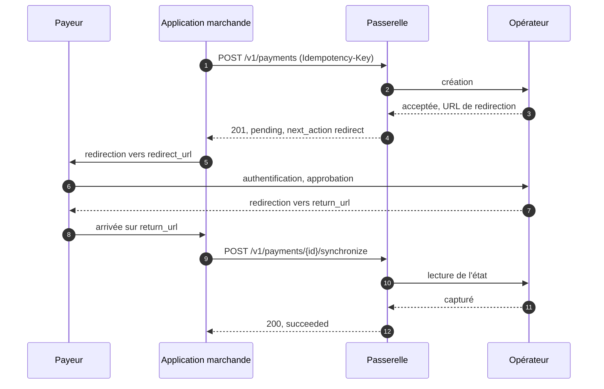

# API HTTP : paiements

Décision : [ADR-0006](../text/0006-gateway-http-api-payments.md).

## 1. Conventions HTTP

Applicables à tout point d'accès OpenFSP.

**1.1.** HTTPS uniquement. La passerelle NE DOIT PAS servir l'API en HTTP clair hors d'un mode
de développement explicite, annoncé dans le journal de démarrage.

**1.2.** Tous les points d'accès sont sous `/v1`. La version majeure ne change qu'en cas de
rupture de compatibilité.

**1.3.** Les versions mineures ne figurent pas dans le chemin ; les ajouts se découvrent par la
[découverte de capacités](capacites.md).

**1.4.** Requêtes et réponses de succès en `application/json` ; erreurs en
`application/problem+json` ([erreurs §1.1](erreurs.md)).

**1.5.** Un corps présent avec un `Content-Type` non pris en charge DOIT être rejeté avec
`malformed-request`.

**1.6.** `POST` crée ou agit, `GET` lit. `PATCH` et `DELETE` ne sont pas utilisés ici. Une
méthode non implémentée sur un chemin connu DOIT recevoir `405` avec `Allow`.

**1.7.** Tout `POST` qui crée ou modifie une ressource relève de
l'[idempotence](idempotence.md). Seule la synchronisation (§5.3) en est exemptée ; la
passerelle NE DOIT PAS étendre l'exemption.

**1.8.** Toute réponse, succès ou erreur, porte l'en-tête `Request-Id` égal au `request_id`
([erreurs §1.6](erreurs.md)).

**1.9.** Requêtes strictes, réponses tolérantes ([modèle de données §2.3, §2.4](modele-de-donnees.md)).

**1.10.** Les chemins sont canoniques sans barre oblique finale ; `/v1/payments/` DOIT être
traité comme `/v1/payments`.

**1.11.** Tout horodatage est un `Timestamp` ([modèle de données §7](modele-de-donnees.md)).

**1.12.** Une collection est un objet à membre OBLIGATOIRE `data`, tableau de ressources, jamais
un tableau nu : `{ "data": [] }`.

## 2. Capacité de base

**2.1.** Les trois opérations du §5 forment la capacité `payments`. Une passerelle conforme DOIT
les implémenter pour chaque opérateur qu'elle prend en charge.

**2.2.** Un client NE DOIT PAS être tenu d'interroger la découverte de capacités avant de les
utiliser.

## 3. Ressource `Payment`

```json
{
  "id": "pay_01J9ZK3QF8XN2M7VYB4C6D8E0G",
  "reference": "INV-2026-00184",
  "status": "pending",
  "amount": { "amount": 125000, "currency": "HTG" },
  "provider": "moncash",
  "provider_reference": null,
  "payer": { "phone_number": "+50934567890" },
  "description": "Invoice 184",
  "next_action": {
    "type": "redirect",
    "redirect_url": "https://provider.example/checkout/abc123",
    "expires_at": "2026-08-17T15:02:07Z"
  },
  "created_at": "2026-08-17T14:32:07.412Z",
  "updated_at": "2026-08-17T14:32:07.412Z",
  "expires_at": "2026-08-17T15:02:07Z",
  "completed_at": null,
  "failure_reason": null,
  "failure_detail": null,
  "fee": null,
  "metadata": { "order_id": "184" }
}
```

**3.1.** Champs :

| Champ | Type | Présence | Notes |
|---|---|---|---|
| `id` | `ResourceId` | OBLIGATOIRE | Opaque. |
| `reference` | `Reference` | OBLIGATOIRE | Unique par propriétaire. |
| `status` | chaîne | OBLIGATOIRE | [Cycle de vie §1](cycle-de-vie.md). |
| `amount` | `Money` | OBLIGATOIRE | |
| `provider` | chaîne | OBLIGATOIRE | Identifiant enregistré de l'opérateur (§3.2). |
| `provider_reference` | `ProviderReference` | FACULTATIF | Peut rester absent. |
| `payer` | objet | FACULTATIF | §3.3. |
| `description` | chaîne | FACULTATIF | 255 caractères au plus. |
| `next_action` | objet | conditionnel | OBLIGATOIRE si `pending`, absent si terminal (§4). |
| `created_at` | `Timestamp` | OBLIGATOIRE | Immuable. |
| `updated_at` | `Timestamp` | OBLIGATOIRE | [Cycle de vie §4.2](cycle-de-vie.md). |
| `expires_at` | `Timestamp` | FACULTATIF | [Cycle de vie §5](cycle-de-vie.md). |
| `completed_at` | `Timestamp` | conditionnel | OBLIGATOIRE si terminal. |
| `failure_reason` | chaîne | conditionnel | OBLIGATOIRE si `failed`. |
| `failure_detail` | objet | FACULTATIF | Erreur brute de l'opérateur. |
| `fee` | `Fee` | FACULTATIF | Absent signifie non connu (§3.5). |
| `metadata` | `Metadata` | FACULTATIF | |

**3.2.** `provider` correspond à `^[a-z0-9_]{1,32}$` et DOIT être l'identifiant du
[registre des opérateurs](https://github.com/openfspht/openfsp/blob/main/registries/providers.md).
Il est OBLIGATOIRE même si la passerelle ne sert qu'un opérateur.

**3.3.** `payer` porte un seul champ, `phone_number` (`PhoneNumber`).

**3.4.** `description` PEUT être transmise à l'opérateur et affichée au payeur. Elle NE DOIT
PAS contenir de données personnelles.

**3.5.** `fee` :

- une création contenant `fee` DOIT être rejetée ;
- `fee` PEUT n'apparaître qu'une fois le paiement terminal ; son arrivée change `updated_at`
  sans changer `status` ;
- son absence NE DOIT PAS être affichée comme zéro.

## 4. `next_action`

**4.1.** OBLIGATOIRE tant que le paiement est `pending`, absent une fois terminal.

**4.2.** Énumération fermée :

| `type` | Sens | Champs |
|---|---|---|
| `redirect` | Envoyer le payeur vers une page de l'opérateur. | `redirect_url`, `expires_at` |
| `payer_approval` | Le payeur approuve sur son appareil (USSD, notification). | aucun |
| `none` | Rien n'est requis du payeur. | aucun |

**4.3.** La passerelle DOIT rapporter le type réellement exigé par l'opérateur. Si ce type ne
peut pas être déterminé, la création échoue avec une erreur ; `none` NE DOIT PAS servir de
valeur par défaut.

**4.4.** Un client DOIT traiter `redirect_url` comme opaque, NE DOIT PAS la réécrire, et NE
DOIT PAS l'intégrer dans un cadre qui en masque l'origine.

**4.5.** `next_action.expires_at` PEUT précéder l'`expires_at` du paiement. Son expiration ne
rend pas le paiement terminal.

## 5. Points d'accès

### 5.1. Créer un paiement

```
POST /v1/payments
```

```json
{
  "reference": "INV-2026-00184",
  "amount": { "amount": 125000, "currency": "HTG" },
  "provider": "moncash",
  "payer": { "phone_number": "+50934567890" },
  "description": "Invoice 184",
  "return_url": "https://merchant.example/checkout/184/return",
  "expires_at": "2026-08-17T15:02:07Z",
  "metadata": { "order_id": "184" }
}
```

| Champ | Présence | Notes |
|---|---|---|
| `reference` | OBLIGATOIRE | Doublon : `reference-conflict`. |
| `amount` | OBLIGATOIRE | Strictement positif. |
| `provider` | OBLIGATOIRE | §5.1.1. |
| `payer` | conditionnel | Selon l'opérateur (§5.1.2). |
| `description` | FACULTATIF | |
| `return_url` | conditionnel | OBLIGATOIRE si l'opérateur utilise `redirect` (§5.1.3). |
| `expires_at` | FACULTATIF | Demande, pas garantie (§5.1.4). |
| `metadata` | FACULTATIF | |

**5.1.1.** La passerelle NE DOIT PAS choisir l'opérateur à la place du client.

**5.1.2.** La passerelle DOIT documenter, par adaptateur, si `payer` est exigé, et DOIT rejeter
avec `missing-field` une requête privée d'un champ exigé par l'opérateur.

**5.1.3.** `return_url` DOIT être une URL `https` absolue ; une URL `http` DOIT être rejetée.
Le retour du payeur sur cette URL NE DOIT PAS être traité comme une preuve de paiement (§7).

**5.1.4.** La passerelle fixe l'`expires_at` de la ressource à ce que l'opérateur garantit, qui
PEUT différer de la demande ou être absent. Un client DOIT relire la valeur.

| Statut | Condition |
|---|---|
| `201` | Paiement créé ; `Location` porte son URL. |
| `400`, `422` | Requête invalide ([erreurs §9.1](erreurs.md)). |
| `409 reference-conflict` | Référence déjà utilisée (§5.1.5). |
| `502`, `503`, `504` | Échec côté opérateur ; lire `effect`. |

**5.1.5.** Sur `reference-conflict`, le client DEVRAIT lire le paiement existant (§5.2).

**5.1.6.** Sur `504 provider-timeout` ou `500 internal-error`, `effect` vaut `unknown` : un
client DOIT résoudre en renvoyant avec la même clé ou en recherchant la référence.

### 5.2. Lire un paiement

```
GET /v1/payments/{id}
GET /v1/payments?reference={reference}
```

**5.2.1.** Par `id` : le paiement, ou `404 not-found`.

**5.2.2.** Par `reference` : une collection d'au plus un élément. Une référence inconnue donne
`200` avec `data` vide.

**5.2.3.** Les bibliothèques clientes DEVRAIENT exposer la recherche par référence.

**5.2.4.** Une lecture renvoie l'état connu de la passerelle et n'appelle pas l'opérateur.

### 5.3. Synchroniser un paiement

```
POST /v1/payments/{id}/synchronize
```

**5.3.1.** La passerelle relit l'état chez l'opérateur, applique la transition qui en découle
selon le [cycle de vie](cycle-de-vie.md), et renvoie le paiement.

**5.3.2.** La passerelle DOIT implémenter ce point d'accès et DOIT aussi rapprocher en arrière-plan.

**5.3.3.** Sur un paiement terminal, la passerelle NE DOIT PAS appeler l'opérateur et DOIT
renvoyer le paiement inchangé en `200`.

**5.3.3.1.** Ce contrôle précède tout autre, y compris celui de capacité
([capacités §5.3](capacites.md)).

**5.3.4.** Opérateur injoignable : `503 provider-unavailable` ou `504 provider-timeout` ; le
paiement reste `pending`.

**5.3.5.** La passerelle DEVRAIT limiter le débit de ce point d'accès par paiement
(`429 rate-limited` avec `Retry-After`).

**5.3.6.** Ce point d'accès est exempté d'`Idempotency-Key` ([idempotence §1.4](idempotence.md)).

## 6. Suivi des changements

**6.1.** Un client apprend un changement d'état par lecture (§5.2), synchronisation (§5.3) ou
[webhook](webhooks.md).

**6.2.** Un client DEVRAIT sonder avec un retrait et DEVRAIT s'arrêter dès que le paiement est
terminal.

**6.3.** Les webhooks complètent le sondage sans le remplacer.

## 7. URL de retour

**7.1.** Un client NE DOIT PAS traiter le retour du payeur sur `return_url` comme preuve d'un
dénouement.

**7.2.** Les paramètres ajoutés par l'opérateur à `return_url` sont contrôlables par un
attaquant.

**7.3.** Au retour, un client DOIT lire le paiement auprès de la passerelle et afficher le
résultat de cette seule réponse.

## 8. Flux type



## 9. Sécurité

**9.1.** La recherche par référence DOIT être cloisonnée au principal authentifié.

**9.2.** Un paiement d'un autre principal DOIT être rapporté `not-found`
([erreurs §9.3.1](erreurs.md)).

**9.3.** La documentation client DEVRAIT préciser que `description` peut atteindre le payeur et
l'opérateur, contrairement à `metadata`.
