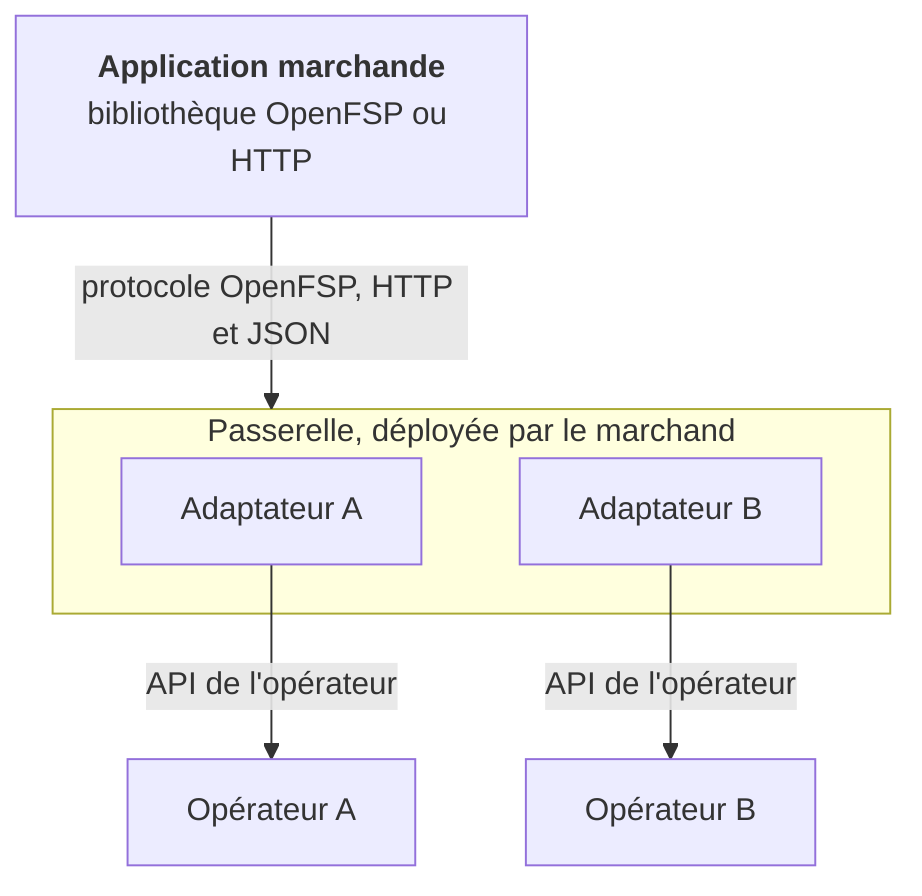

# Architecture et périmètre

Informatif. Décision : [ADR-0001](../text/0001-architecture-and-scope.md).

## Hors périmètre

Limites permanentes, qui fondent la position réglementaire du projet.

- OpenFSP ne détient, ne déplace ni ne conserve de fonds. La passerelle donne des instructions
  aux opérateurs et n'est jamais partie à une transaction.
- OpenFSP n'exploite aucun service hébergé. Toute offre hébergée bâtie dessus est une activité
  distincte, avec ses propres obligations.
- OpenFSP n'est pas un établissement de paiement agréé et ne remplace aucun agrément ni aucun
  contrat avec un opérateur.
- OpenFSP n'est ni un commutateur, ni une chambre de compensation, ni un système de règlement.
  Il normalise la façon dont un marchand donne une instruction à un opérateur.
- OpenFSP ne certifie pas les opérateurs.
- OpenFSP ne spécifie aucune interface utilisateur.

## Composants

| Composant | Rôle | Technologie |
|---|---|---|
| Spécification | Règles normatives : modèle de données, cycle de vie, capacités, erreurs, idempotence, notifications. | Markdown, OpenAPI |
| Passerelle | Serveur auto-hébergé : protocole OpenFSP d'un côté, API des opérateurs de l'autre. | Kotlin, Spring Boot |
| Serveur simulé | Imite les opérateurs, défaillances comprises. | Kotlin, Spring Boot |
| Bibliothèques clientes | Clients minces du protocole. | TypeScript, PHP, Python |

En développement et en intégration continue, le [serveur simulé](serveur-simule.md) remplace
les opérateurs.

## Déploiement et confiance

- Le marchand déploie la passerelle et détient ses identifiants. Le projet ne les possède
  jamais.
- Le projet n'est jamais sur le chemin des fonds.
- La relation entre le marchand et son opérateur est inchangée.
- Aucun service multi-locataire.
- En contrepartie, le marchand exploite un service sensible : la passerelle doit être
  exploitable par une petite équipe (binaire unique, réglages sûrs par défaut, guide de
  durcissement).

## Principes de conception

| Principe | Règle détaillée |
|---|---|
| Une opération absente est déclarée absente, jamais émulée ; le socle se limite à créer et lire un paiement. | [Capacités](capacites.md) |
| Un montant est un entier en centimes de gourde, avec devise explicite. | [Modèle de données §3](modele-de-donnees.md) |
| Toute opération qui modifie l'état est idempotente. | [Idempotence](idempotence.md) |
| La référence du marchand est la clé de corrélation. | [Modèle de données §6.2](modele-de-donnees.md) |
| Les états forment une machine explicite ; un état terminal n'est jamais quitté. | [Cycle de vie](cycle-de-vie.md) |
| Les erreurs sont neutres, l'erreur de l'opérateur est conservée. | [Erreurs](erreurs.md) |
| Aucune dégradation silencieuse : pas de bascule automatique, pas de succès partiel. | [API §5.1.1](api-paiements.md) |
| Protocole volontairement banal : HTTP, JSON, codes de statut et en-têtes standard. | [API §1](api-paiements.md) |

## Normes

| Sujet | Norme |
|---|---|
| Mots-clés d'exigence | RFC 2119, RFC 8174 (équivalents français, [README](README.md)) |
| Erreurs | RFC 9457 |
| Horodatages | RFC 3339, UTC |
| Devise | ISO 4217 (HTG) |
| Modèle sémantique | ISO 20022 comme dictionnaire ([correspondance](iso-20022.md)) |
| Téléphone | UIT-T E.164 |
| Identifiants | RFC 9562, UUID version 7 |
| Signature des notifications | RFC 9421 |
| Idempotence | Brouillon IETF `Idempotency-Key` |
| Description d'API | OpenAPI 3.1 |
| Authentification | Clé porteur ; OAuth 2.0 possible en amont |
| Découverte | RFC 8615 |
| Cadre réglementaire | Loi de 2012, circulaires BRH 121, 126, 131 ([références](../text/references.md)) |

Travaux voisins non repris : GSMA Mobile Money API (surface trop large, référence de nommage),
Mojaloop et le processeur national PRONAP (couche du commutateur, complémentaire : un payeur
chez A ne peut pas payer un marchand qui n'accepte que B, et seul un commutateur y répond). Le
marchand détient un compte chez chaque opérateur accepté ; aucune valeur ne circule entre
opérateurs, donc aucune compensation n'est requise.

## Conformité

| Niveau | Cible | Vérification |
|---|---|---|
| 1 | Client | Suite jouant la passerelle. |
| 2 | Passerelle | Suite jouant le client, simulateur jouant les opérateurs. |
| 3 | Opérateur natif | L'opérateur expose OpenFSP ; la passerelle devient inutile pour lui. |

Le niveau 3 est l'objectif du projet. Règles : [conformité](conformite.md).

## Langue

La spécification est rédigée en français, qui fait foi. Les noms de champs et les valeurs
transmises restent en anglais. Les mots-clés normatifs sont en français (DOIT, NE DOIT PAS,
DEVRAIT, PEUT), avec leur équivalence RFC 2119 dans le [README](README.md). Une édition
anglaise serait une traduction.

## Versions

Versionnement sémantique, avec les garanties de
[GOVERNANCE §5](https://github.com/openfspht/openfsp/blob/main/GOVERNANCE.md#5-garanties-de-stabilité).
Version majeure dans le chemin (`/v1`) ; ajouts découverts par les capacités. Avant `1.0.0`, une
version mineure peut rompre la compatibilité.

## Sécurité

- Transport TLS partout ([API §1.1](api-paiements.md), [webhooks §7.2](webhooks.md)).
- Identifiants d'opérateur hors des fichiers versionnés, jamais journalisés
  ([authentification §9](authentification.md)).
- Un rappel non signé n'est pas un fait ([cycle de vie §6.3](cycle-de-vie.md)).
- Toute transition est attribuable et horodatée.
- Une passerelle compromise n'expose qu'un seul marchand.
- La passerelle est distribuée en artefact signé et reproductible, avec nomenclature logicielle.

## Considérations réglementaires

| Texte | Portée pour OpenFSP |
|---|---|
| Loi du 14 mai 2012, art. 2 | Six catégories d'institution financière ; un éditeur de spécification et de logiciel auto-hébergé n'en fait pas partie. |
| Loi de 2012, art. 3 et 7 | L'activité est définie par la réception de fonds du public avec obligation de restitution ; OpenFSP ne reçoit aucun fonds. |
| Loi de 2012, art. 6 | La BRH peut étendre la loi aux activités assimilables sans loi nouvelle : la position est exacte en l'état du droit, pas acquise. |
| BRH-121 §2 | Trois catégories de sociétés visées ; ni l'éditeur ni le marchand qui déploie n'en relèvent. |
| BRH-121 §5 | Interopérabilité exigée, audit externe triennal, aucun étalon : la spécification et la suite en fournissent un. |
| BRH-121 §8, §13.1, §13.4, §13.5, §15 | Reçu, traçabilité, registre, irrévocabilité, données : voir l'[annexe ISO 20022 §9](iso-20022.md). |
| BRH-126 §2, §3 n), §3 p), §3 t) | Propriétés de sécurité, exigences avant production, documentation tenue à jour, audit triennal. |
| BRH-131 §6.1 s), §6.9 c) | Signaler et compenser les pertes dues au système ; responsabilités des parties : `effect` et le catalogue d'erreurs. |

Un déploiement hébergé par un tiers introduit une partie absente du modèle auto-hébergé ; BRH-121
définit un opérateur technique sans procédure d'autorisation. OpenFSP ne prend pas position.

OpenFSP ne définit pas de reporting réglementaire ; le modèle de données le rend dérivable. La
BRH désigne l'interopérabilité comme son action la plus concrète, avec l'objectif de « payer un
commerçant, sans friction ».
