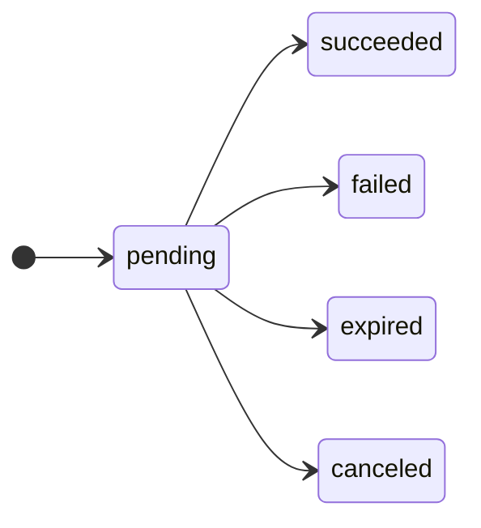

# Cycle de vie du paiement

Décision : [ADR-0003](../text/0003-payment-lifecycle.md).

## 1. États

| État | Terminal | Signification |
|---|---|---|
| `pending` | non | Non encore connu comme terminal. |
| `succeeded` | oui | L'opérateur a confirmé la capture des fonds. |
| `failed` | oui | L'opérateur a rapporté que le paiement n'aboutira pas. |
| `expired` | oui | La fenêtre de paiement s'est fermée sans achèvement (§5). |
| `canceled` | oui | Le paiement a été annulé avant son achèvement. |

**1.1.** `pending` est le seul état non terminal. Il couvre sans distinction : le payeur n'a
pas agi, l'opérateur règle, la passerelle n'a reçu aucune réponse.

**1.2.** Un client DOIT rejeter une valeur de `status` inconnue et la signaler comme une
erreur, sans la traiter comme non terminale. Un nouvel état n'est introduit qu'au titre du
§8.

## 2. Transitions

**2.1.** Seules ces transitions sont permises :

| De | Vers | Cause |
|---|---|---|
| `pending` | `succeeded` | Confirmation de capture par une source autoritative (§6.5). |
| `pending` | `failed` | Refus ou erreur rapporté par une source autoritative. |
| `pending` | `expired` | Conditions du §5.3. |
| `pending` | `canceled` | Annulation au titre du §8 ou rapportée par une source autoritative. |

**2.2.** La passerelle DOIT rejeter et NE DOIT PAS enregistrer toute autre transition. Un
statut d'opérateur impliquant une transition interdite est un conflit (§6.4).

## 3. Terminalité

**3.1.** Un paiement terminal NE DOIT transiter vers aucun autre état, y compris sur un rapport
ultérieur contradictoire de l'opérateur.

**3.2.** La passerelle NE DOIT PAS entrer dans un état terminal par inférence, par expiration de
délai ou par écoulement du temps. Seule une source du §6.5 fonde une transition terminale ;
pour `expired`, le §5 s'applique en plus.

**3.3.** Une passerelle qui ne peut pas établir l'état auprès de l'opérateur DOIT laisser le
paiement `pending`.

**3.4.** Un paiement PEUT rester `pending` indéfiniment.

## 4. Champs

| Champ | Type | Présence | Notes |
|---|---|---|---|
| `status` | chaîne | OBLIGATOIRE | Une valeur du §1. |
| `created_at` | `Timestamp` | OBLIGATOIRE | Création par la passerelle. Immuable. |
| `updated_at` | `Timestamp` | OBLIGATOIRE | Dernier changement d'état ou de champ. |
| `expires_at` | `Timestamp` | FACULTATIF | Fermeture de la fenêtre de paiement (§5). |
| `completed_at` | `Timestamp` | conditionnel | OBLIGATOIRE une fois terminal, absent avant. |
| `failure_reason` | chaîne | conditionnel | OBLIGATOIRE si `status` vaut `failed` (§7). |
| `failure_detail` | objet | FACULTATIF | Erreur brute de l'opérateur (§7.4). |

**4.1.** `completed_at` est l'instant où la passerelle a enregistré l'état terminal. Un
horodatage fourni par l'opérateur est conservé dans `failure_detail` ou son équivalent en cas
de succès, et NE DOIT PAS remplacer `completed_at`.

**4.2.** `updated_at` DOIT changer à chaque transition et PEUT changer sans transition. Un
client NE DOIT PAS déduire une transition de `updated_at` seul.

**4.3.** Une fois l'état terminal atteint, `status`, `completed_at` et `failure_reason` sont
immuables. Les autres champs PEUVENT encore être complétés.

## 5. Expiration

**5.1.** `expires_at` est l'instant après lequel le payeur ne peut plus achever le paiement.

**5.2.** L'écoulement de `expires_at` ne fait pas, à lui seul, passer le paiement à `expired`.

**5.3.** La passerelle NE DOIT PAS enregistrer `expired` sans l'une de ces conditions :

- **(a)** l'opérateur a rapporté le paiement comme expiré, annulé ou définitivement inachevé,
  par une source du §6.5 (a) à (c) ;
- **(b)** `expires_at` est écoulé et une consultation postérieure chez l'opérateur indique
  que le paiement n'est pas achevé ;
- **(c)** l'opérateur garantit contractuellement qu'un paiement non achevé à `expires_at` ne
  s'achèvera jamais, et la passerelle documente ce comportement ;
- **(d)** `expires_at` est écoulé et un relevé (§6.7) couvrant une période qui s'achève après
  `expires_at` ne mentionne pas le paiement comme achevé ;
- **(e)** l'exploitant l'atteste (§6.8).

**5.4.** Faute de l'une de ces conditions, le paiement reste `pending`.

## 6. Rapprochement

**6.1.** La passerelle DOIT disposer, pour tout paiement non terminal, d'au moins une source du
§6.5, et DOIT annoncer par la [découverte de capacités](capacites.md) les sources dont elle
dispose pour chaque opérateur.

**6.2.** La passerelle DEVRAIT relire périodiquement les paiements non terminaux sans
sollicitation.

**6.3.** Un rappel d'opérateur n'est un fait que s'il relève du §6.5 (a) ou (c). Une signature
présente DOIT être vérifiée. Dans les autres cas, la passerelle NE DOIT PAS transiter sur le
contenu du rappel ; elle PEUT le traiter comme un signal pour consulter une autre source.

**6.4. Conflits.** Si l'opérateur rapporte un état contredisant un état terminal enregistré,
la passerelle NE DOIT PAS modifier le paiement. Elle DOIT enregistrer le conflit de façon
durable et le signaler à l'exploitant, et NE DOIT PAS le résoudre automatiquement.

**6.5. Sources autoritatives.** Seules ces sources fondent une transition terminale. La
passerelle DEVRAIT utiliser la première disponible dans cet ordre :

| Source | Capacité annoncée |
|---|---|
| **(a)** rappel dont la signature de l'opérateur est vérifiée | `webhooks.verify` |
| **(b)** consultation de l'état chez l'opérateur | `payments.lookup` |
| **(c)** rappel reçu sur une URL propre au paiement (§6.6) | `webhooks.per_payment_url` |
| **(d)** relevé de l'opérateur obtenu par un canal authentifié (§6.7) | `payments.statement` |
| **(e)** attestation de l'exploitant (§6.8) | aucune, toujours disponible |

Une passerelle qui ne dispose pour un opérateur que de la source (e) PEUT annoncer `payments`
pour cet opérateur.

**6.6. URL propre au paiement.** Pour la source (c), la passerelle DOIT générer pour chaque
paiement un jeton d'au moins 128 bits issu d'un générateur cryptographique, DOIT l'inclure
dans le chemin de l'URL de rappel transmise à la création, et DOIT le comparer en temps
constant à la réception. Un rappel dont le jeton ne correspond à aucun paiement non terminal
DOIT être rejeté sans effet. Le jeton NE DOIT PAS être journalisé. Une URL commune à plusieurs
paiements NE DOIT PAS être traitée comme source (c).

**6.7. Relevé.** Pour la source (d), un paiement mentionné comme achevé est `succeeded` ;
mentionné comme refusé ou annulé, il prend l'état terminal correspondant. L'absence d'un
paiement ne fonde `expired` qu'au titre du §5.3 (d). Un relevé importé manuellement relève de
la source (e). Le format du relevé et son rapprochement sont dans les [relevés](releves.md).

**6.8. Attestation.** Pour la source (e), la passerelle DOIT enregistrer de façon durable
l'identité de la personne, l'horodatage, l'état attesté et la référence de la preuve. Ce moyen
DOIT relever de l'administration de la passerelle et NE DOIT PAS être exposé par
l'[API](api-paiements.md). Une attestation est soumise au §3.1 ; un rapport contradictoire
ultérieur relève du §6.4.

## 7. Échecs

**7.1.** Un paiement `failed` renvoyé avec un HTTP `200` est une requête réussie. Les erreurs
d'API relèvent des [erreurs](erreurs.md), pas du cycle de vie.

**7.2.** Si `status` vaut `failed`, `failure_reason` DOIT prendre l'une de ces valeurs :

| Valeur | Signification |
|---|---|
| `declined` | Refus de l'opérateur sans motif plus précis. |
| `insufficient_funds` | Solde du payeur insuffisant. |
| `payer_canceled` | Le payeur a abandonné ou refusé. |
| `payer_unreachable` | Compte ou numéro du payeur injoignable. |
| `limit_exceeded` | Plafond de l'opérateur ou réglementaire dépassé, non annoncé ([plafonds §3.4](plafonds.md)). |
| `rejected_by_provider` | Refus propre à l'opérateur (risque, conformité). |
| `provider_error` | Défaillance rapportée par l'opérateur. |
| `unspecified` | Échec sans motif exploitable. |

**7.3.** `unspecified` DOIT être utilisé lorsque l'opérateur ne donne pas de motif ou que la
correspondance n'est pas certaine. La passerelle NE DOIT PAS deviner un motif plus précis.

**7.4.** `failure_detail` DOIT porter au minimum le code et le message d'erreur de
l'opérateur, inaltérés. La correspondance avec les codes de motif ISO 20022 est dans
[ISO 20022](iso-20022.md).

**7.5.** L'énumération est fermée ; l'étendre requiert une ADR. Un client DOIT traiter une
valeur inconnue comme `unspecified`.

## 8. Extension par capacité

**8.1.** Une capacité PEUT introduire des états supplémentaires.

**8.2.** Un tel état DOIT être défini par la spécification de la capacité, avec ses
transitions vers et depuis la machine de base et son caractère terminal ou non.

**8.3.** La passerelle NE DOIT PAS rapporter un état propre à une capacité qu'elle n'annonce
pas.

**8.4.** Une capacité NE DOIT PAS modifier le sens d'un état de base, ajouter une transition
sortant d'un état terminal, ni affaiblir le §3.

**8.5.** Un remboursement est une ressource distincte. Un paiement remboursé reste
`succeeded`.

## 9. Sécurité

**9.1.** Le contenu de `failure_detail` DOIT être traité comme non fiable à l'affichage.

**9.2.** La passerelle DEVRAIT limiter le débit de création de paiements, pour empêcher
l'énumération de comptes par `payer_unreachable`.

**9.3.** La documentation client DEVRAIT signaler que `failure_reason` ne doit pas être
affiché tel quel au payeur.

**9.4.** Un déploiement DEVRAIT soumettre l'attestation (§6.8) à une seconde validation
au-delà d'un montant qu'il fixe.
