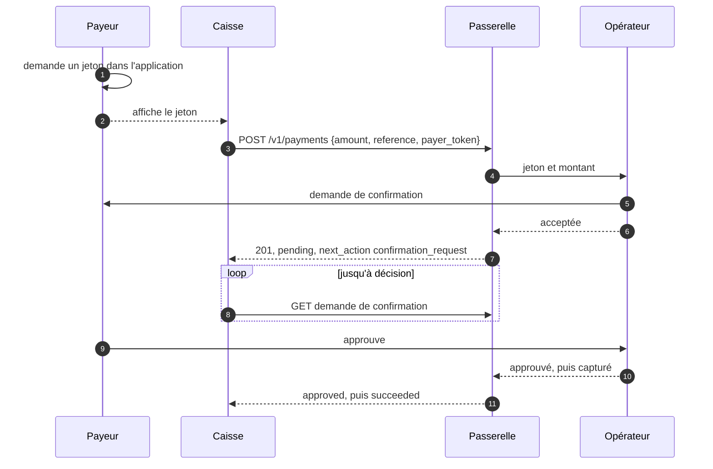

# Paiement de proximité, mode présenté par le client

Décision : [ADR-0012](../text/0012-proximity-payments-cpm.md).

## 1. Flux



**1.1.** Le marchand n'apprend jamais le numéro du payeur ; le payeur ne saisit rien.

**1.2.** Le flux ajoute une entrée à la création de paiement, `payer_token`, et une sortie, une
[demande de confirmation](demandes-de-confirmation.md). Le reste suit l'[API](api-paiements.md).

## 2. Jeton

**2.1.** Un `PayerToken` compte 8 à 128 caractères parmi `A-Za-z0-9._~-`.

**2.2.** Il est opaque pour le marchand et la passerelle : ni l'un ni l'autre NE DOIT l'analyser
ni en dériver quoi que ce soit.

**2.3.** Un jeton DOIT être à usage unique. L'opérateur DOIT rejeter la seconde soumission d'un
jeton déjà résolu (`payer-token-used`).

**2.4.** Un jeton DOIT être de courte durée ; sa durée de vie NE DEVRAIT PAS dépasser
180 secondes.

**2.5.** Un jeton NE DOIT PAS être devinable : au moins 64 bits imprévisibles, jamais dérivés
d'un identifiant de compte, d'un numéro, d'un compteur ou d'un horodatage.

**2.6.** Le support (QR, NFC, code lu à voix haute) n'est pas spécifié ; seule la chaîne l'est.

**2.7.** Une représentation QR DOIT décoder vers un `PayerToken` et rien d'autre. Une
application marchande NE DOIT PAS avoir à extraire le jeton d'une URL ou d'une enveloppe.

**2.8.** Un jeton NE DOIT PAS encoder ni révéler l'identité du payeur, ni rien qu'un marchand
puisse corréler d'une visite à l'autre.

**2.9.** La passerelle NE DOIT PAS conserver un `payer_token` après la création du paiement, ni
le journaliser, ni le renvoyer.

## 3. Création

**3.1.** `POST /v1/payments` ([API §5.1](api-paiements.md)) avec un membre supplémentaire :

```json
{
  "reference": "POS-2026-09-06-0042",
  "amount": { "amount": 45000, "currency": "HTG" },
  "provider": "mock_gamma",
  "payer_token": "8mQ2xR7vK4nZ",
  "description": "Counter sale"
}
```

**3.2.** `payer_token` est OBLIGATOIRE pour ce flux et interdit ailleurs. Une requête portant à
la fois `payer_token` et `payer` DOIT être rejetée avec `invalid-field`.

**3.3.** `Idempotency-Key` est OBLIGATOIRE.

**3.4.** Succès : `201`, paiement `pending`, `next_action` de type `confirmation_request`.

```json
{
  "id": "pay_01J9ZK3QF8XN2M7VYB4C6D8E0G",
  "reference": "POS-2026-09-06-0042",
  "status": "pending",
  "amount": { "amount": 45000, "currency": "HTG" },
  "provider": "mock_gamma",
  "payer": null,
  "next_action": {
    "type": "confirmation_request",
    "confirmation_request_id": "cnf_01J9ZM8W4B7XKQ2R5T3N6P0V9D",
    "expires_at": "2026-09-06T13:05:19.882Z"
  },
  "created_at": "2026-09-06T13:04:19.882Z",
  "updated_at": "2026-09-06T13:04:19.882Z",
  "expires_at": "2026-09-06T13:05:19.882Z",
  "completed_at": null,
  "failure_reason": null,
  "failure_detail": null,
  "fee": null,
  "metadata": {}
}
```

**3.5.** `payer` reste nul. La passerelle NE DOIT PAS le renseigner ni transmettre l'identité du
payeur au marchand, même si l'opérateur la fournit.

**3.6.** L'`expires_at` du paiement DEVRAIT être égal à celui de la demande de confirmation.

**3.7.** Le jeton est résolu à la création : une création réussie signifie que l'opérateur l'a
accepté et a soumis la demande. Un jeton refusé produit une erreur (§6) et aucun paiement.

## 4. Décision

**4.1.** La décision est régie par les [demandes de confirmation](demandes-de-confirmation.md).

**4.2.** La marchandise est remise quand le paiement est `succeeded`, pas à l'approbation.

**4.3.** L'application marchande DEVRAIT afficher le montant et le temps restant, et indiquer que
la décision se prend sur l'appareil du payeur.

## 5. Défaillances

### 5.1. Même jeton scanné deux fois

**5.1.1.** Un nouveau scan après une coupure NE DOIT PAS créer une seconde vente.

**5.1.2.** Un client qui renvoie une soumission incertaine DOIT réutiliser la même
`Idempotency-Key` ; la passerelle rejoue la réponse sans resoumettre le jeton.

**5.1.3.** Une nouvelle vente au même client porte une nouvelle clé et une nouvelle `reference` ;
l'opérateur rejette le jeton consommé (`payer-token-used`).

**5.1.4.** La passerelle NE DOIT PAS dédupliquer en comparant les jetons entre requêtes, ni tenir
d'index jeton vers paiement.

### 5.2. Jeton expiré avant le scan

**5.2.1.** L'opérateur le rejette : `payer-token-expired`, aucun paiement.

**5.2.2.** La passerelle NE DOIT PAS renvoyer la soumission, NE DOIT PAS retenir la requête dans
l'attente d'un autre jeton, et NE DOIT PAS créer de paiement.

**5.2.3.** `payer-token-expired` (renouveler le jeton) est distinct de `payer-token-invalid`
(lecture erronée).

### 5.3. Le payeur s'en va

**5.3.1.** La demande expire et le paiement devient `expired`.

**5.3.2.** Pour libérer la caisse plus tôt, le marchand annule la demande et DOIT traiter le cas
où l'annulation perd contre une approbation.

**5.3.3.** Un client NE DOIT PAS rapporter un échec tant que la demande est `awaiting`.

### 5.4. Réseau du marchand perdu après soumission

**5.4.1.** Le marchand retrouve le paiement par sa `reference`, choisie avant la soumission.

**5.4.2.** Un client NE DOIT PAS resoumettre le jeton dans une nouvelle vente et DOIT d'abord lire
par référence.

**5.4.3.** Aucun paiement trouvé : si la dernière réponse portait `effect: unknown`, le client
DOIT d'abord rejouer la création avec la même `Idempotency-Key` jusqu'à obtenir un dénouement
déterminé. La vente ne reprend avec un jeton neuf qu'ensuite. Sur ce rejeu, si l'opérateur
répond que le jeton est déjà résolu, la passerelle DOIT rapporter `payer-token-used` avec
`effect: unknown`, et le client DOIT relire par référence avant toute nouvelle vente.

**5.4.4.** Paiement trouvé : le client reprend l'attente de la demande de confirmation.

## 6. Erreurs

**6.1.** Codes définis dans les [erreurs §9.7](erreurs.md) : `payer-token-invalid`,
`payer-token-expired`, `payer-token-used`, tous `retryable: false` et `effect: none`.

**6.2.** La récupération est un nouveau jeton, donc une nouvelle requête et une nouvelle clé.

**6.3.** Opérateur injoignable : `provider-unavailable`, jamais `payer-token-invalid`.

**6.4.** Un `payer_token` non conforme au §2.1 DOIT être rejeté avec `invalid-field` avant tout
appel à l'opérateur.

**6.5.** Un jeton inconnu et un jeton d'un autre opérateur produisent tous deux
`payer-token-invalid`.

## 7. Application du payeur

Exigences sur l'opérateur, non testables par la suite :

**7.1.** Produire des jetons conformes aux §2.3, §2.4, §2.5 et §2.8.

**7.2.** Afficher au payeur, avant approbation, le montant et le nom du marchand.

**7.3.** Rendre le refus aussi accessible que l'approbation, avec la même échéance.

**7.4.** Ne jamais réutiliser un jeton affiché après une résolution.

## 8. Capacités et conformité

**8.1.** Capacité `payments.proximity_cpm`. La passerelle NE DOIT l'annoncer que si l'opérateur
résout nativement les jetons présentés par le payeur.

**8.2.** Elle exige `confirmation_requests`.

**8.3.** Aucun repli : pour un payeur sans application, le marchand utilise un paiement ordinaire
avec numéro de téléphone. La passerelle NE DOIT PAS présenter un flux par numéro comme un paiement
de proximité.

**8.4.** Cible de conformité : implémentation native de l'opérateur ou simulateur.

**8.5.** La suite exerce au minimum : un paiement de bout en bout ; le même jeton deux fois avec la
même clé (un seul paiement) ; le même jeton avec deux clés (`payer-token-used`) ; un jeton expiré ;
un jeton mal formé (rejet avant appel) ; un opérateur injoignable (`provider-unavailable`) ; une
lecture par référence après perte réseau.

## 9. Sécurité

**9.1.** L'opérateur DEVRAIT limiter le nombre de demandes de confirmation par payeur.
