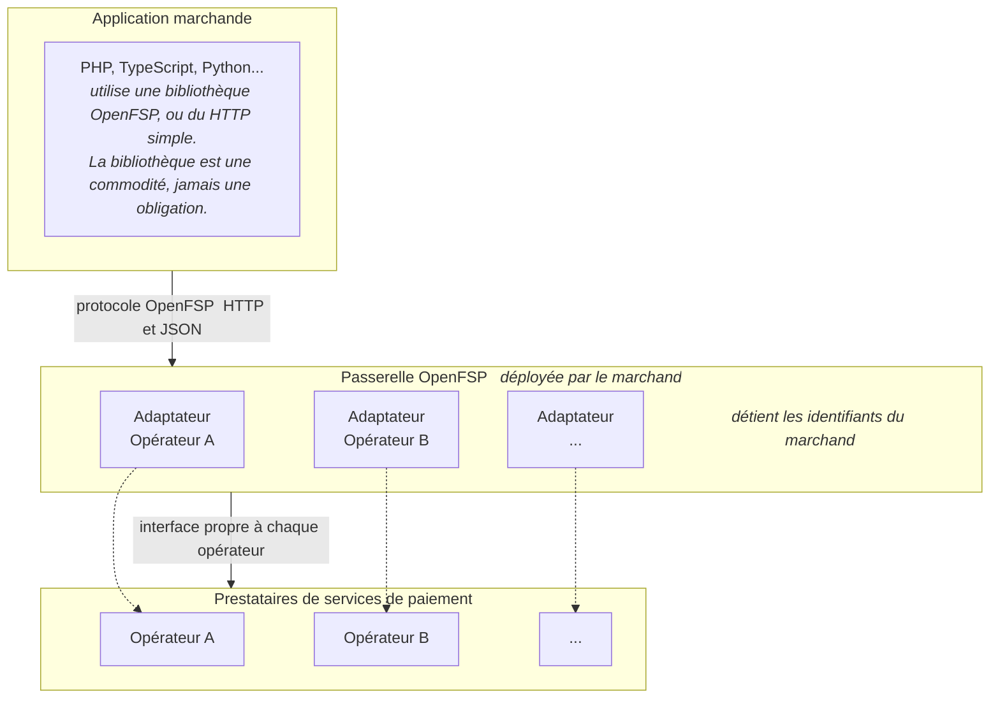

# ADR-0001 : Architecture et périmètre

- Voie : Informative
- Statut : Brouillon
- Créée : 2026-08-16

## Résumé

Cette ADR définit ce qu'est OpenFSP, ce qu'il n'est délibérément pas, et comment ses parties
s'articulent. Elle établit l'architecture dans laquelle travaille chaque ADR ultérieure : un
protocole ouvert, une passerelle auto-hébergée qui le parle, un serveur de simulation qui
imite de vrais opérateurs pour les tests, et des bibliothèques clientes minces.

Elle est informative. Elle n'exige rien d'une implémentation par elle-même. Elle existe pour
que les ADR de la voie Standards qui suivent disposent d'un cadre arrêté, et pour qu'un
lecteur, développeur, opérateur ou régulateur, puisse juger de la forme du projet avant de
lire une seule définition de champ.

## Motivation

Haïti dispose de services de paiement numériques qui fonctionnent, et d'aucune
interopérabilité entre eux.

**Pour qui, en un chiffre.** La détention de compte en Haïti s'établit à « environ 27 % des
adultes » disposant d'un compte financier formel ou de monnaie mobile, nettement en deçà de la
moyenne régionale, selon la lecture que fait la banque centrale du `FINDEX-2021`
[BRH-PILOT-2026]. Le chiffre qui décrit l'utilisateur de cette spécification est le suivant
dans le même paragraphe : « seules 14 % des micro, petites et moyennes entreprises sont
bancarisées » [FINSCOPE-2023, cité par BRH-PILOT-2026]. C'est le marchand, et non le payeur,
qui intègre une interface de paiement, et 86 % des micro, petites et moyennes entreprises
haïtiennes se trouvent hors du système formel qui pourrait leur en vendre une.

L'offre est décrite par la même source comme « fragmentée et insuffisamment intégrée dans un
cadre stratégique global » [BRH-PILOT-2026], et l'association professionnelle du secteur
parvient à la même conclusion par l'autre bout, en qualifiant les infrastructures formelles de
« coûteuses, lentes, peu accessibles ou insuffisamment interopérables » [EF-AYITI-2026, p. 8].
Aucune de ces deux phrases n'a été écrite au sujet de ce projet.

**Le vide est nommé, dans l'enceinte même du régulateur, en termes techniques.** La section 5
de `BRH-121` impose l'interopérabilité entre opérateurs et avec les banques. Analysant cette
exigence à l'intention de la BRH, l'association professionnelle écrit que « la circulaire pose
le principe mais ne définit ni les standards techniques, ni les protocoles d'échange », de
sorte que « les acteurs se replient sur des accords bilatéraux, souvent exclusifs, qui
reproduisent la fragmentation que la circulaire entendait précisément éviter »
[EF-AYITI-121, p. 11].

Trois éléments dans cette phrase. L'absence de standards techniques et de protocoles d'échange
est ce que cette spécification fournit. Les accords bilatéraux, souvent exclusifs, sont la
formulation réglementaire du coût en `N × M` exposé plus loin. Et la reproduction de la
fragmentation que la circulaire entendait éviter est un constat d'échec : l'obligation existe,
le moyen de la satisfaire n'existe pas.

La même analyse recense, parmi les faiblesses du cadre actuel, « une faiblesse du système
PRONAP qui, bien qu'ayant formalisé une certaine interopérabilité entre les banques et avec
les institutions financières non bancaires, ne l'impose pas ni la garantie »
[EF-AYITI-121, p. 11]. C'est un troisième énoncé indépendant de la distinction de couche
défendue plus loin, après la note de bas de page de la BRH elle-même et le relevé des
initiatives africaines par le CPMI.

Ce que l'association demande effectivement n'est pas ceci. Elle recommande un cadre d'Open
Banking sur le modèle mexicain, avec « des API standardisées » et « une gouvernance encadrée
par le régulateur » [EF-AYITI-121, p. 13], assorti d'un hub national d'échange
[EF-AYITI-121, p. 9]. Ces dispositifs relèvent de l'autorité et demandent du temps. Cette
spécification ne s'y substitue pas et n'en dépend pas, et resterait utile sous un tel cadre.
La présenter comme la réponse que le secteur a réclamée serait excessif.

Pour quiconque construit un logiciel devant encaisser un paiement, il en résulte quatre coûts.

**L'intégration s'écrit depuis zéro, opérateur par opérateur.** Chaque opérateur expose sa
propre interface, sa propre authentification, son propre vocabulaire de statuts, ses propres
conventions d'erreur. Il n'existe aucun modèle partagé, de sorte que rien de ce qui est appris
sur l'un ne se transfère au suivant. Un marchand qui veut accepter deux opérateurs écrit et
maintient deux intégrations qui font la même chose.

**Les tests exigent un compte marchand réel.** Faute d'environnement de test fidèle, le chemin
praticable consiste à développer contre la production avec de petits montants réels. C'est
coûteux, lent, et cela signifie que les chemins de défaillance, expiration, refus, doublon,
rappel tardif, sont les moins susceptibles d'être testés, parce que ce sont les plus
difficiles à provoquer délibérément. Ce sont les chemins où l'argent disparaît.

**Ajouter ou changer d'opérateur impose une réécriture.** Le choix d'un opérateur devient un
engagement architectural permanent plutôt qu'une décision commerciale. Cela conforte celui qui
est déjà intégré et renchérit l'entrée de tout nouveau venu.

**Chaque langage paie le coût une fois de plus.** Une intégration PHP n'apprend rien à une
intégration TypeScript. Chaque écosystème réimplémente les mêmes malentendus sur les mêmes
particularités d'opérateurs, et chacun porte ses propres bogues.

Le facteur commun est l'absence de contrat partagé. Chaque participant négocie bilatéralement
avec chaque autre, et le coût total croît comme le produit du nombre d'opérateurs par celui
des consommateurs, plutôt que comme leur somme.

Ce n'est pas une observation locale. Le CPMI et la Banque mondiale décrivent le même mécanisme
de façon générale : « the different types of new payment products created as a result of
innovation have increased the complexity for payees, especially if they each have different
interface requirements », et « without standardisation and harmonisation, there will be siloes
and fragmentation, duplicated efforts leading to unnecessary costs, and a lack of efficiency
leading to little or no gains for the unserved or underserved » [CPMI-PAFI-2020, p. 53,
§ 146]. Le terme *payees* y désigne les marchands. Leur conclusion est la prémisse de cette
ADR : « Open technical standards and harmonised rules must be defined to help new technologies
fulfil their promise and support market integration. »

**Le même paragraphe contient l'objection la plus forte adressée à ce projet, et elle est
citée ici plutôt que laissée à découvrir par quelqu'un d'autre.** Il avertit que
« fragmentation might create opportunities for specialised entities, such as payment gateways,
this might be at the detriment of the overall efficiency of the retail payments market ». Une
passerelle peut vivre de la fragmentation qu'elle prétend réduire, et n'aurait alors aucune
raison de la réduire.

La réponse est structurelle plutôt qu'une promesse de bonne conduite. La passerelle est
déployée par le marchand, et non exploitée comme un service (*Modèle de déploiement et de
confiance*). Le protocole est public et sous une licence qui permet à quiconque de
l'implémenter. Et un opérateur qui implémente le protocole nativement rend son propre
adaptateur inutile, ce qui est énoncé comme un objectif dans *Principes de conception* plutôt
que toléré comme un risque. Une entité spécialisée du type de celle contre laquelle le CPMI
met en garde ne construit pas la chose qui supprime le besoin qu'on a d'elle.

La prémisse d'OpenFSP est que le contrat devrait exister une fois, publiquement, sans
appartenir à un fournisseur unique, et être implémentable par quiconque, y compris, à terme,
par les opérateurs eux-mêmes.

## Hors périmètre

Ces frontières sont aussi importantes que l'architecture, et plusieurs sont porteuses pour la
position juridique du projet. Elles ne sont pas provisoires.

**OpenFSP ne détient, ne déplace et ne prend en dépôt aucun fonds.** La passerelle donne des
instructions aux opérateurs ; elle ne devient jamais partie à une transaction. L'argent circule
entre le payeur, l'opérateur et le marchand, exactement comme sans OpenFSP.

**OpenFSP n'exploite aucun service hébergé.** Le projet publie un logiciel que d'autres
déploient. Il n'exploite aucun point d'accès de production pour le compte de quiconque. Toute
offre hébergée bâtie sur OpenFSP, par le steward ou par quiconque, est une entreprise
distincte, soumise à ses propres accords et à ses propres obligations réglementaires, et
extérieure à ce projet.

**OpenFSP n'est pas un établissement de paiement agréé et n'entend pas le devenir.** C'est un
logiciel et une spécification. Il ne remplace ni ne crée aucun agrément, aucune autorisation,
aucun accord dont un marchand a besoin auprès d'un opérateur ou d'un régulateur.

**OpenFSP n'est ni un commutateur, ni une chambre de compensation, ni un système de
règlement.** Il ne compense pas de positions, n'achemine pas une transaction entre les livres
de deux opérateurs, et ne règle rien. Ces fonctions requièrent un exploitant doté d'un mandat ;
OpenFSP n'a ni l'un ni l'autre. Il normalise *la manière dont un marchand donne instruction à
un opérateur*, ce qui est un problème strictement plus petit, et dont la résolution ne requiert
la permission de personne.

**OpenFSP ne certifie pas les opérateurs.** Il n'audite, ne note ni ne cautionne aucun service
de paiement. L'existence d'un adaptateur n'implique rien quant à la solidité de l'opérateur.

**OpenFSP ne spécifie aucune interface utilisateur.** Les parcours de paiement, les tableaux de
bord marchands et les applications de terminal sont des produits. Ceci est une infrastructure.

Les trois premiers points sont la raison pour laquelle une architecture auto-hébergée a été
retenue plutôt qu'une architecture hébergée, et ils doivent être traités comme des contraintes
sur toute conception future, non comme la description d'une étape.

## Architecture

### Les quatre artefacts

| Artefact | Ce que c'est | Langage |
|---|---|---|
| **Protocole** | La spécification normative : modèle de données, cycle de vie du paiement, capacités, erreurs, idempotence, notifications. Défini par les ADR de la voie Standards. | Prose et OpenAPI |
| **Passerelle** | Un serveur auto-hébergé qui parle le protocole d'un côté et les interfaces des opérateurs de l'autre. L'implémentation de référence. | Kotlin, Spring Boot |
| **Simulateur** | Un serveur imitant le comportement observable d'opérateurs réels, y compris leurs modes de défaillance, afin qu'une intégration puisse être développée et testée sans compte marchand. | Kotlin, Spring Boot |
| **Bibliothèques clientes** | Clients minces du protocole, idiomatiques pour chaque écosystème. | TypeScript, PHP, Python |

### Comment ils s'articulent

En développement et en intégration continue, le serveur de simulation remplace les opérateurs
au bas de ce schéma. Rien de ce qui se trouve au-dessus ne change.

### Modèle de déploiement et de confiance

**Le marchand déploie la passerelle et détient les identifiants.** Cette seule propriété porte
l'essentiel de la sûreté du projet :

- Le projet ne possède jamais les identifiants d'un marchand, il ne peut donc pas les perdre.
- Le projet n'est jamais sur le chemin des fonds, il n'encourt donc aucune obligation de
  conservation.
- La relation réglementaire d'un marchand avec son opérateur est inchangée ; OpenFSP n'y
  ajoute aucun tiers.
- Il n'existe aucun service multi-locataire à compromettre.

Le coût est réel et doit être énoncé : le marchand exploite un service, et ce service est une
cible de grande valeur. La passerelle doit donc pouvoir être exploitée par une petite équipe
sans personnel de plateforme spécialisé : un binaire statique unique, aucune dépendance
externe obligatoire, des réglages sûrs par défaut et un durcissement documenté. L'exploitabilité
est ici une exigence de sécurité, non une commodité.

### Pourquoi une passerelle, et non des adaptateurs par langage

L'architecture alternative est en processus : chaque langage reçoit une bibliothèque qui
s'adresse directement à chaque opérateur, sans serveur. Elle est plus simple à déployer et
c'est ce que font la plupart des bibliothèques de paiement.

Elle a été écartée parce qu'elle multiplie le travail le plus difficile par le nombre
d'écosystèmes. L'intégration d'un opérateur est là où réside réellement la difficulté :
comportements non documentés, sémantiques de statut incohérentes, gestion des reprises et des
doublons, vérification des rappels. Dans le modèle en processus, ce travail est refait pour
chaque langage, et chaque copie porte ses propres bogues subtilement différents. Avec `P`
opérateurs et `L` langages, cela fait `P × L` adaptateurs, chacun nécessitant ses propres
identifiants pour être testé.

La passerelle ramène cela à `P + L` : un adaptateur par opérateur, écrit une fois, plus un
client mince par langage. Un nouveau langage devient une affaire de jours plutôt que de mois,
et un nouvel opérateur devient disponible pour tous les langages d'un coup. Pour un projet dont
la portée dépend de la couverture de nombreux écosystèmes avec peu de personnes, c'est la
différence entre une promesse réelle et une promesse décorative.

Trois conséquences supplémentaires en découlent, chacune comptant pour elle-même :

- **Le contrat client est un protocole de transport, non un jeu de définitions de classes.**
  Il peut être implémenté dans un langage auquel personne ici n'a pensé, sans notre
  participation.
- **Un opérateur peut à terme implémenter le protocole nativement**, moment à partir duquel la
  passerelle devient optionnelle pour cet opérateur au lieu d'être porteuse. Une bibliothèque
  en processus n'offre aucun chemin de ce type : voir *Conformité* ci-dessous.
- **Les identifiants restent en un seul endroit**, au lieu d'être répartis dans chaque
  application devant encaisser un paiement.

## Principes de conception

Ces engagements contraignent les ADR de la voie Standards qui suivent. Ils sont énoncés ici
afin que les désaccords ultérieurs se tranchent contre une prémisse écrite plutôt que contre
un goût.

**Les capacités sont optionnelles, et rien n'est jamais simulé.** Le contrat de base que tout
opérateur doit satisfaire est délibérément minimal : créer un paiement, lire un paiement. Tout
le reste, remboursement, capture, annulation, transfert, consultation de transaction,
vérification des notifications, est une capacité distincte, annoncée indépendamment. Un
adaptateur n'implémente que ce que son opérateur prend réellement en charge.

C'est la décision de conception centrale d'OpenFSP, et il vaut la peine d'être explicite sur
ce qu'elle rejette. L'approche habituelle est une interface au plus petit dénominateur commun
que chaque opérateur implémente, avec les opérations non prises en charge émulées : un
« remboursement » qui est en réalité un virement inverse, une « capture » qui ne fait rien et
renvoie un succès. L'émulation est pire que l'absence, parce que l'appelant ne fait pas la
différence avant le moment où quelqu'un est créancier. Une opération qu'un opérateur ne peut
pas effectuer MUST être absente et découvrable comme absente, jamais simulée.

**Un montant est un entier d'unités mineures assorti d'une devise explicite.** Jamais un
flottant, jamais une chaîne décimale, jamais un montant sans sa devise. Les devises sont des
codes ISO 4217 ; HTG et USD ont tous deux deux décimales, ce qui est exactement le genre
d'hypothèse qui doit être encodée plutôt que mémorisée.

**Toute opération modifiant l'état est idempotente.** Les réseaux échouent après l'arrivée de
la requête et avant le retour de la réponse. Un client qui ne peut pas réessayer sans danger
débitera deux fois ou perdra un paiement ; il n'y a pas de troisième issue. L'idempotence est
donc une exigence du protocole, non une fonctionnalité par point d'accès, et elle est
spécifiée avant tout point d'accès.

**La référence propre du marchand est la clé de corrélation.** Un marchand identifie un
paiement par un identifiant qu'il a choisi et qu'il stocke déjà, et non uniquement par un
identifiant que l'opérateur renvoie plus tard. C'est ce qui rend le rapprochement possible
après une expiration de délai, lorsque l'identifiant de l'opérateur peut n'avoir jamais atteint
le marchand.

**L'état est une machine explicite.** Les états d'un paiement, les transitions permises entre
eux et ceux qui sont terminaux sont spécifiés plutôt qu'implicites. Les opérateurs dont le
vocabulaire de statut ne correspond pas sont mis en correspondance explicitement dans leur
adaptateur, et toute correspondance qui perd de l'information est documentée comme telle.

**Les erreurs sont neutres vis-à-vis de l'opérateur, tout en préservant son erreur propre.**
Un appelant peut agir sur une taxonomie d'erreurs stable et spécifiée sans lire la
documentation de l'opérateur, et peut néanmoins accéder au code et au message d'origine pour
le support et l'audit. Aucun des deux ne suffit seul : une erreur uniquement neutre est
intraçable, une erreur uniquement brute est inexploitable par programme.

**Le comportement n'est jamais dégradé silencieusement.** Aucun repli automatique vers un autre
opérateur, aucune reprise qui change la sémantique de la requête, aucun succès partiel rapporté
comme un succès. Lorsqu'une décision doit être prise, elle revient à l'appelant, et
l'information nécessaire pour la prendre figure dans la réponse.

**Le protocole est ennuyeux à dessein.** HTTP, JSON, codes de statut conventionnels, en-têtes
standards. Une spécification destinée à être implémentée par des institutions aux cycles
d'achat longs et aux plateformes conservatrices doit être implémentable avec une bibliothèque
standard et sans dépendance inhabituelle.

## Normes sur lesquelles ceci s'appuie

OpenFSP définit aussi peu de choses qu'il le peut et réutilise des spécifications établies
partout ailleurs. C'est en partie une économie d'ingénierie et en partie une stratégie
d'adoption : une institution qui examine OpenFSP devrait reconnaître l'essentiel de ce qu'elle
lit.

| Sujet | Norme |
|---|---|
| Mots-clés d'exigence | RFC 2119, RFC 8174 |
| Réponses d'erreur | RFC 9457, Problem Details for HTTP APIs |
| Horodatages | RFC 3339, UTC |
| Codes de devise et unités mineures | ISO 4217 |
| Modèle sémantique | ISO 20022, domaine Payments Initiation, comme dictionnaire plutôt que comme transport |
| Cadre réglementaire | Droit haïtien et circulaires de la BRH, recensés dans [`references.md`](references.md) |
| Numéros de téléphone | UIT-T E.164 |
| Identifiants | RFC 9562, UUID, version 7 préférée pour son ordonnancement temporel |
| Signature des notifications | RFC 9421, HTTP Message Signatures |
| En-tête d'idempotence | `Idempotency-Key`, suivant le projet du groupe de travail HTTP API de l'IETF. S'agissant d'un projet, la sémantique du champ est fixée par notre propre ADR de la voie Standards plutôt que par référence. |
| Description d'API | OpenAPI 3.1 |
| Authentification du client | OAuth 2.0 (RFC 6749) là où un serveur d'autorisation se justifie ; identifiants porteurs sinon |
| Découverte | RFC 8615, URI bien connus |

**ISO 20022, comme dictionnaire et non comme transport.** ISO 20022 est la lingua franca de la
messagerie financière institutionnelle, et OpenFSP y ancre son modèle de données. L'ancrage est
sémantique, non syntaxique : le format de transport reste JSON, parce que les schémas XML sont
disproportionnés pour une interface d'intégration marchande et coûteux sur la bande passante
dont ce marché dispose réellement. Ce qu'OpenFSP prend d'ISO 20022, c'est le modèle conceptuel,
la séparation entre une instruction et son statut, l'identification des parties indépendamment
de leurs institutions, un identifiant de bout en bout transporté inchangé sur toute la chaîne,
et des montants typés par ISO 4217.

La correspondance est un livrable, non une aspiration. Une ADR informative dédiée,
[ADR-0010](0010-iso-20022-semantic-correspondence.md), documente la correspondance avec le
domaine Payments Initiation, `pain.013` pour l'initiation et `pain.014` pour son statut, avec
`camt.053` pour le rapprochement, ainsi que la correspondance de `failure_reason` avec les
codes de motif ISO 20022. `pain.013` plutôt que le `pain.001` auquel un lecteur pourrait
s'attendre : OpenFSP modélise un marchand demandant à un payeur d'approuver un encaissement, ce
qui est la forme de la demande d'activation de paiement par le créancier, et non celle d'un
payeur donnant instruction à sa propre institution de pousser des fonds. La distinction est
travaillée dans [ADR-0010 §3.4](0010-iso-20022-semantic-correspondence.md), et la
correspondance au niveau de la transaction est presque identique dans les deux cas. Cette ADR
consigne également, explicitement, là où la correspondance perd de l'information. Un numéro de
téléphone employé comme identifiant de compte n'est pas un IBAN, et aucune discipline de
nommage n'en fait un. Ces écarts sont documentés comme des écarts plutôt que masqués, selon le
principe même qui gouverne les capacités : ce qui n'existe pas est déclaré absent, jamais
émulé.

**Autres travaux voisins, délibérément non repris intégralement.** La GSMA Mobile Money API
[GSMA-MMAPI] spécifie un domaine comparable et constitue un point de référence pour nommer les
choses. Elle couvre les transferts de fonds, les paiements marchands, les paiements de
factures, la gestion de compte, les transferts internationaux avec cotation, les opérations en
masse et les dépôts et retraits d'espèces ; l'adopter intégralement importerait une surface
bien plus vaste que ce dont le marché haïtien a besoin aujourd'hui, face à une capacité de base
de trois opérations ici.

Mojaloop [MOJALOOP] traite l'interopérabilité à la couche du schéma et du commutateur, une
couche différente de celle-ci, et un effort complémentaire plutôt que concurrent : un
commutateur national et un protocole d'intégration marchande peuvent coexister, et OpenFSP est
explicitement le plus petit des deux problèmes.

**Haïti dispose déjà du commutateur, et il s'appelle PRONAP.** Le nommer importe davantage que
de nommer Mojaloop, parce que c'est la première question que posera un lecteur de la banque
centrale. La Banque de la République d'Haïti exploite un Processeur National de Paiement,
décrit comme conçu « pour garantir l'interopérabilité, moderniser les infrastructures de
paiement et stimuler l'innovation des paiements électroniques » [BRH-PILOT-2026], et traitant
« les autorisations de paiement par divers moyens comme les cartes de débit et les paiements
mobiles » [BRH-DI-0011, p. 10].

OpenFSP n'est pas cela, et la définition qu'en donne la BRH elle-même est ce qui rend la
différence précise. L'interopérabilité que délivre le processeur national est définie dans une
note de bas de page de ce même document comme la possibilité, pour le détenteur d'une carte de
débit émise par l'établissement A, de l'utiliser sur les terminaux de l'établissement B
[BRH-DI-0011, p. 10, note 10]. C'est de l'interopérabilité monétique, à la couche du
commutateur. Le problème traité ici se situe au-dessus : un marchand, plusieurs opérateurs, une
intégration pour chacun. Un commutateur ne supprime pas cette intégration, et cette
spécification ne commute, ne compense et ne règle rien.

**L'objection que cela appelle, et la réponse.** Un lecteur qui connaît les systèmes de
paiement dira : l'interopérabilité entre opérateurs est un problème de compensation et de
règlement, non un problème d'interface. Deux opérateurs sans accord de compensation commun ne
peuvent pas faire circuler d'argent entre eux quel que soit le JSON que l'un ou l'autre parle,
de sorte qu'un protocole excluant le règlement a exclu l'obstacle réel.

L'objection est exacte sur la compensation et porte à faux sur ce qui est revendiqué ici, et la
distinction mérite d'être énoncée précisément parce qu'un relecteur indépendant de cette
spécification a fait exactement cette lecture.

Le marchand, dans ce modèle, détient un compte chez chacun des opérateurs qu'il accepte. Un
payeur client de l'opérateur A règle sur le compte du marchand chez A. Un payeur client de
l'opérateur B règle sur le compte du marchand chez B. Aucune valeur ne traverse de A vers B à
aucun moment, et aucun accord de compensation entre A et B n'est requis, puisqu'aucun n'est
sollicité. Ce que le marchand gagne n'est pas le règlement interopérateurs, dont il n'a jamais
eu besoin, mais une surface d'intégration unique au lieu d'une par opérateur. C'est
l'intégralité de la revendication, et c'est pourquoi *Hors périmètre* exclut la compensation
plutôt que de la reporter.

Là où l'objection porte, c'est sur une affirmation que cette ADR ne fait pas. Un payeur chez
l'opérateur A ne peut pas régler un marchand qui n'accepte que l'opérateur B. Résoudre cela est
le travail d'un commutateur, et Haïti en a un. Les deux problèmes sont voisins, ils ne sont pas
le même, et aucun ne résout l'autre.

**Les comparateurs régionaux font le même constat.** Les quatre initiatives subsahariennes que
documentent le CPMI et la Banque mondiale sont le commutateur central du Nigeria, la plateforme
ghanéenne d'interopérabilité de la monnaie mobile, le projet de la BCEAO dans les huit pays de
l'UEMOA, et Mowali, bâti par MTN et Orange sur Mojaloop [CPMI-PAFI-2020, p. 54, encadré R ;
NCS ; GH-MMI ; BCEAO-WAEMU ; MOWALI]. Les quatre traitent du transfert entre portefeuilles ou
de l'interopérabilité de schéma. Aucune n'est un protocole d'intégration marchande, ce qui
établit que le vide est réel et non l'artefact d'une recherche insuffisante.

Mowali mérite une seconde mention pour une autre raison. C'est « an industry-owned and
industry-governed payments hub », bâti sur une plateforme libre et ouvert à tout opérateur du
continent [CPMI-PAFI-2020, p. 54]. C'est la forme de gouvernance que ce projet vise.

Là où le modèle d'OpenFSP peut être exprimé comme un profil de l'un de ces travaux, une ADR
ultérieure devrait le dire explicitement.

## Conformité

La conformité est définie à trois niveaux. L'échelle est délibérée : chaque niveau est utile
par lui-même, et chacun rend le suivant moins coûteux.

**Niveau 1, conformité du client.** Un client, généralement une bibliothèque, implémente
correctement le protocole face à une passerelle conforme. Vérifié par la suite de conformité
agissant comme une passerelle.

**Niveau 2, conformité de la passerelle.** Un serveur implémente correctement le protocole du
côté client et représente correctement au moins un opérateur de l'autre. Vérifié par la suite
de conformité agissant comme un client, le serveur de simulation tenant lieu d'opérateurs.

**Niveau 3, conformité native de l'opérateur.** Un prestataire de services de paiement expose
directement le protocole OpenFSP. À ce niveau, la passerelle n'est plus requise pour cet
opérateur : les clients s'adressent à lui nativement, et le coût d'intégration pour l'ensemble
de l'écosystème tombe à presque rien.

Le niveau 3 est l'objet du projet. Les niveaux 1 et 2 existent pour démontrer que le protocole
fonctionne et mérite d'être adopté ; le niveau 3 est là où la fragmentation décrite en
*Motivation* prend effectivement fin. Il ne peut pas être atteint par l'ingénierie seule : il
requiert que des opérateurs le choisissent. Le plus que l'architecture puisse faire est de
rendre ce choix peu coûteux, peu risqué et manifestement avantageux, et c'est à cela que
servent la passerelle et la suite de conformité. Un opérateur qui adopte OpenFSP nativement
hérite, sans frais, de chaque bibliothèque et de chaque intégration déjà écrite contre lui.

La suite de conformité est exécutable par machine et publique. Une revendication de conformité
que personne ne peut vérifier en exécutant la suite n'engage à rien, et les règles d'usage du
nom OpenFSP sont exposées dans [ADR-0016](0016-conformance-marks-and-naming.md).

## Langues

La spécification est publiée en français. C'est la langue de son marché, de son régulateur
et des développeurs qu'elle vise en premier, et une spécification que ses lecteurs doivent
traduire avant de la lire est une spécification qu'ils liront mal.

Les mots-clés RFC 2119, les noms de champs et les valeurs transmises sur le fil restent en
anglais. Ce sont des termes normatifs et des valeurs littérales : les traduire créerait un
second vocabulaire normatif, ce qui est le risque qu'une spécification multilingue existe pour
éviter.

Une édition anglaise pourra être publiée. Elle serait alors une traduction, et le français
continuerait de faire foi.

## Versionnement

La spécification est versionnée selon le versionnement sémantique, sous les garanties de
[GOVERNANCE.md §5](https://github.com/openfspht/openfsp/blob/main/GOVERNANCE.md#5-garanties-de-stabilité) :
aucune rupture de compatibilité sans une ADR acceptée, et un préavis de dépréciation d'une
version majeure complète.

Le protocole porte sa version majeure dans le chemin de requête (`/v1/...`). Les ajouts mineurs
sont découvrables à l'exécution par la découverte des capacités plutôt que par inspection d'un
numéro de version : un client devrait demander ce qu'un déploiement sait faire, non le déduire
d'un nombre.

Les implémentations déclarent la version de spécification qu'elles visent. Jusqu'à ce que la
spécification atteigne `1.0.0`, des ruptures de compatibilité peuvent survenir entre versions
mineures ; cela est énoncé clairement afin que personne ne bâtisse par accident une intégration
de production sur une cible mouvante.

## Considérations de sécurité

Au seul niveau de l'architecture ; chaque ADR de la voie Standards porte les siennes.

**Gestion des identifiants.** La passerelle détient les identifiants des opérateurs, ce qui en
fait le composant de plus grande valeur de la conception. Les identifiants MUST pouvoir être
chargés depuis l'environnement ou depuis un gestionnaire de secrets plutôt que depuis des
fichiers de configuration versionnés, MUST NOT apparaître dans les journaux, les réponses
d'erreur ou la télémétrie, et SHOULD être renouvelables sans redémarrer la passerelle.

**Transport.** Toute communication, du client vers la passerelle, de la passerelle vers
l'opérateur, et la livraison des notifications, requiert TLS. La passerelle MUST NOT offrir
d'écoute en clair hors d'un mode de développement explicitement signalé, et ce signalement MUST
être visible dans le journal de démarrage.

**Falsification et rejeu des notifications.** Les rappels entrants des opérateurs ne sont pas
fiables tant qu'ils ne sont pas vérifiés. Lorsqu'un opérateur offre des signatures, la
vérification est obligatoire et les rappels invérifiables MUST être rejetés, et non simplement
journalisés. Lorsqu'un opérateur n'en offre aucune, cas réel et fréquent, l'adaptateur MUST
traiter le rappel comme une invitation à relire l'état autoritatif auprès de l'opérateur,
jamais comme un fait en soi. Une protection contre le rejeu est requise dans les deux cas.

**L'idempotence comme contrôle de sécurité.** L'idempotence est spécifiée ici comme une
propriété de sécurité, et pas seulement d'ergonomie : sans elle, une requête réémise ou rejouée
est un double débit.

**Piste d'audit.** Chaque transition d'état est attribuable et horodatée. C'est à la fois une
exigence de sécurité et une exigence réglementaire, et cela contraint la manière dont l'état
est stocké, non simplement ce qui est journalisé.

**Rayon d'impact.** Une passerelle compromise expose les identifiants et l'historique de
paiement d'un seul marchand. C'est une conséquence directe de l'auto-hébergement, et c'est le
principal argument de sécurité en faveur de ce choix : il n'y a aucun agrégat à dérober.

**Chaîne d'approvisionnement.** La passerelle est distribuée sous forme d'artefact signé et
reproductible, accompagné d'une nomenclature logicielle publiée. Une institution ne peut pas
adopter ce qu'elle ne peut pas vérifier.

## Considérations réglementaires

Cette section s'adresse aux autorités de supervision, et à quiconque évalue OpenFSP pour leur
compte. Elle figure dans l'ADR d'architecture plutôt que dans un support commercial afin
d'être versionnée, relisible et contraignante pour la conception.

**Ce qu'est OpenFSP, en termes réglementaires.** Une spécification technique, et un logiciel
libre qui l'implémente. Ce n'est pas un service financier, pas un établissement de paiement, et
pas un exploitant de quoi que ce soit. Il n'exerce aucune activité soumise à autorisation.

**Où se situe la responsabilité.** Le marchand déploie et exploite la passerelle, détient ses
propres identifiants, et conserve sa relation et ses obligations existantes avec son prestataire
de services de paiement. OpenFSP n'insère aucun intermédiaire dans cette relation et ne crée
aucune partie nouvelle à une transaction.

**Ce à quoi il ne touche pas.** Aucune conservation de fonds. Aucun règlement, aucune
compensation. Aucune émission. Aucune détention de soldes de clients. Aucune fonction de
transfert transfrontalier. En ajouter une serait un changement de nature, non une
fonctionnalité, et cela est exclu par le hors-périmètre ci-dessus.

**Le cadre haïtien.** Le cadre commence au-dessus des circulaires. `HT-LAW-2012` régit les
institutions financières opérant sur le territoire haïtien, et son article 2 énumère ce qu'est
une institution financière : une banque autorisée ; une société de promotion des
investissements, de cartes de crédit, d'affacturage ou de fiducie ; une société financière de
développement ; une maison de transfert ; un agent de change autorisé ; ou « toute autre
catégorie de société qui effectue des opérations assimilables à celles des banques » que la
BRH peut désigner [HT-LAW-2012, art. 2, p. 4]. Les articles 3 et 7 définissent l'activité par
la réception de fonds du public assortie d'une obligation de restitution [HT-LAW-2012, p. 4 et
p. 6].

Un éditeur de spécification et de logiciel auto-hébergé n'est aucune des six, et la sixième,
clause balai, est bornée aux opérations assimilables à celles des banques. Publier un document
n'en est pas une, et publier un logiciel qu'un marchand exécute sur sa propre infrastructure
avec des identifiants qu'il détient non plus. Le projet ne reçoit aucun fonds et ne doit aucune
restitution, ce que les articles 3 et 7 érigent en critère opérant.

**Une réserve, énoncée ici plutôt que laissée à découvrir.** L'article 6 donne à la BRH le
pouvoir exprès d'étendre la loi, « dans les cas non prévus par la présente loi », aux activités
assimilables à celles des articles 3, 4 et 5 et aux entités qui s'y livrent [HT-LAW-2012,
p. 6]. La position ci-dessus est donc exacte en l'état du droit, et l'autorité peut en décider
autrement sans législation nouvelle. Cette ADR revendique la première proposition et ne
revendique pas la seconde.

Les prestataires de services de paiement électronique en Haïti sont régis par la Circulaire 121
de la BRH du 6 décembre 2021 [BRH-121]. Par sa section 2, cette circulaire s'adresse à trois
catégories : les sociétés dont l'activité principale et habituelle est exclusivement la
fourniture de services de paiement électronique ; les sociétés de technologie ou de
télécommunication détenant un département exclusivement dédié à ceux-ci ; et les institutions
agréées de dépôt détenant un tel département. Un éditeur de spécification et de logiciel
auto-hébergé n'est aucune de celles-ci, et déployer la passerelle ne fait entrer un marchand
dans aucune non plus. Le marchand demeure le client ou le marchand affilié d'un prestataire
agréé, exactement comme auparavant.

Lue positivement, cette même circulaire est la raison pour laquelle cette spécification vaut la
peine d'être écrite. Sa section 5 range l'interopérabilité avec les autres prestataires et avec
les acteurs du système national de paiement parmi les exigences techniques qu'un prestataire
doit satisfaire, et impose que la conformité à ces exigences techniques soit attestée par un
audit externe au moins tous les trois ans. Elle ne prescrit aucune norme par laquelle
l'interopérabilité devrait être jugée. Une spécification ouverte assortie d'une suite de
conformité exécutable par machine est une réponse auditable à une exigence qui n'en a
actuellement aucune.

**Deux autres circulaires atteignent cette spécification, et toutes deux procèdent du même
texte de loi.**

`BRH-126` fixe les règles minimales de sécurité informatique pour les institutions financières,
au titre des articles 83 et 161 de `HT-LAW-2012`. L'article 83 alinéa 10 est le pouvoir
spécifique : des règles sur « les mécanismes de contrôle et de sécurité dans le domaine de
l'informatique ainsi que les procédures de contrôle interne » [HT-LAW-2012, p. 29]. Quatre de
ses dispositions portent directement sur ce que ce projet produit.

Sa section 2 exige que ces règles assurent « la disponibilité, l'intégrité, la confidentialité
et la traçabilité de toutes les données et informations gérées à travers le système
informatique » [BRH-126, p. 1]. Ces quatre propriétés sont celles autour desquelles les ADR de
la voie Standards sont organisées : disponibilité sous défaillance, intégrité de ce que la
passerelle affirme, confidentialité des identifiants, et traçabilité de chaque paiement.

Sa section 3 p) exige d'une institution qu'elle « organiser la documentation appropriée de ses
systèmes et applications informatiques acquis ou développés en interne et assurer sa mise à
jour régulière par la consignation des évolutions ou correctifs dont ils font l'objet »
[BRH-126, p. 4]. Un ensemble d'ADR versionnées, assorties d'errata datés et d'un processus
d'amendement écrit, est cette documentation, et c'est la raison réglementaire la plus nette de
la forme que prend ce projet plutôt qu'un wiki.

Sa section 3 n) exige que les exigences de sécurité soient établies « au début de la phase de
développement, avant toute mise en production » [BRH-126, p. 3], ce qui est la raison pour
laquelle le canevas des ADR rend la section *Considérations de sécurité* obligatoire et jamais
vide, avant acceptation plutôt qu'après.

Sa section 3 t) exige un audit de sécurité informatique « tous les trois (3) ans au plus »
[BRH-126, p. 4], assorti d'une pénalité de 200 000 gourdes puis de 100 000 gourdes par jour
ensuite [BRH-126, p. 4]. **Il s'agit d'un second audit triennal, distinct de l'audit
d'interopérabilité de la section 5 de la Circulaire 121, et ni l'un ni l'autre ne prescrit
d'étalon.**

`BRH-131`, du 6 février 2026, fixe des règles de protection des consommateurs et s'applique
expressément aux prestataires de services de paiement électronique, à leurs agents et
sous-agents [BRH-131, p. 1, § 2]. Deux de ses dispositions ont ici un contrepoint. Sa section
6.1 s) interdit à une institution de « négliger de signaler et de compenser toute perte du
consommateur liée à une défaillance du système » [BRH-131, p. 8], ce qui suppose d'être en
mesure de dire qu'une défaillance du système est survenue, laquelle, et avec quel effet : c'est
ce que la taxonomie d'erreurs existe pour rendre possible. Sa section 6.9 c) exige que les
dispositifs de protection « définir clairement les responsabilités respectives des parties en
cas de pertes financières » [BRH-131, p. 17], ce qui ne peut pas se faire entre deux
institutions employant deux vocabulaires privés de la défaillance.

D'autres sections de la circulaire ont des contreparties directes dans le modèle de données et
dans la machine à états. Sa section 8 exige un reçu portant la référence de la transaction, la
nature du service, le nom du fournisseur, les parties, ainsi que la date, le montant et les
frais. Sa section 13.1 exige que chaque client soit uniquement identifié et chaque transaction
traçable. Sa section 13.4 exige un registre des opérations. Sa section 13.5 exige que les
opérations se dénouent en temps réel et rend l'ordre de paiement irrévocable ; l'ADR sur le
cycle de vie s'aligne sur cette règle en interdisant de quitter l'état `succeeded`. Sa section
15 gouverne la protection des données en transmission et en conservation.
[ADR-0010](0010-iso-20022-semantic-correspondence.md) porte une annexe faisant correspondre
chacune de ces exigences au champ ou à l'invariant qui y répond.

Une question que cette ADR ne tranche pas. Un déploiement hébergé, exploité pour le compte d'un
marchand par un tiers, n'est pas le modèle auto-hébergé spécifié ici : il introduit une partie
que le modèle auto-hébergé ne comporte pas. La Circulaire 121 définit un opérateur technique à
sa section 1 et se réfère à sa section 13.1 à un opérateur agréé ; elle étend à cet opérateur
l'audit de sa section 5 et la supervision sur site de sa section 16 ; et elle ne prévoit aucune
procédure d'autorisation par laquelle on le deviendrait, sa section 4 ne couvrant que les
prestataires de services de paiement. Des obligations, sans porte d'entrée définie. Ce vide
revient à l'autorité et non à cette ADR, et OpenFSP n'y prend aucune position.

**Ce que cela rend plus facile à superviser.** Une machine à états spécifiée, une piste d'audit
attribuable, une taxonomie d'erreurs explicite et une suite de conformité publique font qu'un
superviseur examinant un déploiement OpenFSP lit un système documenté et testable plutôt qu'un
système sur mesure. La normalisation est en elle-même un bien pour la supervision : elle rend
possible la comparaison entre institutions.

**Ce que l'autorité dit chercher à faire.** La BRH décrit la promotion de l'interopérabilité
entre banques, émetteurs de monnaie électronique et fournisseurs de monnaie mobile comme
« l'action la plus concrète » dont elle dispose, visant un écosystème dans lequel un usager peut
transférer des fonds d'un portefeuille mobile vers un compte bancaire « ou payer un commerçant,
sans friction » [BRH-PILOT-2026]. Payer un commerçant sans friction est le périmètre de cette
spécification, nommé par la banque centrale comme un objectif plutôt qu'inféré par ses auteurs.
Le même passage conditionne cette interopérabilité à un cadre garantissant la protection des
données, « la transparence des frais » et des recours effectifs.

**Reporting.** OpenFSP ne définit pas de reporting réglementaire, parce que les exigences sont
juridictionnelles et qu'il revient à l'autorité de les fixer. Le modèle de données est conçu
pour rendre un tel reporting dérivable, et
[ADR-0010](0010-iso-20022-semantic-correspondence.md) documente la correspondance qu'il
porte déjà. Si un régulateur spécifie un format de reporting, OpenFSP peut s'y conformer par
une ADR ; le projet traiterait une telle demande comme prioritaire.

**Gouvernance et neutralité.** Le steward du projet, son intérêt commercial déclaré et les
contraintes qui le bornent sont exposés dans
[GOVERNANCE.md](https://github.com/openfspht/openfsp/blob/main/GOVERNANCE.md). La licence
Apache-2.0 et l'absence d'accord de licence de contributeur signifient que la spécification ne
peut être ni retirée ni refermée. Une autorité publique qui s'appuierait sur OpenFSP s'appuie
sur quelque chose qui ne peut pas lui être repris.

**Une invitation ouverte.** OpenFSP est offert comme un bien public pour l'écosystème haïtien
des paiements. Toute autorité souhaitant examiner, façonner ou approuver formellement la
spécification est invitée à le faire par le processus public d'ADR, et le projet se rendra
disponible pour une revue technique sur demande.

## Alternatives écartées

**Des adaptateurs en processus, par langage.** Déploiement plus simple, aucun serveur à
exploiter pour le marchand, et familiarité immédiate pour les développeurs. Écarté parce que
cela croît en `P × L` (voir *Pourquoi une passerelle* ci-dessus), parce que cela répartit les
identifiants dans chaque application, et que cela n'offre aucun chemin vers la conformité
de niveau 3 : un opérateur ne peut pas « implémenter nativement » une interface PHP.

**Une spécification sans implémentation de référence.** Coût minimal, et neutre par
construction. Écarté parce qu'une spécification sans implémentation fonctionnelle n'est pas
adoptée : elle est citée. Le marché n'a aucune preuve que la conception fonctionne, les
développeurs n'ont rien à utiliser aujourd'hui, et il n'existe aucune suite de conformité parce
qu'il n'y a rien contre quoi tester. Les spécifications qui ont réussi étaient presque toujours
accompagnées de quelque chose qui tournait.

**Un service hébergé multi-locataire.** De loin la meilleure expérience développeur : aucun
déploiement, aucune manipulation d'identifiants. Écarté de manière décisive. Cela placerait le
projet sur le chemin des fonds, créerait des obligations de conservation et d'agrément,
agrégerait les identifiants de chaque marchand en une seule cible, et ferait du projet un
concurrent des opérateurs mêmes dont il a besoin de l'adhésion. Chaque point du hors-périmètre
ci-dessus existe pour empêcher cette dérive.

**Adopter la GSMA Mobile Money API telle quelle.** Crédibilité normative immédiate et aucun
travail de conception. Écarté comme disproportionné : une surface bien plus vaste que ce dont
le marché a besoin, largement sans rapport avec les opérations réellement en usage, et aucune
réduction de la difficulté réelle, qui est le comportement propre à chaque opérateur plutôt que
la forme de l'interface. Elle demeure une référence de nommage et un profil futur possible.

**Bâtir sur Mojaloop.** Mature, financé et institutionnellement crédible. Non adopté parce
qu'il traite une couche différente, l'interopérabilité au niveau du schéma entre institutions,
qui présuppose des participants ayant accepté d'interopérer. OpenFSP traite l'intégration du
marchand vers l'opérateur, qui ne requiert l'accord de personne pour commencer. Les deux sont
complémentaires, et une ADR future sur leur relation mériterait d'être écrite si un commutateur
national venait à être établi.

## Questions non résolues

Nommées délibérément. Chacune est censée être tranchée par une ADR ultérieure, et aucune ne
devrait l'être par accident d'implémentation.

1. **Routage multi-opérateurs.** Si une passerelle est configurée avec plusieurs opérateurs, le
   protocole permet-il à un client d'exprimer une préférence, ou la sélection de l'opérateur
   relève-t-elle entièrement de l'appelant ? Un routage automatique entre en conflit avec
   *aucune dégradation silencieuse* ; aucun routage du tout pourrait se révéler impraticable.
2. **Périmètre des devises.** La gourde est certaine. Savoir si le dollar entre dans le
   périmètre de la première version, et comment un environnement bi-devise est représenté,
   n'est pas tranché, et la question est plus lourde de conséquences en Haïti que sa
   formulation ne le laisse entendre.
3. **La frontière de l'identité.** L'identité du payeur n'est actuellement modélisée que par un
   numéro de téléphone. Savoir si OpenFSP devrait modéliser l'identité plus avant, ou s'arrêter
   délibérément là et laisser la connaissance du client aux opérateurs, demande une décision
   explicite plutôt qu'un défaut.
4. **Persistance de la passerelle.** Savoir si la passerelle est sans état, en déléguant les
   enregistrements d'idempotence et la piste d'audit à l'appelant, ou si elle requiert une base
   de données. Cela détermine si elle est véritablement un binaire unique, et donc si l'exigence
   d'exploitabilité ci-dessus est satisfaite.
5. **Adaptateurs d'opérateurs dans le dépôt ou hors du dépôt.** Savoir si les adaptateurs vivent
   dans le dépôt de la passerelle ou comme greffons distincts. Cela affecte la cadence des
   livraisons, et la manière dont un opérateur pourrait maintenir son propre adaptateur.
6. **Documentation en créole.** Le français est tranché : la spécification est publiée dans les
   deux langues, l'anglais fait foi, et chaque page française le dit. La question qui demeure
   est celle du créole, qui atteint un public qu'aucune des deux autres langues n'atteint. Ce
   n'est pas une question de traduction mais de registre, puisque le vocabulaire de la
   supervision des paiements n'a pas de forme créole arrêtée, et qu'en inventer une au sein
   d'une spécification serait le mauvais endroit pour le faire.

## Références

Citations complètes dans [`references.md`](references.md). Cette ADR est informative, donc
chaque référence est informative.

**Droit et réglementation haïtiens.** `HT-LAW-2012`, `BRH-121`, `BRH-126`, `BRH-131`,
`BRH-DI-0011`, `BRH-PILOT-2026`.

**Politiques internationales.** `CPMI-PAFI-2020`, `FINDEX-2021`, `FINSCOPE-2023`.

**Sectorielles et régionales.** `EF-AYITI-2026`, `EF-AYITI-121`, `GSMA-MMAPI`, `MOJALOOP`,
`NCS`, `GH-MMI`, `BCEAO-WAEMU`, `MOWALI`.

**Normes techniques.** Le tableau de *Normes sur lesquelles ceci s'appuie* les nomme ; leurs
citations figurent dans [`references.md`](references.md).

`CPMI-PAFI-2020` est cité en *Motivation* des deux côtés de son argument, y compris le
paragraphe qui met en garde contre les passerelles de paiement comme entités spécialisées
vivant de la fragmentation qu'elles prétendent réduire. N'en citer que la moitié favorable
aurait été le choix le plus facile et un document moins bon.

## Implémentation de référence

Aucune à ce jour. La passerelle, le serveur de simulation et les bibliothèques clientes sont
prévus dans l'ordre exposé dans [`README.md`](https://github.com/openfspht/adrs/blob/main/README.md).

## Errata

Aucun.
