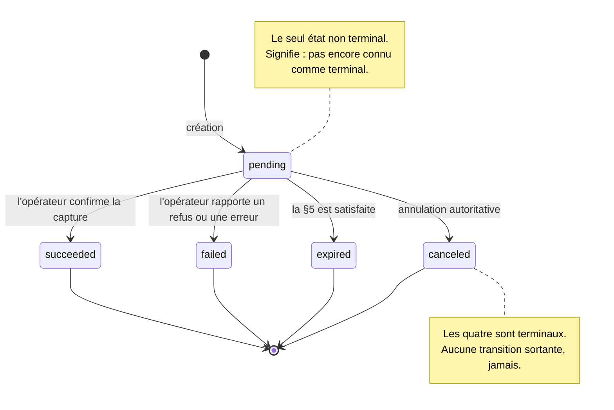

# ADR-0003 : Cycle de vie du paiement

- Voie : Standards
- Statut : Brouillon
- Créée : 2026-08-17
- Dépend de : ADR-0001, ADR-0002

## Résumé

Cette ADR spécifie les états dans lesquels un paiement peut se trouver, les transitions
entre ces états, et les garanties sur lesquelles un client peut s'appuyer en les observant.

Elle définit cinq états fondamentaux, dont quatre sont terminaux, et un invariant dont
dépend tout le reste de la spécification : **un état terminal n'est atteint que sur
information autoritative, et n'est jamais quitté.** Tout le reste découle du fait de
prendre cette règle au sérieux, y compris sa conséquence inconfortable : un paiement peut
légitimement demeurer non terminal pendant longtemps.

## Motivation

Un marchand pose une seule question à propos d'un paiement, indéfiniment répétée :
*puis-je livrer ?*

Y répondre suppose de connaître non seulement l'état courant du paiement, mais ce que cet état
garantit. Un statut susceptible de changer après avoir paru définitif conduit le marchand à
livrer contre un paiement qui n'aboutira pas. Chaque défaillance pratique d'une intégration de
paiement est une variante de cela : une marchandise remise contre un paiement qui s'inverse
ensuite, un client débité deux fois parce que la première tentative avait l'air échouée, une
commande bloquée parce que rien n'a jamais rapporté l'issue.

Les vocabulaires de statut des opérateurs ne facilitent pas la tâche. Ils diffèrent par leur
granularité, ils réutilisent les mêmes mots pour des sens différents, et plusieurs emploient
un statut unique à la fois pour « le payeur n'a pas encore agi » et pour « nous ne savons pas
ce qui s'est passé ». Les faire correspondre à un modèle partagé est le travail que cette ADR
existe pour accomplir une fois, publiquement, plutôt que dans chaque intégration.

La tentation, lorsqu'on établit cette correspondance, est de rendre le modèle assez riche
pour exprimer les distinctions de chaque opérateur. Cette ADR fait l'inverse : elle définit
le plus petit ensemble d'états qui réponde à la question du marchand, et exige que tout ce
qu'un opérateur ne peut pas rapporter honnêtement demeure non rapporté plutôt qu'approximé.
Une machine à états précise sur peu de choses est plus utile qu'une machine vague sur
beaucoup.

## Hors périmètre

- **Aucun format de transport.** Les points d'accès, les corps de requête et de réponse
  relèvent de l'ADR sur l'API HTTP. Cette ADR spécifie le cycle de vie et les champs qui
  l'expriment.
- **Aucune taxonomie d'erreurs d'API.** Une *requête* échouée et un *paiement* échoué sont
  deux choses différentes, voir §7, et la première relève de l'ADR sur la taxonomie
  d'erreurs.
- **Aucun remboursement, capture ou annulation à l'initiative du marchand.** Chacun est une
  capacité optionnelle dotée de sa propre ADR. La §8 spécifie comment une telle ADR peut
  étendre cette machine sans l'invalider.
- **Aucune livraison d'événements.** La façon dont un client apprend une transition relève
  de [ADR-0008](0008-webhooks-and-event-delivery.md). Cette ADR définit ce qu'*est* une
  transition.
- **Aucune procédure de rapprochement.** La §6 impose un devoir de rapprochement ; le
  mécanisme est spécifié séparément.

## Spécification

Les mots-clés MUST, MUST NOT, REQUIRED, SHALL, SHALL NOT, SHOULD, SHOULD NOT, RECOMMENDED,
MAY et OPTIONAL doivent être interprétés comme décrit dans les RFC 2119 et RFC 8174, et
seulement lorsqu'ils apparaissent en capitales.

### 1. Les états

Un paiement se trouve dans exactement un état à chaque instant, porté par le champ `status`
sous la forme de l'une de ces chaînes en minuscules.

| État | Terminal | Signification |
|---|---|---|
| `pending` | non | Créé. Non encore connu comme ayant atteint un état terminal. |
| `succeeded` | **oui** | L'opérateur a confirmé de manière autoritative que les fonds sont capturés. |
| `failed` | **oui** | L'opérateur a rapporté de manière autoritative que le paiement n'aboutira pas. |
| `expired` | **oui** | La fenêtre de paiement s'est fermée sans achèvement, confirmé selon la §5. |
| `canceled` | **oui** | Le paiement a été annulé de manière autoritative avant son achèvement. |

**1.1.** Il existe exactement un état non terminal. `pending` signifie *pas encore connu
comme terminal*, et couvre toutes ces conditions sans distinction : le payeur n'a pas encore
agi ; le payeur a agi et l'opérateur règle ; la passerelle a émis une requête et n'a reçu
aucune réponse.

Ce dernier cas est la raison pour laquelle l'état est défini par ce qui n'est *pas* connu
plutôt que par ce qui se produit. Après une expiration de délai, le paiement peut avoir
réussi, peut avoir échoué, et la passerelle ne peut pas le dire. Aucun état « inconnu »
distinct n'est défini, parce que `pending` signifie déjà exactement cela, et qu'un état
dont la seule signification serait l'absence d'information ajouterait un cas à traiter à
chaque client sans mieux répondre à la question du marchand.

**1.2.** Un client MUST rejeter une valeur de `status` qu'il ne reconnaît pas, plutôt que de
la traiter comme non terminale, et MUST faire remonter la condition comme une erreur. De
nouveaux états ne sont introduits que par une ADR acceptée, et seulement au titre de la §8.

### 2. La machine

**2.1. Transitions permises.** Ces quatre, et aucune autre :

| De | Vers | Provoquée par |
|---|---|---|
| `pending` | `succeeded` | L'opérateur confirme la capture de manière autoritative. |
| `pending` | `failed` | L'opérateur rapporte un refus ou une erreur de manière autoritative. |
| `pending` | `expired` | La §5 est satisfaite. |
| `pending` | `canceled` | Une annulation autoritative, au titre de la §8 ou sur rapport de l'opérateur. |

**2.2.** Une passerelle MUST rejeter et MUST NOT enregistrer toute transition absente de la
§2.1. Lorsqu'un opérateur rapporte un statut impliquant une transition interdite, la
passerelle MUST traiter cela comme un conflit au titre de la §6.4, plutôt que de le résoudre
en déplaçant le paiement.

**2.3.** La machine est délibérément aussi petite. Un paiement est résolu ou il ne l'est pas,
et tant qu'il ne l'est pas, il n'y a rien qu'un marchand puisse faire différemment. Les états
de progression intermédiaires sont examinés et écartés dans *Alternatives écartées*.

### 3. L'invariant de terminalité

**3.1.** Un paiement dans un état terminal MUST NOT transiter vers un autre état, en aucune
circonstance, pour aucune raison, y compris un rapport ultérieur contradictoire de
l'opérateur.

**3.2.** Une passerelle MUST NOT entrer dans un état terminal par inférence, par expiration de
délai, par écoulement du temps, ni sur aucun signal en deçà d'une information autoritative.
Autoritative signifie : établie par l'une des sources du §6.5. Pour `expired`, l'information
est en outre soumise à la §5.

**3.3.** Ces deux règles sont l'objet même de cette ADR, et elles sont délibérément
inconfortables. Ensemble, elles signifient qu'une passerelle qui ne peut pas joindre son
opérateur **MUST laisser le paiement en `pending` indéfiniment** plutôt que de deviner. Elle
ne peut pas le faire échouer au bout de trente secondes, ne peut pas le faire expirer au bout
d'une heure, et ne peut pas le faire réussir parce que le payeur l'a dit.

L'alternative, un état terminal révisable, paraît plus commode et ne l'est pas. La
terminalité est la seule garantie sur laquelle un marchand puisse agir. Si `succeeded` peut
devenir `failed` plus tard, alors `succeeded` signifie « probablement », chaque marchand doit
bâtir son propre rapprochement de toute façon, et la spécification ne lui a rien apporté. Un
paiement en `pending` est un problème opérationnel, visible et traitable. Un état terminal
qui ment est une perte financière découverte plus tard.

**3.4.** Un paiement MAY demeurer non terminal indéfiniment. C'est une issue prise en charge,
non un défaut. La §6 place le devoir correspondant sur la passerelle.

### 4. Les champs du cycle de vie

La ressource paiement complète est spécifiée par l'ADR sur l'API HTTP. Ces champs sont
normatifs ici parce qu'ils expriment le cycle de vie.

| Champ | Type | Présence | Notes |
|---|---|---|---|
| `status` | chaîne | REQUIRED | L'un de ceux de la §1. |
| `created_at` | `Timestamp` | REQUIRED | Moment où la passerelle a créé le paiement. Immuable. |
| `updated_at` | `Timestamp` | REQUIRED | Dernier changement d'état ou de champ. |
| `expires_at` | `Timestamp` | OPTIONAL | Moment où la fenêtre de paiement se ferme. Voir §5. |
| `completed_at` | `Timestamp` | conditionnel | REQUIRED une fois terminal, absent avant. |
| `failure_reason` | chaîne | conditionnel | REQUIRED lorsque `status` vaut `failed`. Voir §7. |
| `failure_detail` | objet | OPTIONAL | Report brut de l'opérateur. Voir §7.4. |

**4.1.** `completed_at` est le moment où le paiement est entré dans son état terminal tel que
la passerelle l'a enregistré, et non le moment où l'opérateur affirme que les fonds ont bougé.
Lorsque l'opérateur fournit son propre horodatage et que les deux diffèrent, la valeur de
l'opérateur est portée dans `failure_detail` ou son équivalent en cas de succès, et MUST NOT
écraser `completed_at`. Les deux répondent à des questions différentes, et une piste d'audit
reconstituable a besoin des deux.

**4.2.** `updated_at` MUST changer à chaque transition d'état. Il MAY également changer sans
transition, par exemple lorsqu'un `provider_reference` arrive tardivement, de sorte qu'un
client MUST NOT inférer une transition du seul `updated_at`.

**4.3.** Une fois l'état terminal atteint, `status`, `completed_at` et `failure_reason` sont
immuables. D'autres champs MAY encore être renseignés par le rapprochement.

### 5. L'expiration

**5.1.** `expires_at`, lorsqu'il est présent, est le moment après lequel le paiement ne peut
plus être achevé par le payeur.

**5.2.** L'écoulement de `expires_at` ne déplace **pas**, à lui seul, le paiement vers
`expired`. Cela découle directement de la §3.2 et c'est la disposition que les implémenteurs
ont le plus de chances de mal comprendre.

**5.3.** Une passerelle MUST NOT enregistrer `expired` à moins que l'une de ces conditions ne
soit remplie :

- **(a)** L'opérateur a rapporté le paiement comme expiré, annulé ou définitivement inachevé,
  par une source du §6.5 (a) à (c) ; ou
- **(b)** `expires_at` est écoulé **et** la passerelle a depuis relu l'état du paiement auprès
  de l'opérateur et s'est vu répondre qu'il n'est pas achevé ; ou
- **(c)** L'opérateur garantit contractuellement qu'un paiement non achevé avant `expires_at`
  ne pourra jamais s'achever par la suite, et la passerelle documente sur quel comportement
  d'opérateur elle s'appuie ; ou
- **(d)** `expires_at` est écoulé **et** un relevé de l'opérateur obtenu au titre du §6.7,
  couvrant une période qui s'achève après `expires_at`, ne mentionne pas le paiement comme
  achevé ; ou
- **(e)** L'exploitant l'atteste au titre du §6.8.

**5.4.** Lorsqu'aucune de ces conditions ne peut être établie, parce que l'opérateur est
injoignable par exemple, le paiement demeure `pending`. Il ne devient pas `expired` parce que
du temps s'est écoulé.

**5.5.** Le risque contre lequel cela protège est précis et coûteux : un payeur achève un
paiement quelques instants avant la fermeture d'une fenêtre, l'opérateur l'enregistre, et la
passerelle, l'ayant fait expirer localement sur une horloge, rapporte un échec terminal pour
un paiement qui a réussi. Le marchand ne livre pas, le client a payé, et rien dans aucun des
deux systèmes n'est signalé comme anormal.

### 6. Le devoir de rapprochement

**6.1.** Une passerelle MUST disposer, pour tout paiement non terminal, d'au moins une source
d'information autoritative au sens du §6.5. Elle MUST annoncer, par la découverte de capacités
d'[ADR-0007](0007-capability-discovery.md), les sources dont elle dispose pour chaque
opérateur, afin qu'un client sache avant d'intégrer si la finalité sera immédiate, différée ou
manuelle.

**6.2.** Une passerelle SHOULD relire périodiquement les paiements non terminaux sans qu'on
le lui demande. Un paiement laissé en `pending` parce qu'un appel réseau a échoué est
invisible de tous jusqu'à ce que quelque chose aille le chercher.

**6.3.** Un rappel entrant d'un opérateur est un **indice**, jamais un fait, sauf lorsqu'il
relève d'une source du §6.5 (a) ou (c). Lorsque l'opérateur signe ses rappels, la vérification
est obligatoire. Dans tous les autres cas, la passerelle MUST NOT transiter sur le seul
contenu du rappel ; elle MAY le traiter comme le signal d'aller consulter une autre source du
§6.5.

**6.4. Conflits.** Lorsqu'un opérateur rapporte un état contredisant un état terminal déjà
enregistré, la passerelle MUST NOT modifier le paiement (§3.1). Elle MUST enregistrer le
conflit de manière durable, MUST le faire remonter à l'exploitant, et MUST NOT le résoudre
silencieusement.

Un tel conflit est un écart financier et requiert un humain, non une correction automatique.
Le rôle de la spécification est de garantir qu'il devienne visible au lieu d'être absorbé par
celle des deux écritures qui a eu lieu en dernier.

**6.5. Sources d'information autoritative.** Seules les sources suivantes fondent une
transition vers un état terminal. Elles sont énumérées de la plus immédiate à la plus lente,
et une passerelle SHOULD utiliser la première dont elle dispose.

- **(a) Rappel signé.** Un rappel dont la signature de l'opérateur a été vérifiée. Annoncée
  par `webhooks.verify`.
- **(b) Consultation.** Une lecture de l'état chez l'opérateur, au titre d'[ADR-0007
  §5](0007-capability-discovery.md). Annoncée par `payments.lookup`.
- **(c) Rappel sur une URL propre au paiement.** Un rappel reçu sur une URL que la passerelle
  a générée pour ce seul paiement, aux conditions du §6.6. Annoncée par
  `webhooks.per_payment_url`.
- **(d) Relevé de l'opérateur.** Un relevé des transactions obtenu de l'opérateur par un canal
  authentifié, aux conditions du §6.7. Annoncée par `payments.statement`.
- **(e) Attestation de l'exploitant.** Une décision enregistrée par une personne habilitée à
  administrer la passerelle, sur une preuve venant de l'opérateur, aux conditions du §6.8.
  Toujours disponible, et jamais annoncée comme capacité.

Une passerelle qui ne dispose pour un opérateur que de la source (e) MAY annoncer `payments`
pour cet opérateur. Chaque paiement y attendra une attestation, et l'absence des capacités (a)
à (d) dans la découverte le signale au client avant qu'il n'intègre.

**6.6. URL propre au paiement.** Pour la source (c), la passerelle MUST générer pour chaque
paiement un jeton d'au moins 128 bits issu d'un générateur cryptographique, MUST l'inclure
dans le chemin de l'URL de rappel transmise à l'opérateur à la création, et MUST le comparer
en temps constant à la réception. Un rappel dont le jeton ne correspond à aucun paiement non
terminal MUST être rejeté sans effet. La passerelle MUST NOT journaliser le jeton. Une URL de
rappel commune à plusieurs paiements MUST NOT être traitée comme source (c) : quiconque l'a
vue une fois pourrait forger un rappel pour n'importe quel paiement.

La source (c) prouve seulement que l'expéditeur connaissait l'URL, c'est-à-dire l'opérateur ou
quiconque a eu accès à ses journaux. La garantie est plus faible qu'une signature, et c'est
pourquoi elle est annoncée sous un nom distinct.

**6.7. Relevé.** Pour la source (d), un paiement mentionné comme achevé dans un relevé est
`succeeded`, et un paiement mentionné comme refusé ou annulé prend l'état terminal
correspondant. L'absence d'un paiement dans un relevé ne fonde `expired` qu'aux conditions de
la §5.3 (d). Un relevé importé à la main par l'exploitant relève de la source (e), non de la
source (d).

**6.8. Attestation.** Pour la source (e), la passerelle MUST enregistrer de façon durable
l'identité de la personne, l'horodatage, l'état attesté et la référence de la preuve invoquée.
Ce moyen MUST relever de l'administration de la passerelle et MUST NOT être exposé par l'API
d'[ADR-0006](0006-gateway-http-api-payments.md) : une clé qui porte `payments:write` ne doit
jamais pouvoir déclarer ses propres paiements réussis. Une attestation est soumise au §3.1
comme toute autre transition, et un rapport ultérieur contradictoire de l'opérateur relève du
§6.4.

### 7. Paiements échoués et motifs d'échec

**7.1.** Un paiement échoué et une requête échouée sont deux événements différents. Une
requête qui renvoie un HTTP `200` avec `"status": "failed"` a **réussi** : l'API a fonctionné
et a rapporté que le paiement, lui, n'a pas abouti. Les erreurs de niveau API, requête
malformée, échec d'authentification, opérateur injoignable, ne sont pas des états de paiement
et sont spécifiées par l'ADR sur la taxonomie d'erreurs.

Confondre les deux est un défaut d'intégration répandu : un client qui traite toute réponse
non 2xx comme un « paiement échoué » marquera comme échoués des paiements qui n'ont jamais
été tentés, et les réessaiera jusqu'à produire des doublons.

**7.2.** Lorsque `status` vaut `failed`, `failure_reason` est REQUIRED et MUST valoir l'une
de ces valeurs :

| Valeur | Signification |
|---|---|
| `declined` | L'opérateur a refusé sans motif plus précis. |
| `insufficient_funds` | Le solde du payeur était insuffisant. |
| `payer_canceled` | Le payeur a abandonné ou refusé le paiement. |
| `payer_unreachable` | Le compte ou le numéro du payeur n'a pas pu être joint. |
| `limit_exceeded` | Un plafond de l'opérateur ou réglementaire a été dépassé. |
| `rejected_by_provider` | Refusé pour un motif propre à l'opérateur, tel que le risque ou la conformité. |
| `provider_error` | L'opérateur a rapporté une défaillance de son côté. |
| `unspecified` | L'opérateur a rapporté un échec sans motif exploitable. |

**7.3.** `unspecified` MUST être employé lorsque l'opérateur ne donne aucun motif, ou en donne
un que la passerelle ne peut pas faire correspondre avec certitude. Deviner une valeur plus
précise à partir d'un code d'opérateur inconnu est interdit. La réponse automatisée d'un
marchand à `insufficient_funds` diffère de sa réponse à `provider_error`, et une mauvaise
supposition produit une mauvaise action automatisée.

**7.4.** `failure_detail` porte l'erreur propre de l'opérateur, telle quelle : au minimum son
code et son message, inaltérés. Un motif neutre seul est intraçable lorsqu'un marchand appelle
le support de l'opérateur ; un report brut seul est inexploitable par programme. Les deux sont
nécessaires pour que la paire serve à quelque chose.

**7.4.1.** Cette énumération est le point où OpenFSP et ISO 20022 se rencontrent sur le sujet
de l'échec. [ADR-0010](0010-iso-20022-semantic-correspondence.md) fait correspondre chaque
valeur ci-dessus au code de motif ISO 20022 désignant la même condition, `insufficient_funds`
vers `AM04` et ainsi de suite, et consigne explicitement les valeurs pour lesquelles aucun
code de motif n'existe. La correspondance est documentée là-bas et non ici, afin que cette
énumération ne réponde qu'au cycle de vie. Une valeur y est ajoutée parce qu'un marchand
agirait différemment dessus, jamais parce qu'ISO 20022 dispose d'un code actuellement
inutilisé.

**7.5.** Cette énumération est fermée. L'étendre requiert une ADR. Un client MUST traiter un
`failure_reason` non reconnu comme `unspecified` et MUST NOT échouer à traiter le paiement.
Ici, contrairement à la §1.2, la tolérance est correcte, parce que le paiement a déjà échoué
de manière terminale et que l'action nécessaire du marchand ne dépend pas du motif.

### 8. Extension par capacité

**8.1.** Les états de la §1 sont ceux que toute passerelle conforme prend en charge. Des
capacités peuvent introduire des états supplémentaires : une autorisation en deux temps, par
exemple, a besoin d'un état entre l'autorisation et la capture.

**8.2.** Un tel état MUST être introduit par l'ADR qui définit cette capacité, laquelle MUST
spécifier ses transitions vers et depuis la machine de base, et s'il est terminal.

**8.3.** Une passerelle MUST NOT rapporter un état propre à une capacité à moins d'annoncer
cette capacité. Un client qui n'a pas négocié une capacité n'observera donc jamais ses états,
ce qui est ce qui rend la §1.2 sûre à faire appliquer strictement.

**8.4.** Une ADR de capacité MUST NOT altérer le sens d'un état de base, MUST NOT ajouter une
transition sortant d'un état terminal, et MUST NOT affaiblir la §3.

**8.5. Les remboursements ne changent pas l'état d'un paiement.** Un remboursement est une
ressource distincte qui référence le paiement. Un paiement intégralement remboursé demeure
`succeeded`, parce qu'il a bel et bien réussi ; le remboursement est un événement ultérieur,
auditable séparément. Cela maintient la machine de base implémentable par des opérateurs
dépourvus de capacité de remboursement, et garde l'enregistrement historique honnête : un
paiement qui a réussi puis été remboursé est un fait différent d'un paiement qui n'a jamais
réussi.

## Compatibilité

Spécification nouvelle. Rien à casser.

La machine à états est la chose la plus coûteuse à modifier ultérieurement dans OpenFSP,
puisque chaque ADR de capacité, l'API et la spécification des notifications s'appuient
dessus. C'est la raison pour laquelle la §8 définit le mécanisme d'extension dès maintenant,
afin que les capacités ultérieures étendent la machine plutôt que de l'amender.

Ajouter un état à la §1 est une rupture de compatibilité. Ajouter une valeur de
`failure_reason` n'en est pas une, compte tenu de la §7.5.

## Considérations de sécurité

**Les états terminaux comme frontière de sécurité.** La §3.1 est une propriété de sécurité
autant que de correction. Un `succeeded` révisable est exploitable : un attaquant capable
d'influencer un rapport ultérieur de l'opérateur, ou d'en rejouer un, peut retourner un
paiement achevé. Une terminalité immuable supprime la classe entière.

**Rappels non vérifiés.** La §6.3 existe parce qu'un point d'accès de rappel non authentifié
qui fait transiter des paiements est une voie directe vers un règlement frauduleux. Traiter
les rappels comme des indices fait qu'en forger un ne coûte à un attaquant rien de plus
qu'une requête gaspillée.

**URL de rappel propre au paiement.** La source (c) du §6.5 déplace le secret de la signature
vers l'URL. Tout système qui voit cette URL, journaux de l'opérateur, proxys intermédiaires ou
outils de support, détient de quoi forger un rappel pour ce paiement, et pour lui seul. Le
§6.6 borne l'exposition en liant chaque jeton à un paiement, en interdisant sa journalisation
par la passerelle, et en le rendant inopérant une fois le paiement terminal.

**Attestation.** La source (e) est la plus puissante : une personne peut faire réussir un
paiement. Le §6.8 la retire de l'API marchande et exige une trace nominative. Un déploiement
SHOULD en outre la soumettre à une seconde validation au-delà d'un montant qu'il fixe.

**Divulgation du motif d'échec.** `failure_reason` est renvoyé au marchand, non au payeur.
Des valeurs telles que `insufficient_funds` divulguent une information sur le compte du
payeur, et un marchand qui la relaierait telle quelle sur une page de paiement la révélerait
à quiconque se trouve devant l'appareil. Les implémentations SHOULD mettre en garde contre
cela dans leur documentation client.

**Contenu du report brut.** `failure_detail` porte une sortie d'opérateur que la passerelle
n'a pas rédigée. Elle MUST être traitée comme non fiable au moment de l'affichage : un
message d'opérateur atteignant un tableau de bord marchand sans échappement est un vecteur
d'injection de script issu de l'extérieur des deux parties.

**Étouffement des conflits.** La §6.4 interdit la résolution silencieuse parce que le silence
est exactement ce que voudrait un attaquant exploitant une situation de concurrence. Un
conflit journalisé et remonté est un incident ; un conflit absorbé est une perte non détectée.

**Énumération par la mesure.** Lorsqu'un opérateur distingue `payer_unreachable` de
`declined`, la paire divulgue si un numéro de téléphone est enregistré. Cela est inhérent au
comportement de l'opérateur plutôt qu'introduit ici, mais les implémentations SHOULD limiter
le débit de création de paiements pour empêcher que cela serve à une découverte de comptes en
masse.

## Considérations réglementaires

**Auditabilité.** La combinaison d'un état terminal immuable, de `completed_at` et de
l'horodatage conservé de l'opérateur (§4.1) fait que la séquence d'événements de tout paiement
peut être reconstituée a posteriori à partir des seuls enregistrements de la passerelle.

**Traitement des écarts.** L'exigence de la §6.4, selon laquelle les conflits doivent être
enregistrés et remontés plutôt que résolus silencieusement, est ce qui permet à un exploitant
de démontrer à un superviseur que les écarts sont détectés et escaladés au lieu d'être
écrasés. C'est fréquemment la substance d'un examen de risque opérationnel.

**Codes de motif.** L'énumération fermée de la §7.2 donne un vocabulaire stable pour rapporter
les transactions refusées d'un opérateur à l'autre. Lorsqu'une autorité exige des catégories
de reporting, elles peuvent en être dérivées sans toucher au protocole.

**Aucune finalité silencieuse.** L'interdiction faite par la §3.2 d'inférer des états
terminaux signifie qu'aucun paiement n'est jamais enregistré comme échoué sans une déclaration
de l'opérateur en ce sens, ce qui compte lorsqu'un payeur conteste une transaction, puisque
l'enregistrement de la passerelle cite alors l'opérateur ou montre `pending`.

**L'irrévocabilité ne fonde qu'une partie de l'invariant.** La section 13.5 de `BRH-121`
impose un règlement en temps réel et rend l'ordre de paiement irrévocable. Un paiement
`succeeded` est un ordre exécuté : en interdisant d'en sortir, la §3.1 s'aligne sur cette
règle. Pour `failed`, `expired` et `canceled`, aucun ordre n'a été exécuté et la circulaire ne
dit rien ; leur terminalité repose sur le motif exposé dans la *Motivation*, le client qui
relance après un échec apparent et se retrouve débité deux fois. Une machine à états qui
permettrait de réviser un paiement réussi modéliserait un autre marché, et [ADR-0010
§7.15](0010-iso-20022-semantic-correspondence.md) consigne qu'OpenFSP est ici plus strict
qu'ISO 20022, qui comporte des messages entiers pour les contre-passations.

**La falsification des données de transaction est interdite, ce qui donne à la §3.1 une
seconde raison d'exister.** `BRH-131` interdit à une institution de « manipuler ou falsifier
les données de transaction dans le cadre des services numériques » [BRH-131, p. 8, § 6.1 v)].
Un état terminal qu'on ne peut pas quitter est une protection contre la réécriture
rétroactive autant qu'une commodité d'ingénierie, et l'exigence de la §2.1 de traiter une
transition impossible comme une erreur d'opérateur plutôt que de l'appliquer est ce qui
empêche une passerelle d'en blanchir une.

**Un échec qu'un marchand sait nommer est un échec qu'une institution sait rapporter.**
`BRH-131` interdit de négliger de signaler et de compenser une perte du consommateur liée à
une défaillance du système [BRH-131, p. 8, § 6.1 s)]. L'énumération fermée de `failure_reason`
de la §7.2, associée au `failure_detail` brut de la §7.4, est ce qui rend cela rapportable
plutôt qu'anecdotique.

## Références

Citations complètes dans [`references.md`](references.md).

**Normatives.** `RFC3339` pour les horodatages, `RFC2119` et `RFC8174` pour les mots-clés
d'exigence.

**Informatives.** `BRH-121` section 13.5 pour l'irrévocabilité et le règlement en temps réel,
et `BRH-131` sections 6.1 s) et 6.1 v). `ISO20022` pour la correspondance des codes de motif,
établie dans [ADR-0010 §6](0010-iso-20022-semantic-correspondence.md) plutôt qu'ici.

## Alternatives écartées

**Un état terminal révisable.** Permettre à `succeeded` de devenir `failed` sur un rapport
contradictoire ultérieur. Plus simple à implémenter, et cela correspond à ce que plusieurs
opérateurs font en interne. Écarté au titre de la §3.3 : cela rend tout état terminal
consultatif et reporte le rapprochement sur chaque marchand, ce qui est le coût que la
spécification existe pour supprimer.

**Un état `unknown` explicite** pour la condition consécutive à une expiration de délai.
Séduisant par son honnêteté, et écarté parce que `pending` signifie déjà « pas connu comme
terminal ». Un état distinct ajouterait un cas à chaque client sans donner au marchand
d'information nouvelle : la réponse à « puis-je livrer ? » est identique.

**Un état `processing`**, atteint lorsque le payeur a agi et que l'opérateur règle. Une
version antérieure de cette ADR le comportait, optionnel et indicatif. Il a été retiré.

L'argument en sa faveur est réel : certains opérateurs rapportent effectivement la
distinction, et une interface de paiement peut s'en servir pour montrer au payeur qu'il se
passe quelque chose. L'argument contraire est qu'il ne change aucune décision. Pour chaque
question qu'un marchand se pose réellement, puis-je livrer, puis-je réessayer, est-ce résolu,
`processing` et `pending` sont identiques, de sorte que l'état n'existerait que pour être
affiché.

Ce qui a tranché est une asymétrie de coût. Retirer un état plus tard est une rupture de
compatibilité pour chaque client ; en ajouter un plus tard en est également une, mais plus
petite et mieux informée, et la §8 fournit le mécanisme pour l'introduire aux côtés de la
capacité qui en a besoin. Face à un état qui pourrait mériter sa place, l'erreur la moins
chère est de l'omettre. Si une capacité de paiement en démontre plus tard le besoin, elle
pourra l'apporter avec elle et dire précisément quel comportement d'opérateur le renseigne.

**Une machine plus riche, calquée sur les vocabulaires des opérateurs**, avec `initiated`,
`authorized`, `settling`, `settled`, `reversed`. Expressive, et écartée parce que la plupart
des opérateurs ne peuvent en renseigner la plus grande partie, de sorte que les passerelles
infèreraient, et l'inférence est l'émulation que
[ADR-0001](0001-architecture-and-scope.md#principes-de-conception) interdit. Des états que personne
ne peut rapporter honnêtement sont pires que des états absents.

**L'expiration par horloge.** Faire passer un paiement à `expired` lorsque `expires_at`
s'écoule, sans confirmation de l'opérateur. C'est ce que font la plupart des implémentations,
et la §5.5 décrit exactement ce que cela coûte. Écartée.

**Le remboursement comme état de paiement.** Un statut `refunded` est intuitif et figure dans
plusieurs API. Écarté au titre de la §8.5 : il force chaque passerelle à modéliser les
remboursements même là où l'opérateur n'a pas cette capacité, et il détruit la distinction
entre un paiement qui n'a jamais réussi et un paiement qui a réussi puis été contre-passé,
distinction qui compte en comptabilité comme en résolution de litige.

**Un état terminal unique `closed`** assorti d'un champ d'issue distinct. Moins d'états, et
l'issue est de toute façon là où l'information réside. Écarté comme fausse économie : les
clients se brancheraient immédiatement sur le champ d'issue, ce qui est une machine à états
avec une indirection supplémentaire, et cela rendrait `status` inutile comme chose qu'un
marchand lit.

## Questions non résolues

1. **Faut-il rendre `expires_at` REQUIRED ?** Faire expirer chaque paiement borne l'ensemble
   des paiements indéfiniment en `pending`, que la §3.4 laisse autrement non borné. Mais cela
   ne peut être honoré que là où l'opérateur prend en charge un contrat d'expiration, et
   imposer un champ que les passerelles ne peuvent pas faire respecter serait l'émulation que
   cette spécification interdit.
2. **Une cadence minimale de rapprochement.** La §6.2 dit SHOULD, sans intervalle. Un plancher
   normatif rendrait la garantie testable par la suite de conformité ; il pourrait aussi être
   inapplicable d'un opérateur à l'autre, les limites de débit divergeant.
3. **La représentation des conflits.** La §6.4 exige qu'un conflit soit enregistré et remonté
   mais ne spécifie pas comment il apparaît dans l'API. Cela mériterait peut-être une ressource
   propre plutôt que d'être laissé à l'outillage de l'exploitant.
4. **Capture partielle et remboursement partiel.** Les deux interagissent avec la §8.5 et
   aucun n'est tranché. Ils sont signalés ici uniquement pour que les ADR de capacité ne
   supposent pas la question ouverte alors qu'elle a en réalité été fermée par la §3.
5. **Exposer la source par paiement.** La §6.1 fait annoncer les sources disponibles par
   opérateur, mais un paiement ne dit pas laquelle a fondé son état terminal. Un marchand
   pourrait vouloir distinguer un `succeeded` attesté d'un `succeeded` signé pour ses propres
   contrôles. L'ajouter toucherait le modèle de données d'[ADR-0002](0002-core-data-model.md)
   et la ressource d'[ADR-0006](0006-gateway-http-api-payments.md).

## Implémentation de référence

Aucune à ce jour.

## Errata

Aucun.
