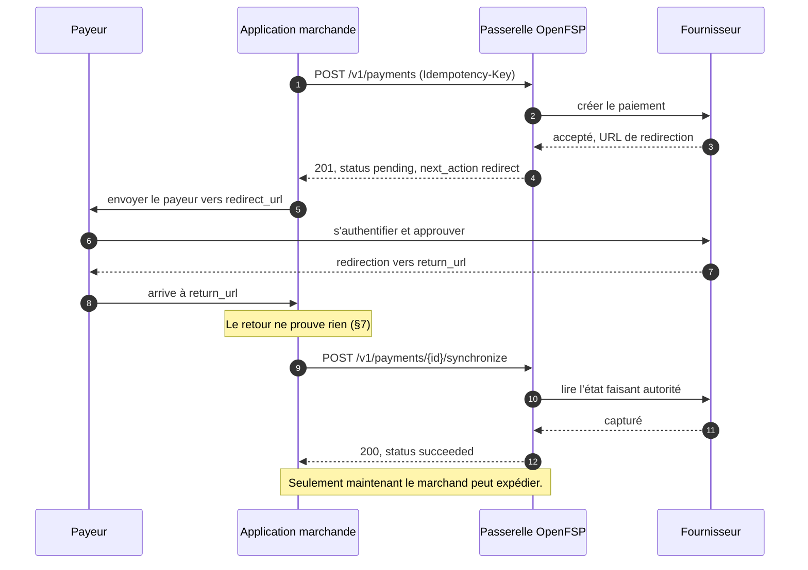

# ADR-0006 : API HTTP de la passerelle, paiements

- Voie : Standards
- Statut : Brouillon
- Créée : 2026-08-17
- Dépend de : ADR-0001, ADR-0002, ADR-0003, ADR-0004, ADR-0005

## Résumé

Cette ADR spécifie les conventions HTTP que suit chaque point d'accès OpenFSP, et les points
d'accès de paiement eux-mêmes : créer un paiement, le lire, et le synchroniser avec le
fournisseur.

C'est la première ADR qu'un client appelle réellement. Tout ce qui précède définissait un
vocabulaire, des garanties et des modes de défaillance ; celle-ci les assemble en une
surface, et définit la **capacité de base** que toute passerelle conforme doit implémenter.

## Motivation

Un marchand a besoin de trois choses d'une API de paiement, et de trois seulement pour
commencer.

Il a besoin de **démarrer un paiement** et qu'on lui dise ce que le payeur doit faire
maintenant, parce qu'un paiement qui exige une redirection et un paiement qui exige que le
payeur approuve sur son combiné sont deux produits différents du point de vue du tunnel
d'achat. Il a besoin de **relire le paiement**, à la fois par l'identifiant que la passerelle
a retourné et par la référence qu'il a choisie lui-même, parce qu'après une expiration la
seconde est la seule qu'il détient. Et il a besoin de **forcer une relecture chez le
fournisseur**, parce qu'un paiement resté `pending` faute d'un rappel perdu doit pouvoir être
résolu sans attendre une tâche de fond que personne ne voit.

Tout le reste, remboursements, listes et reporting compris, est soit une capacité soit une
préoccupation ultérieure. Spécifier la plus petite surface qui permette à un marchand
d'encaisser et de savoir s'il a encaissé est ce qui rend la capacité de base implémentable
par tout fournisseur, ce qui est la condition préalable à tout le modèle de capacités de
[ADR-0001](0001-architecture-and-scope.md#principes-de-conception).

Les conventions HTTP du §1 sont spécifiées ici plutôt que dans un document séparé parce que
c'est la première ADR qui en a besoin, et qu'une ADR de conventions sans point d'accès
auquel les appliquer tend à spécifier des choses que personne n'a essayées.

## Hors périmètre

- **Aucun remboursement, capture, annulation ni transfert.** Chacun est une capacité
  optionnelle avec sa propre ADR.
- **Aucune liste ni recherche.** Un marchand qui rapproche en masse a besoin de pagination,
  de filtrage et d'ordonnancement, ce qui est un problème distinct aux caractéristiques de
  performance distinctes. La recherche par référence (§5.2) couvre le cas opérationnel ; le
  reporting viendra plus tard.
- **Aucun schéma d'authentification.** La façon dont un client prouve qui il est relève de
  [ADR-0009](0009-authentication-and-credentials.md). Cette ADR suppose qu'un principal
  authentifié existe et s'y réfère.
- **Aucune découverte de capacités.** La façon dont un client apprend ce que cette
  passerelle prend en charge est l'ADR suivante. Celle-ci définit la capacité de base, qui
  n'exige aucune découverte parce que toute passerelle conforme la possède.
- **Aucune livraison de webhooks.** Le §6 décrit comment un client apprend aujourd'hui les
  changements, par sondage. La livraison d'événements est spécifiée dans
  [ADR-0008](0008-webhooks-and-event-delivery.md) et ne remplace pas le sondage.

## Spécification

Les mots-clés MUST, MUST NOT, REQUIRED, SHALL, SHALL NOT, SHOULD, SHOULD NOT, RECOMMENDED,
MAY et OPTIONAL sont à interpréter comme décrit dans les RFC 2119 et RFC 8174, lorsque, et
seulement lorsque, ils apparaissent en capitales.

### 1. Conventions HTTP

Elles s'appliquent à chaque point d'accès OpenFSP, dans cette ADR et dans toutes les
suivantes.

**1.1. Transport.** HTTPS uniquement. Une passerelle MUST NOT servir l'API en HTTP clair en
dehors d'un mode de développement explicitement signalé, et ce mode MUST être annoncé dans
le journal de démarrage.

**1.2. Chemin de base.** Chaque point d'accès vit sous `/v1`. La version majeure apparaît
dans le chemin et ne change que lors d'une rupture de compatibilité, au titre de
[GOVERNANCE.md §5](https://github.com/openfspht/openfsp/blob/main/GOVERNANCE.md#5-garanties-de-stabilité).

**1.3. Les versions mineures ne sont pas dans le chemin.** Les changements additifs sont
découverts par la découverte de capacités, non déduits d'un numéro de version. Un client
demande ce qu'un déploiement sait faire ; il ne le déduit pas.

**1.4. Types de média.** Les corps de requête sont en `application/json`. Les réponses de
succès sont en `application/json`. Les réponses d'erreur sont en `application/problem+json`,
selon [ADR-0005 §1.1](0005-error-taxonomy.md).

**1.5.** Une passerelle MUST rejeter une requête dont le corps est présent avec un
`Content-Type` non pris en charge, avec `malformed-request`.

**1.6. Méthodes.** `POST` crée ou agit. `GET` lit. `PATCH` et `DELETE` ne sont pas utilisés
par cette ADR. Une passerelle MUST retourner `405` avec `Allow` pour une méthode qu'elle
n'implémente pas sur un chemin connu.

**1.7. Idempotence.** Tout `POST` qui crée ou mute une ressource porte `Idempotency-Key` et
est régi par [ADR-0004](0004-idempotency-and-retries.md).

L'unique exception dans cette ADR est la synchronisation (§5.3), exemptée au titre de
[ADR-0004 §1.5](0004-idempotency-and-retries.md). Le §5.3.7 en donne le raisonnement. Une
passerelle MUST NOT étendre l'exemption à une autre opération.

**1.8. Identifiants de requête.** Chaque réponse, de succès ou non, porte un en-tête
`Request-Id` dont la valeur est le `request_id` de
[ADR-0005 §1.6](0005-error-taxonomy.md). Le porter aussi bien en succès qu'en échec
signifie qu'un marchand peut le citer pour toute requête, pas seulement pour celles qui ont
mal tourné.

**1.9. Champs inconnus.** Les requêtes sont strictes, les réponses tolérantes, selon
[ADR-0002 §2.3 et 2.4](0002-core-data-model.md).

**1.10. Barres obliques finales.** Les chemins sont canoniques sans barre oblique finale.
Une passerelle MUST traiter `/v1/payments/` comme `/v1/payments` et non comme une ressource
distincte.

**1.11. Temps.** Chaque horodatage de chaque charge utile est un `Timestamp` selon
[ADR-0002 §7](0002-core-data-model.md) : RFC 3339, UTC, `Z`.

**1.12. Collections.** Une réponse portant zéro ressource ou plus est un objet comportant un
unique membre REQUIRED `data`, un tableau de ressources. Ce n'est jamais un tableau nu.

```json
{ "data": [] }
```

Une enveloppe est utilisée pour que des membres puissent être ajoutés plus tard, les
curseurs de pagination et les totaux étant les candidats évidents, sans rupture de
compatibilité. Un tableau au niveau supérieur ne peut pas être étendu du tout : chaque API
qui a commencé par un tableau et a ensuite eu besoin de pagination a dû soit versionner le
point d'accès, soit retourner une forme différente selon l'appelant.

Cette ADR ne définit aucune pagination, parce qu'elle ne définit aucune liste. Une ADR
ultérieure qui en ajoutera une ajoutera des membres à cette enveloppe, et les clients
ignorent les membres qu'ils ne reconnaissent pas (§1.9), de sorte que cela ne coûte rien.

### 2. La capacité de base

**2.1.** Les trois opérations de cette ADR constituent la **capacité de base**, nommée
`payments`. Toute passerelle conforme MUST implémenter les trois pour chaque fournisseur
qu'elle prend en charge.

**2.2.** Un client MUST NOT être tenu d'effectuer une découverte de capacités avant de les
utiliser. Elles sont la seule partie de la surface dont la présence est garantie.

**2.3.** La capacité de base est délibérément aussi réduite. Toute opération qu'on y
ajouterait doit être implémentable par chaque fournisseur, et un fournisseur qui ne peut pas
en implémenter une honnêtement devrait l'émuler, ce que
[ADR-0001](0001-architecture-and-scope.md#principes-de-conception) interdit. Le remboursement,
la capture et l'annulation sont absents de la base exactement pour cette raison, et non
parce qu'ils seraient sans importance.

### 3. La ressource Payment

```json
{
  "id": "pay_01J9ZK3QF8XN2M7VYB4C6D8E0G",
  "reference": "INV-2026-00184",
  "status": "pending",
  "amount": { "amount": 125000, "currency": "HTG" },
  "provider": "moncash",
  "provider_reference": null,
  "payer": { "phone_number": "+50934567890" },
  "description": "Invoice 184",
  "next_action": {
    "type": "redirect",
    "redirect_url": "https://provider.example/checkout/abc123",
    "expires_at": "2026-08-17T15:02:07Z"
  },
  "created_at": "2026-08-17T14:32:07.412Z",
  "updated_at": "2026-08-17T14:32:07.412Z",
  "expires_at": "2026-08-17T15:02:07Z",
  "completed_at": null,
  "failure_reason": null,
  "failure_detail": null,
  "fee": null,
  "metadata": { "order_id": "184" }
}
```

**3.1. Champs.**

| Champ | Type | Présence | Notes |
|---|---|---|---|
| `id` | `ResourceId` | REQUIRED | Assigné par la passerelle. Opaque. |
| `reference` | `Reference` | REQUIRED | Choisie par le marchand. Unique. |
| `status` | chaîne | REQUIRED | [ADR-0003 §1](0003-payment-lifecycle.md). |
| `amount` | `Money` | REQUIRED | [ADR-0002 §3](0002-core-data-model.md). |
| `provider` | chaîne | REQUIRED | L'identifiant du fournisseur vers lequel ce paiement a été acheminé. |
| `provider_reference` | `ProviderReference` | OPTIONAL | Peut être absent, possiblement définitivement. |
| `payer` | objet | OPTIONAL | Voir 3.3. |
| `description` | chaîne | OPTIONAL | Texte du marchand, jusqu'à 255 points de code. |
| `next_action` | objet | conditionnel | REQUIRED tant que `pending`, absent une fois terminal. Voir §4. |
| `created_at` | `Timestamp` | REQUIRED | Immuable. |
| `updated_at` | `Timestamp` | REQUIRED | [ADR-0003 §4.2](0003-payment-lifecycle.md). |
| `expires_at` | `Timestamp` | OPTIONAL | [ADR-0003 §5](0003-payment-lifecycle.md). |
| `completed_at` | `Timestamp` | conditionnel | REQUIRED une fois terminal. |
| `failure_reason` | chaîne | conditionnel | REQUIRED lorsque `failed`. |
| `failure_detail` | objet | OPTIONAL | Relais du fournisseur. |
| `fee` | `Fee` | OPTIONAL | Ce que le fournisseur a facturé ([ADR-0002 §8](0002-core-data-model.md)). Absent signifie non connu. Voir §3.5. |
| `metadata` | `Metadata` | OPTIONAL | [ADR-0002 §9](0002-core-data-model.md). |

**3.2. `provider`** est un identifiant en minuscules correspondant à `^[a-z0-9_]{1,32}$`,
nommant l'adaptateur qui a traité ce paiement. Sa valeur n'est pas choisie par la
passerelle : les identifiants sont assignés par
[`registries/providers.md`](https://github.com/openfspht/openfsp/blob/main/registries/providers.md)
au titre de [ADR-0007 §2.6](0007-capability-discovery.md), afin que le même fournisseur
porte le même nom sur chaque déploiement. Il est REQUIRED même là où la passerelle ne prend
en charge qu'un seul fournisseur, afin que les enregistrements stockés par un marchand
restent sans ambiguïté si un second est ajouté plus tard.

**3.3. `payer`** porte actuellement exactement un champ, `phone_number`, un `PhoneNumber`
selon [ADR-0002 §5](0002-core-data-model.md). C'est un objet plutôt qu'une chaîne nue
afin qu'une ADR future puisse ajouter des champs sans rupture de compatibilité. Savoir si
OpenFSP devrait modéliser plus richement l'identité du payeur reste ouvert dans
[ADR-0001](0001-architecture-and-scope.md#questions-non-résolues).

**3.4.** `description` est un texte fourni par le marchand. Une passerelle MAY le transmettre
au fournisseur, où il peut être montré au payeur. Il MUST NOT contenir de données
personnelles, pour la raison donnée à propos de `Reference` en
[ADR-0002 §6.2.4](0002-core-data-model.md).

**3.5. `fee`** porte ce que le fournisseur a facturé, au titre de
[ADR-0002 §8](0002-core-data-model.md). Trois règles le régissent ici.

Il est rapporté, jamais demandé : une passerelle MUST rejeter une requête de création
contenant `fee` au titre du §1.9, parce que les frais appartiennent au fournisseur à
déclarer et qu'un client qui pourrait les fixer pourrait fausser un reçu.

Il MAY n'apparaître qu'une fois le paiement terminal, et son arrivée fait bouger
`updated_at` sans changer `status`. Un client qui sonde un paiement terminal pour obtenir les
frais fait quelque chose que la spécification soutient.

Son absence signifie que la passerelle n'a pas été informée, et MUST NOT être affichée comme
zéro. Là où le fournisseur ne divulgue jamais de frais, la passerelle n'annonce pas
`payments.fee` et le champ est définitivement absent, ce qu'un client apprend à la découverte
plutôt que par déduction.

**3.6. Pourquoi un paiement porte des frais du tout**, alors que ce n'est pas nécessaire pour
encaisser. La section 8 de la circulaire 121 de la BRH impose un reçu portant la référence de
la transaction, la nature du service, le nom du fournisseur, les parties, la date, le montant
et les frais. Le reçu est au marchand de le produire, pas à la passerelle, ce qui est
pourquoi rien ici n'oblige une passerelle à en rendre un. Mais un marchand qui ne peut pas
lire les frais depuis le paiement doit les obtenir ailleurs, et une API d'intégration qui
laisse hors d'elle-même une donnée légalement exigée a résolu la partie facile du problème.

### 4. `next_action`

**4.1.** `next_action` indique au client ce qui doit se produire ensuite pour que le paiement
avance. Il est REQUIRED tant que le paiement est `pending` et MUST être absent une fois qu'il
est terminal.

**4.2. Types.** Cette énumération est fermée.

| `type` | Signification | Champs supplémentaires |
|---|---|---|
| `redirect` | Le payeur doit être envoyé vers une page hébergée par le fournisseur. | `redirect_url`, `expires_at` |
| `payer_approval` | Le payeur doit approuver sur son propre appareil, par invite USSD, notification, ou similaire. Le client attend. | aucun |
| `none` | Rien de plus n'est requis du payeur. Le paiement se dénoue. | aucun |

**4.3.** Une passerelle MUST rapporter le type que son fournisseur exige réellement, et MUST
NOT en substituer un à un autre. En particulier, une passerelle MUST NOT rapporter `none`
parce qu'elle ignore ce que le fournisseur attend ; là où l'exigence d'un fournisseur ne peut
pas être déterminée, la création a échoué et est rapportée comme une erreur, non comme un
paiement assorti d'une action inutile.

**4.4. `redirect_url`** est l'endroit où le navigateur du payeur est envoyé. Il est contrôlé
par le fournisseur. Un client MUST le traiter comme opaque, MUST NOT le réécrire, et MUST NOT
l'intégrer dans un cadre qui masque son origine au payeur, qui s'apprête à s'authentifier
auprès de lui.

**4.5.** `next_action.expires_at` est la durée de vie de l'action, qui MAY être plus courte
que l'`expires_at` du paiement lui-même. Un lien de redirection expiré ne rend pas le
paiement terminal ; cela signifie qu'un paiement neuf doit être donné au payeur.

**4.6.** `payer_approval` ne porte aucun champ parce qu'il n'y a rien à faire pour le client
sinon attendre et sonder (§6). Il existe comme type distinct pour qu'un tunnel d'achat puisse
dire au payeur de consulter son combiné plutôt que de lui montrer un indicateur de chargement
sans explication.

### 5. Points d'accès

#### 5.1. Créer un paiement

```
POST /v1/payments
```

**Requête**

```json
{
  "reference": "INV-2026-00184",
  "amount": { "amount": 125000, "currency": "HTG" },
  "provider": "moncash",
  "payer": { "phone_number": "+50934567890" },
  "description": "Invoice 184",
  "return_url": "https://merchant.example/checkout/184/return",
  "expires_at": "2026-08-17T15:02:07Z",
  "metadata": { "order_id": "184" }
}
```

| Champ | Présence | Notes |
|---|---|---|
| `reference` | REQUIRED | Unique. Un doublon donne `reference-conflict`. |
| `amount` | REQUIRED | Strictement positif, selon [ADR-0002 §3.6](0002-core-data-model.md). |
| `provider` | REQUIRED | Voir 5.1.1. |
| `payer` | conditionnel | REQUIRED là où le fournisseur en a besoin. Voir 5.1.2. |
| `description` | OPTIONAL | |
| `return_url` | conditionnel | REQUIRED là où le fournisseur utilise une action `redirect`. Voir 5.1.3. |
| `expires_at` | OPTIONAL | Une demande, pas une garantie. Voir 5.1.4. |
| `metadata` | OPTIONAL | |

**5.1.1.** `provider` est REQUIRED. La passerelle ne choisit pas de fournisseur pour le
compte du client, parce qu'un acheminement automatique est une décision comportementale
silencieuse et que [ADR-0001](0001-architecture-and-scope.md#principes-de-conception) les
interdit. Savoir si le protocole devrait un jour exprimer une préférence d'acheminement est
une question ouverte dans cette ADR.

**5.1.2.** Le caractère obligatoire de `payer` dépend du fournisseur : un flux par
notification a besoin du numéro d'emblée, un flux par redirection le recueille sur la page du
fournisseur. Une passerelle MUST le documenter par adaptateur et MUST rejeter une requête à
laquelle manque un champ que son fournisseur exige, avec `missing-field`.

**5.1.3.** `return_url` est l'endroit où le fournisseur renvoie le payeur après un flux par
redirection. Ce MUST être un URL `https` absolu. Une passerelle MUST rejeter un URL `http`, et
MUST NOT traiter le retour du payeur à cet URL comme une preuve que le paiement a réussi. Voir
§7.

**5.1.4.** `expires_at` dans une requête exprime l'intention du marchand. La passerelle fixe
l'`expires_at` de la ressource à ce que le fournisseur garantit réellement, qui MAY être plus
tôt, plus tard, ou absent. Un client MUST relire la valeur plutôt que supposer sa demande
honorée.

**Réponses**

| Statut | Condition |
|---|---|
| `201 Created` | Le paiement a été créé. `Location` porte son URL. |
| `400`, `422` | La requête était invalide. Voir [ADR-0005 §9.1](0005-error-taxonomy.md). |
| `409 reference-conflict` | La référence est déjà utilisée. Voir 5.1.5. |
| `502`, `503`, `504` | Le fournisseur a échoué. **Lire `effect` avant de faire quoi que ce soit.** |

**5.1.5.** `reference-conflict` signifie qu'un paiement portant cette référence existe. Ce
n'est pas une impasse : la réponse correcte est de le lire (§5.2) et de continuer depuis son
état réel. C'est la protection permanente contre les doublons de
[ADR-0004 §6.3](0004-idempotency-and-retries.md), et la recevoir après une reprise signifie
que le mécanisme a fonctionné.

**5.1.6.** Sur `504 provider-timeout` ou `500 internal-error`, `effect` vaut `unknown` et un
paiement peut exister. Un client MUST le résoudre, en rejouant avec la même clé d'idempotence
ou en recherchant la référence. Traiter cela comme un échec et passer à autre chose est la
façon dont l'argent d'un payeur disparaît.

#### 5.2. Lire un paiement

```
GET /v1/payments/{id}
GET /v1/payments?reference={reference}
```

**5.2.1.** Par `id`, la réponse est le paiement, ou `404 not-found`.

**5.2.2.** Par `reference`, la réponse est un objet collection comportant au plus un membre,
puisque les références sont uniques :

```json
{ "data": [ { "id": "pay_01J9ZK…", "reference": "INV-2026-00184", "...": "..." } ] }
```

Une référence inconnue donne un `200` avec un tableau `data` vide, pas un `404`. La question
posée est « existe-t-il un paiement portant cette référence », et « non » est une réponse de
succès.

**5.2.3.** La recherche par référence est le chemin de récupération. Après une expiration, la
référence est le seul identifiant que le client détient, ce qui est toute la raison pour
laquelle [ADR-0002 §6.2.3](0002-core-data-model.md) en fait la clé de corrélation. Les
bibliothèques clientes SHOULD l'exposer en évidence plutôt qu'en arrière-pensée.

**5.2.4.** Une lecture retourne la connaissance courante de la passerelle. Elle n'appelle pas
le fournisseur. Là où un client a besoin d'être certain que l'état est frais, il utilise le
§5.3.

#### 5.3. Synchroniser un paiement

```
POST /v1/payments/{id}/synchronize
```

**5.3.1.** La passerelle relit l'état faisant autorité chez le fournisseur et applique toute
transition qui en découle, sous réserve de chaque règle de
[ADR-0003](0003-payment-lifecycle.md). Elle retourne le paiement tel qu'il se présente
ensuite.

**5.3.2.** C'est la forme tournée vers le client du devoir de rapprochement de
[ADR-0003 §6.1](0003-payment-lifecycle.md). Une passerelle MUST l'implémenter, et MUST
aussi rapprocher en arrière-plan plutôt que compter sur les clients pour le demander.

**5.3.3.** Sur un paiement terminal, la passerelle MUST NOT appeler le fournisseur et MUST
retourner le paiement inchangé avec un `200`. Terminal est terminal, et appeler au dehors
inviterait un rapport contradictoire sur lequel la passerelle a interdiction d'agir.

**5.3.3.1. Ce contrôle prime sur toute autre condition de ce point d'accès**, y compris le
contrôle de capacité de [ADR-0007 §5.3](0007-capability-discovery.md). Un paiement
terminal est déjà aussi à jour qu'il pourra jamais l'être, de sorte que la requête du client
est satisfaisable sans le fournisseur, et est satisfaite. Rapporter
`capability-not-supported` pour un paiement achevé, au motif que le fournisseur n'aurait pas
pu être interrogé, refuserait une question à laquelle il avait déjà été répondu.

**5.3.4.** Là où le fournisseur est injoignable, la réponse est `503 provider-unavailable` ou
`504 provider-timeout` selon le cas. Le paiement lui-même n'est pas affecté et reste
`pending`.

**5.3.5.** Une passerelle MAY limiter le débit de ce point d'accès par paiement, et le
SHOULD, puisqu'un client qui le sonde en boucle serrée transforme un marchand en générateur
de charge contre le fournisseur. `429 rate-limited` avec `Retry-After` est la réponse
correcte.

**5.3.6.** `POST` plutôt que `GET` parce que l'opération n'est pas sûre : elle appelle un
système externe et peut changer l'état stocké. Elle ne doit pas être atteignable par un
préchargeur, un robot d'indexation ou un mandataire qui rejoue.

**5.3.7. Cette opération est exemptée de clé d'idempotence.** Elle ne porte pas
d'`Idempotency-Key` ; une passerelle MUST NOT en exiger une, MUST NOT enregistrer de réponse
pour elle, et MUST ignorer l'en-tête si un client l'envoie. L'exemption est accordée par
[ADR-0004 §1.5](0004-idempotency-and-retries.md).

Exiger une clé ici ferait retourner des données périmées au point d'accès. Une réponse
enregistrée est rejouée plutôt qu'exécutée
([ADR-0004 §3.2](0004-idempotency-and-retries.md)), de sorte qu'un client réutilisant sa
clé recevrait le paiement tel qu'il se présentait au premier appel, pendant toute la fenêtre
de rétention, depuis la seule opération qui existe pour obtenir l'état courant. Répéter une
synchronisation est inoffensif, ce qui satisfait l'autre moitié du test d'exemption, et la
sûreté de l'opération vient de [ADR-0003](0003-payment-lifecycle.md) plutôt que d'une
clé : la passerelle ne peut enregistrer qu'une transition que le fournisseur rapporte de
façon autoritaire, quel que soit le nombre de fois où on le lui demande.

### 6. Apprendre les changements

**6.1.** Tant que [ADR-0008](0008-webhooks-and-event-delivery.md) n'est pas acceptée, un
client apprend un changement d'état en lisant le paiement (§5.2) ou en le synchronisant
(§5.3).

**6.2.** Les clients SHOULD sonder avec un retrait plutôt qu'à intervalle court fixe, et
SHOULD s'arrêter dès que le paiement est terminal, puisque selon
[ADR-0003 §3.1](0003-payment-lifecycle.md) rien de plus ne peut se produire.

**6.3.** Les webhooks complètent le sondage, ne le remplacent jamais, et
[ADR-0008 §10](0008-webhooks-and-event-delivery.md) le rappelle normativement. Un client
qui s'appuie uniquement sur un événement entrant n'a aucun chemin de récupération quand l'un
d'eux n'est pas livré, et [ADR-0003 §6.3](0003-payment-lifecycle.md) établit déjà qu'un
rappel de fournisseur est un indice plutôt qu'un fait.

### 7. L'URL de retour n'est pas un reçu

**7.1.** Dans un flux `redirect`, le payeur revient à `return_url` quand le fournisseur en a
fini avec lui. Un client MUST NOT traiter ce retour comme preuve d'un quelconque dénouement.

**7.2.** Le navigateur du payeur n'est pas un canal digne de confiance. L'URL peut être
visitée directement, partagée, rejouée, ou atteinte après un paiement qui a échoué. Tout
paramètre de requête qu'un fournisseur y ajoute est contrôlable par un attaquant du point de
vue du marchand.

**7.3.** Au retour, un client MUST établir le dénouement en lisant le paiement depuis la
passerelle, et MUST afficher le résultat à partir de cette seule réponse.

**7.4.** Ceci est énoncé comme une section à part parce que c'est la vulnérabilité la plus
fréquente des intégrations de paiement, et qu'elle est invisible en test : le chemin heureux
fonctionne parfaitement que le contrôle soit effectué ou non.

### 8. Exemple de flux



## Compatibilité

Nouvelle spécification. Rien à casser.

Le §1 établit des conventions dont héritent les ADR ultérieures, de sorte que changer l'une
d'elles est une rupture de compatibilité sur toute la surface.

Ajouter un type de `next_action` est cassant, puisque le §4.2 est fermé et qu'un client ne
peut pas agir sur un type qu'il ne connaît pas. Ajouter un champ OPTIONAL à la ressource
paiement ne l'est pas, au titre de [ADR-0002 §2.3](0002-core-data-model.md).

## Considérations de sécurité

**L'URL de retour.** Le §7 est la disposition de sécurité la plus importante ici. Un marchand
qui affiche un succès parce que le payeur est arrivé à `return_url` a un contournement
d'autorisation atteignable en tapant une URL, et il passe tous les tests fonctionnels.

**Les URL de redirection sont contrôlées par le fournisseur.** Le §4.4 interdit de les
réécrire ou de les encadrer. Un payeur sur le point de saisir des identifiants chez un
fournisseur doit pouvoir voir sur la page de qui il se trouve ; l'encadrement retire
exactement ce signal.

**`return_url` doit être en HTTPS.** §5.1.3. Un retour en `http` expose tout paramètre que le
fournisseur y ajoute, et entraîne les payeurs à accepter une transition non sécurisée en
plein paiement.

**Énumération.** `id` est indevinable au titre de
[ADR-0002 §6.1.4](0002-core-data-model.md), mais `reference` est choisie par le marchand
et souvent séquentielle. Deux chemins distincts doivent donc être fermés, et n'en fermer
qu'un laisse l'oracle ouvert.

La recherche par référence (§5.2) MUST être cloisonnée au principal authentifié. La création
(§5.1) MUST NOT rapporter un `reference-conflict` provenant de la référence d'un autre
propriétaire, selon [ADR-0002 §6.2.2.1](0002-core-data-model.md) ; une passerelle dont
l'index d'unicité est global fuitera par la création même si ses lectures sont correctement
cloisonnées, et c'est l'erreur la plus facile à commettre.

**`not-found` plutôt que `forbidden`.** Selon
[ADR-0005 §9.3.1](0005-error-taxonomy.md), un paiement appartenant à un autre principal
est rapporté comme absent, non comme interdit.

**La synchronisation comme amplificateur.** Le §5.3.5 exige une limitation de débit parce
qu'un client authentifié peut sinon conduire un trafic illimité vers le fournisseur à travers
la passerelle, aux frais de l'opérateur et contre les limites du fournisseur.

**`description` et `metadata` atteignent des endroits différents.** `description` peut être
montrée au payeur et envoyée au fournisseur ; `metadata` reste avec la passerelle
([ADR-0002 §9.4](0002-core-data-model.md)). La documentation cliente SHOULD rendre la
distinction explicite, parce que mettre des notes internes dans `description` les divulgue.

**Portée de l'idempotence.** Les enregistrements sont partitionnés par principal selon
[ADR-0004 §2.4](0004-idempotency-and-retries.md). Rejouer une création de paiement avec
une clé appartenant à quelqu'un d'autre ne doit pas retourner son paiement.

## Considérations réglementaires

**Identifiants contrôlés par le marchand.** Parce que `reference` est choisie par le marchand
et rendue unique, les livres propres d'un marchand et les enregistrements de la passerelle se
joignent sur une clé que le marchand tient déjà. Le rapprochement pour un examinateur ne
dépend pas des identifiants internes de la passerelle.

**Attribution au fournisseur.** `provider` et `provider_reference` sur chaque paiement
permettent de tracer toute transaction jusqu'à l'institution qui l'a traitée, ce qui est
normalement la première chose demandée dans une enquête de supervision.

**Aucune opacité d'acheminement.** Le §5.1.1 exige que le client nomme le fournisseur. Il n'y
a aucune logique cachée décidant où un paiement est parti, de sorte que l'enregistrement
montre un choix que le marchand a fait plutôt qu'un choix que le logiciel a fait pour lui.

**Synchronisation auditable.** Le §5.3 fait du rapprochement une opération explicite,
journalisée et attribuable, plutôt qu'un effet d'arrière-plan invisible.

**Le reçu que le marchand doit produire, et le champ qui manque.** La section 8 de `BRH-121`
impose un reçu portant la référence de la transaction, la nature du service, le nom du
fournisseur, les parties, ainsi que la date, le montant et les frais. La ressource Payment du
§3 en porte six sur sept : `reference` et `provider_reference`, `provider`, `payer`,
`completed_at`, `amount`, et `fee` depuis que le §3.5 en a ajouté un. Ce qu'elle ne porte pas
est la nature du service, et [ADR-0010 §9.1](0010-iso-20022-semantic-correspondence.md)
travaille cette lacune restante. Le reçu est au marchand de le produire et rien ici n'oblige
la passerelle à le produire, de sorte que l'omission ne constitue pas un manquement à la
conformité, mais laisse un écart entre ce que cette API remet à un marchand et ce qu'il est
ensuite tenu d'imprimer, écart nommé ici plutôt que passé sous silence. Un marchand peut
mettre ce qu'il a vendu dans `description` ou `metadata`.

**La surcharge est interdite, ce qui fixe le sens des frais manquants.** `BRH-131` interdit à
une institution de permettre ou tolérer que des marchands imposent des frais additionnels sur
les paiements par carte ou autres paiements électroniques [BRH-131, p. 8, s. 6.1 p)]. Les
frais qui doivent figurer sur le reçu sont donc ceux que le marchand supporte, non ceux
répercutés sur le payeur, et un champ futur doit pouvoir exprimer cette distinction.

**La transparence des frais est une condition explicite de l'interopérabilité que la BRH
promeut.** La banque centrale la conditionne à un cadre garantissant la protection des
données, « la transparence des frais » et un recours effectif [BRH-PILOT-2026]. Une API
incapable de rapporter des frais ne peut pas soutenir la part du marchand dans cela.

## Alternatives envisagées

**Laisser la passerelle choisir le fournisseur.** Commode, et la demande de fonctionnalité
évidente dès que deux adaptateurs existent. Rejeté au titre du §5.1.1 : l'acheminement est
une décision aux conséquences commerciales et réglementaires, et le cacher dans la passerelle
signifie que ni les enregistrements du marchand ni le marchand ne savent pourquoi un paiement
est parti là où il est parti.

**`GET /v1/payments/{id}?synchronize=true`** au lieu d'un `POST`. Moins de points d'accès, et
cela se lit naturellement. Rejeté parce que cela rend `GET` non sûr : une opération qui
appelle un système externe et peut changer l'état stocké ne doit pas être atteignable par un
préchargeur, un robot d'indexation ou un mandataire qui rejoue.

**Retourner `404` pour une référence inconnue** plutôt qu'une collection vide. Sans doute plus
RESTful. Rejeté au titre du §5.2.2 : c'est le chemin de récupération après expiration, et un
`404` y est ambigu entre « pas de tel paiement » et « pas de tel point d'accès » au moment où
un client cherche à établir si son argent a bougé.

**Un chemin dédié `/v1/payments/by-reference/{reference}`.** Sans ambiguïté, et il retourne la
ressource directement. Rejeté comme seconde forme d'URL pour la même ressource ; une
collection filtrée est conventionnelle et coûte au client un accès à un tableau.

**Faire de `next_action` une simple chaîne `redirect_url`.** Plus simple pour le cas courant.
Rejeté parce que cela ne peut pas exprimer `payer_approval`, qui est une expérience
réellement différente pour le payeur, et un client qui ne comprend que les redirections
montrerait silencieusement un tunnel d'achat cassé à chaque payeur d'un fournisseur fondé sur
la notification.

**Inclure un point d'accès de liste dans cette ADR.** Tout marchand en voudra un. Différé
parce qu'une liste amène pagination, filtrage, ordonnancement et leurs caractéristiques de
performance, dont aucune n'est nécessaire pour encaisser, et qui sont toutes plus faciles à
spécifier une fois qu'un usage réel montre sur quoi on filtre.

## Questions non résolues

1. **Si `provider` devrait être optionnel là où une passerelle n'en a exactement qu'un.**
   L'exiger toujours est cohérent et rend les enregistrements sans ambiguïté ; c'est aussi une
   friction dans le déploiement courant à fournisseur unique, qui est tout déploiement
   aujourd'hui.
2. **Le nom `synchronize`.** `reconcile` et `refresh` ont tous deux été envisagés.
   `synchronize` a été choisi comme le moins ambigu, mais c'est le plus long, et c'est le
   genre de décision qui est bon marché maintenant et permanente plus tard.
3. **Si `description` devrait être spécifiée comme atteignant le payeur.** Elle MAY
   actuellement être transmise au fournisseur, de sorte que les marchands ne peuvent compter
   ni sur son affichage ni sur son masquage. L'une ou l'autre garantie serait plus utile que
   l'ambiguïté présente, et le modèle de capacités est peut-être le bon endroit pour
   l'exprimer.
4. **Si `next_action` devrait porter une représentation de code QR.** Plusieurs flux
   régionaux présentent un code à scanner plutôt qu'un lien à suivre. Ajouter un type plus
   tard est une rupture de compatibilité au titre du §4.2, ce qui plaide pour trancher avant
   la `1.0.0`.
5. **Paiement partiel ou excédentaire.** Certains fournisseurs permettent au payeur d'envoyer
   un montant différent de celui demandé. Cette ADR suppose que le montant capturé égale le
   montant demandé, et ne dit pas ce qu'une passerelle conforme fait autrement. Cela exige une
   réponse avant qu'un déploiement ne rencontre un tel fournisseur, et non après.

## Références

Citations complètes dans [`references.md`](references.md).

**Normatives.** `RFC9110` pour la sémantique HTTP, `RFC9457` via
[ADR-0005](0005-error-taxonomy.md) pour les réponses d'erreur, `RFC3339` pour les
horodatages, `RFC8615` pour l'URI well-known utilisé par la découverte, `OAS31` pour la
description de l'API, `RFC2119` et `RFC8174` pour les mots-clés d'exigence.

**Informatives.** `BRH-121` sections 8 et 13.1, `BRH-131` sections 6.1 p) et 6.9,
`BRH-PILOT-2026` pour les conditions que le régulateur attache à l'interopérabilité.

## Implémentation de référence

Aucune pour l'instant.

## Errata

Aucun.
