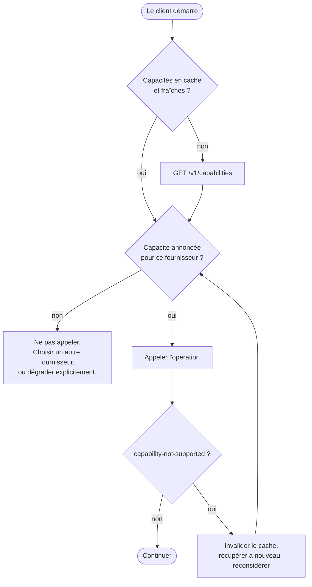

# ADR-0007 : Découverte de capacités

- Voie : Standards
- Statut : Brouillon
- Créée : 2026-08-17
- Dépend de : ADR-0001, ADR-0002, ADR-0003, ADR-0005, ADR-0006

## Résumé

Cette ADR spécifie comment un client apprend ce qu'une passerelle sait réellement faire : le
modèle de capacités, son nommage et son registre, les points d'accès de découverte, et les
obligations des deux côtés.

C'est le mécanisme d'application du principe de conception au centre d'OpenFSP : une
opération qu'un fournisseur ne peut pas effectuer est absente et découvrable comme absente,
jamais émulée. Chaque ADR antérieure qui avait renvoyé un détail propre à un fournisseur
vers une documentation en prose est ici résolue en quelque chose qu'une machine peut lire.

## Motivation

Les fournisseurs diffèrent, et ils diffèrent d'une manière qui compte pour un tunnel
d'achat.

L'un prend en charge les remboursements ; un autre non. L'un signe ses rappels ; un autre
envoie des notifications non authentifiées. L'un redirige le payeur vers une page hébergée ;
un autre pousse une invite vers son combiné. L'un peut être interrogé de façon autoritaire
sur l'aboutissement d'un paiement ; un autre ne peut pas être interrogé du tout.

Il y a deux façons de traiter cela, et l'habituelle est fausse. L'habituelle consiste à
définir une interface uniforme que chaque fournisseur implémente et à combler les trous par
de l'émulation : un remboursement qui est en réalité un transfert inverse, une recherche qui
retourne le dernier état connu en le qualifiant d'autoritaire. L'appelant ne peut pas faire
la différence jusqu'au moment où elle compte, et dans ce domaine le moment où elle compte est
le moment où quelqu'un est créancier.

L'autre façon, celle qu'OpenFSP prend, est de laisser l'interface honnêtement incomplète et
de rendre la forme du trou découvrable. Cela ne fonctionne que si la découverte est précise.
Un client à qui l'on dit « ce fournisseur prend en charge les remboursements » et qui doit
découvrir par tâtonnement lesquels, dans quelle devise, jusqu'à quelle ancienneté, a reçu un
slogan plutôt qu'un contrat.

Cette ADR fait donc deux choses. Elle définit les capacités comme des unités nommées qu'une
passerelle possède ou ne possède pas, par fournisseur. Et elle porte les détails propres à
chaque fournisseur que les ADR antérieures avaient laissés à la documentation des
adaptateurs, afin qu'un client puisse être écrit contre un déploiement qu'il n'a jamais vu.

## Hors périmètre

- **Aucune nouvelle opération.** Les capacités nommées ici qui n'ont pas encore d'ADR sont
  des noms enregistrés, pas des spécifications. Une passerelle MUST NOT en annoncer une
  avant que son ADR ne soit acceptée.
- **Aucun droit ni autorisation.** Ce qu'un *principal* est autorisé à faire est une
  question d'autorisation, tranchée dans
  [ADR-0009](0009-authentication-and-credentials.md). Cette ADR décrit ce qu'un
  *déploiement et un fournisseur* sont capables de faire. La distinction est préservée dans
  les questions ouvertes.
- **Aucune information de niveau de service.** Disponibilité, débit et limites du
  fournisseur sont opérationnels, varient continûment, et n'ont pas leur place dans un
  document de protocole.
- **Aucune tarification.** Les frais sont des conditions commerciales entre un marchand et
  un fournisseur.

## Spécification

Les mots-clés MUST, MUST NOT, REQUIRED, SHALL, SHALL NOT, SHOULD, SHOULD NOT, RECOMMENDED,
MAY et OPTIONAL sont à interpréter comme décrit dans les RFC 2119 et RFC 8174, lorsque, et
seulement lorsque, ils apparaissent en capitales.

### 1. Ce qu'est une capacité

**1.1.** Une capacité est une unité nommée de fonctionnalité qu'une passerelle prend en
charge ou ne prend pas en charge, **pour un fournisseur donné**.

**1.2.** Les capacités sont rapportées au fournisseur, pas à la passerelle. Une même
passerelle prend couramment en charge les remboursements pour un fournisseur et pas pour un
autre, et une liste de capacités valable pour toute la passerelle serait fausse pour au
moins l'un d'eux.

**1.3.** Une passerelle MUST n'annoncer une capacité que là où le fournisseur sous-jacent
prend réellement en charge l'opération correspondante. Elle MUST NOT annoncer une capacité
qu'elle satisfait par émulation, approximation, ou en composant d'autres opérations en
quelque chose qui ressemble à la vraie.

**1.4.** Le §1.3 est la phrase opérante de cette ADR et le point d'application de
[ADR-0001](0001-architecture-and-scope.md#principes-de-conception). Tout le reste ici est
mécanisme. Là où un implémenteur est tenté d'annoncer une capacité parce que le résultat est
« assez proche », l'action correcte est de ne pas l'annoncer et de laisser le client décider
quoi faire de l'écart, parce que le client est la seule partie qui sait ce que l'écart coûte.

**1.5.** La capacité de base `payments`
([ADR-0006 §2](0006-gateway-http-api-payments.md)) est présente pour chaque fournisseur
sur toute passerelle conforme. Un client MUST NOT être tenu d'effectuer une découverte avant
de l'utiliser.

### 2. Noms et registre

**2.1.** Un nom de capacité est en minuscules, séparé par des points, correspondant à
`^[a-z][a-z0-9_]*(\.[a-z][a-z0-9_]*)*$`. Le segment de tête nomme le domaine, les segments
suivants nomment l'opération.

**2.2. Le registre.** Ces noms sont réservés par cette ADR. Un nom marqué *enregistré* n'a
pas encore d'ADR acceptée et MUST NOT être annoncé avant qu'il n'en existe une.

| Nom | Statut | Signification |
|---|---|---|
| `payments` | spécifié, obligatoire | Créer et lire un paiement ([ADR-0006](0006-gateway-http-api-payments.md)). |
| `payments.lookup` | spécifié | Le fournisseur peut être interrogé de façon autoritaire sur l'état courant d'un paiement. Voir §5. |
| `payments.statement` | spécifié | Le fournisseur fournit un relevé des transactions par un canal authentifié. Source (d) d'[ADR-0003 §6.5](0003-payment-lifecycle.md). |
| `payments.fee` | spécifié | Le fournisseur divulgue ce qu'il a facturé, de sorte que `fee` peut être rapporté ([ADR-0002 §8](0002-core-data-model.md)). |
| `payments.refund` | enregistré | Le fournisseur peut inverser un paiement capturé. |
| `payments.capture` | enregistré | Le fournisseur sépare l'autorisation de la capture. |
| `payments.cancel` | enregistré | Le fournisseur peut annuler un paiement avant son achèvement. |
| `payments.proximity_cpm` | enregistré | Le fournisseur résout nativement les jetons éphémères présentés par le payeur ([ADR-0012](0012-proximity-payments-cpm.md)). |
| `confirmation_requests` | enregistré | Le fournisseur offre une confirmation minutée, répondue par le payeur ([ADR-0011](0011-confirmation-requests.md)). |
| `confirmation_requests.cancel` | enregistré | Le fournisseur peut retirer une demande de confirmation avant que le payeur ne réponde. |
| `transfers` | enregistré | Le fournisseur peut envoyer des fonds à un bénéficiaire. |
| `webhooks.emit` | enregistré | La passerelle émet des événements signés vers le client ([ADR-0008](0008-webhooks-and-event-delivery.md)). |
| `webhooks.verify` | spécifié | Le fournisseur signe ses rappels de façon vérifiable. Source (a) d'[ADR-0003 §6.5](0003-payment-lifecycle.md). |
| `webhooks.per_payment_url` | spécifié | Le fournisseur accepte une URL de rappel propre à chaque paiement. Source (c) d'[ADR-0003 §6.5](0003-payment-lifecycle.md). |

**2.3.** Ajouter un nom au registre exige une ADR. Parce qu'un client qui ne reconnaît pas un
nom l'ignore (§4.4), un ajout n'est pas une rupture de compatibilité.

**2.4. Extensions propriétaires.** Une passerelle MAY annoncer des noms hors du registre, et
MUST les préfixer d'une étiquette DNS inversée qu'elle contrôle, par exemple
`com.example.payments.instalments`. Une passerelle MUST NOT inventer de noms non préfixés,
qui sont réservés au registre.

**2.5. Les capacités ne sont pas versionnées.** Un changement de ce qu'une capacité signifie
exige un nouveau nom, pas un suffixe de version. La négociation de version par capacité
multiplie les états que les deux côtés doivent traiter, et les cas qu'elle résoudrait sont
mieux résolus en nommant honnêtement le nouveau comportement.

**2.6. Les identifiants de fournisseur sont eux aussi enregistrés.** La valeur `provider` de
[ADR-0006 §3.2](0006-gateway-http-api-payments.md), annoncée comme `id` au §3.2
ci-dessous, n'est pas un choix libre. Une passerelle MUST utiliser l'identifiant enregistré
pour tout fournisseur qui en a un, et le registre est
[`registries/providers.md`](https://github.com/openfspht/openfsp/blob/main/registries/providers.md).

**2.7.** Sans registre, une passerelle écrit `moncash`, une autre `mon_cash`, une troisième
`digicel_moncash`, et un client écrit contre un déploiement cesse de fonctionner contre le
suivant. La contrainte de syntaxe de
[ADR-0006 §3.2](0006-gateway-http-api-payments.md) rend la valeur bien formée ; seul un
registre en fait *la même valeur partout*, ce qu'exige réellement la portabilité.

**2.8. L'enregistrement est plus léger que pour les noms de capacité.** Un nom de capacité
est ajouté par ADR, parce qu'il nomme un comportement qu'une ADR doit définir. Un
identifiant de fournisseur est ajouté par pull request sur le fichier de registre, parce
qu'il ne nomme rien de normatif : c'est une étiquette pour une partie qui existe que ce
projet la reconnaisse ou non. Exiger une ADR pour consigner qu'un service de paiement existe
serait un cérémonial, et le délai pousserait les implémenteurs à inventer des graphies
locales, qui est la défaillance que le registre prévient.

**2.9.** Les identifiants sont permanents. Là où un fournisseur se renomme, un nouvel
identifiant est enregistré et l'ancienne ligne est marquée comme remplacée plutôt que
supprimée, parce que les paiements déjà enregistrés portent l'ancienne valeur et que ces
enregistrements sont immuables.

### 3. Découverte

#### 3.1. Descripteur de service

```
GET /.well-known/openfsp
```

Non authentifié. Selon la RFC 8615.

```json
{
  "protocol_version": "0.1.0",
  "api_base": "https://gateway.example/v1",
  "capabilities_url": "https://gateway.example/v1/capabilities"
}
```

**3.1.1.** Le descripteur existe pour que l'outillage puisse localiser l'API et confirmer
qu'elle parle OpenFSP sans détenir d'identifiants secrets.

**3.1.2.** Il MUST NOT divulguer quels fournisseurs le déploiement utilise, ni aucune
information sur le marchand. Les fournisseurs de paiement avec lesquels une entreprise
travaille sont commercialement sensibles, et ce point d'accès est public. Voir
*Considérations de sécurité* ci-dessous.

**3.1.3.** `protocol_version` est la version de spécification que la passerelle vise, au sens
de
[GOVERNANCE.md §5](https://github.com/openfspht/openfsp/blob/main/GOVERNANCE.md#5-garanties-de-stabilité).
Un client MUST NOT en déduire une capacité quelconque.

#### 3.2. Capacités

```
GET /v1/capabilities
```

Authentifié.

```json
{
  "protocol_version": "0.1.0",
  "providers": [
    {
      "id": "moncash",
      "display_name": "MonCash",
      "capabilities": ["payments", "payments.lookup"],
      "currencies": ["HTG"],
      "payments": {
        "next_actions": ["redirect"],
        "payer_required": false,
        "return_url_required": true,
        "expiry_guaranteed": true
      }
    },
    {
      "id": "natcash",
      "display_name": "NatCash",
      "capabilities": ["payments", "webhooks.verify"],
      "currencies": ["HTG"],
      "payments": {
        "next_actions": ["payer_approval"],
        "payer_required": true,
        "return_url_required": false,
        "expiry_guaranteed": false
      }
    }
  ]
}
```

**3.2.1. Champs d'un fournisseur.**

| Champ | Type | Présence | Notes |
|---|---|---|---|
| `id` | chaîne | REQUIRED | L'identifiant enregistré (§2.6). Correspond à `provider` sur un paiement ([ADR-0006 §3.2](0006-gateway-http-api-payments.md)). |
| `display_name` | chaîne | REQUIRED | Pour les interfaces tournées vers le marchand. Pas un identifiant. |
| `capabilities` | tableau de chaînes | REQUIRED | Contient toujours `payments`. |
| `currencies` | tableau de `Currency` | REQUIRED | Devises acceptées. Voir §4.1. |
| `payments` | objet | REQUIRED | Détail par fournisseur pour la capacité de base. |

**3.2.2. L'objet de détail `payments`.**

| Champ | Type | Signification |
|---|---|---|
| `next_actions` | tableau de chaînes | Quels types de `next_action` ce fournisseur produit ([ADR-0006 §4.2](0006-gateway-http-api-payments.md)). |
| `payer_required` | booléen | Si `payer` est REQUIRED à la création ([ADR-0006 §5.1.2](0006-gateway-http-api-payments.md)). |
| `return_url_required` | booléen | Si `return_url` est REQUIRED à la création ([ADR-0006 §5.1.3](0006-gateway-http-api-payments.md)). |
| `expiry_guaranteed` | booléen | Si le fournisseur garantit qu'un paiement ne peut pas aboutir après `expires_at` ([ADR-0003 §5.3c](0003-payment-lifecycle.md)). |

**3.2.3.** Ces quatre champs existent parce que [ADR-0003](0003-payment-lifecycle.md) et
[ADR-0006](0006-gateway-http-api-payments.md) exigeaient chacune qu'une passerelle
*documente* en prose un comportement propre à un fournisseur. La prose ne peut pas être lue
par une bibliothèque cliente, ne peut pas être testée par la suite de conformité, et est la
première chose à se périmer. Transformer chacun en champ est la différence entre une
spécification à laquelle un SDK peut s'adapter et une que l'intégrateur doit lire.

**3.2.4.** `expiry_guaranteed` est celui qu'on rate le plus facilement. Il affirme une
propriété contractuelle du fournisseur, pas une intention de la passerelle, et l'affirmer à
tort laisse une passerelle conforme marquer `expired` des paiements qui aboutissent ensuite.
Un implémenteur qui n'est pas sûr MUST rapporter `false`.

**3.2.5. Mise en cache.** La réponse SHOULD porter un `Cache-Control` avec un `max-age` d'au
plus une heure. Les capacités changent rarement mais elles changent, le plus souvent quand un
fournisseur retire ou active une fonctionnalité pour un marchand donné.

### 4. Obligations du client et de la passerelle

**4.1. Devises.** Un client MUST NOT créer un paiement dans une devise absente des
`currencies` de ce fournisseur. C'est la découverte à l'exécution que
[ADR-0002 §4.4](0002-core-data-model.md) avait différée : le modèle de données peut
représenter toute devise ISO 4217, et ce point d'accès dit lesquelles sont acceptées ici.

**4.2.** Un client MUST NOT invoquer une opération dont la capacité n'est pas annoncée pour
le fournisseur choisi.

**4.3.** Un client MUST néanmoins traiter `capability-not-supported`
([ADR-0005 §9.1](0005-error-taxonomy.md)) à tout moment. Les capacités sont un cache
d'une vérité distante, et la vérité peut changer entre la récupération et l'appel. En le
recevant, un client SHOULD récupérer à nouveau les capacités avant de décider quoi faire.

**4.4.** Un client MUST ignorer les noms de capacité qu'il ne reconnaît pas, et MUST NOT
traiter leur présence comme une erreur. C'est ce qui rend le §2.3 non cassant.

**4.5.** Une passerelle MUST rejeter une opération dont elle n'annonce pas la capacité, avec
`capability-not-supported`, même là où elle pourrait techniquement l'effectuer. L'ensemble
annoncé et l'ensemble permis sont le même ; une passerelle qui honore discrètement plus
qu'elle n'annonce apprend aux clients à deviner.

**4.6.** Une passerelle MUST mettre à jour l'ensemble annoncé quand la réalité sous-jacente
change, et MUST NOT annoncer une capacité qu'un fournisseur a suspendue.

#### 4.7. Négociation



**4.7.1.** La boucle n'est pas redondante. Vérifier avant d'appeler évite une classe d'échecs
évitables ; traiter l'erreur quand même est ce qui garde un client correct quand un
fournisseur change sous lui. Un client qui ne fait que le premier est fragile, et un client
qui ne fait que le second découvre les opérations non prises en charge en les tentant, ce qui
dans une API de paiement peut signifier tenter de déplacer de l'argent.

### 5. `payments.lookup` et le rapprochement

**5.1.** `payments.lookup` annonce que le fournisseur peut être interrogé de façon autoritaire
sur l'état courant d'un paiement.

**5.2.** Là où elle est annoncée, `POST /v1/payments/{id}/synchronize`
([ADR-0006 §5.3](0006-gateway-http-api-payments.md)) effectue une vraie lecture chez le
fournisseur.

**5.3.** Là où elle n'est **pas** annoncée, ce point d'accès MUST retourner
`capability-not-supported`. Il MUST NOT retourner le dernier état connu du paiement comme s'il
avait été relu, ce qui serait l'émulation que le §1.3 interdit, dans le seul endroit où un
client demande explicitement une vérité faisant autorité.

**5.3.1. Une exception, et ce n'est pas de l'émulation.** Là où le paiement est déjà
terminal, [ADR-0006 §5.3.3](0006-gateway-http-api-payments.md) prime : la passerelle
retourne le paiement inchangé avec un `200`, que `payments.lookup` soit annoncée ou non. Le
contrôle de terminalité s'exécute en premier.

Ce n'est pas l'émulation interdite ci-dessus, et la distinction mérite d'être exacte.
Retourner un état non terminal périmé comme faisant autorité est une fausse affirmation,
parce que l'état a pu changer depuis. Retourner un état terminal en est une vraie, parce que
selon [ADR-0003 §3.1](0003-payment-lifecycle.md) il ne peut pas changer. La passerelle ne
prétend pas avoir interrogé le fournisseur ; elle répond depuis un fait qu'aucun fournisseur
ne pourrait contredire.

**5.4.** Ceci affine [ADR-0006 §5.3.2](0006-gateway-http-api-payments.md) : le point
d'accès est implémenté par toute passerelle conforme, et répond honnêtement que l'opération
est indisponible pour les fournisseurs qui ne peuvent pas la soutenir.

**5.5.** Un déploiement dont le fournisseur n'a pas `payments.lookup` ne peut pas satisfaire
pleinement le devoir de rapprochement de [ADR-0003 §6.1](0003-payment-lifecycle.md). C'est une
limitation réelle du fournisseur plutôt qu'un défaut de la passerelle. Il reste les autres
sources d'[ADR-0003 §6.5](0003-payment-lifecycle.md), et la contribution de cette ADR est de
rendre visible lesquelles avant qu'un marchand n'en dépende, plutôt que pendant un incident.

### 6. Conformité

**6.1.** Une passerelle conforme MUST servir les deux points d'accès du §3.

**6.2.** La suite de conformité vérifie que chaque capacité annoncée se comporte comme son ADR
le spécifie, et que chaque opération non annoncée retourne `capability-not-supported`. La
seconde moitié compte autant que la première : une passerelle est conforme non seulement par
ce qu'elle fait, mais par ce qu'elle refuse correctement de faire semblant de faire.

**6.3.** Une passerelle qui annonce un nom `enregistré` mais non spécifié (§2.2) est non
conforme.

## Compatibilité

Nouvelle spécification. Rien à casser.

Le §5.3 affine [ADR-0006 §5.3.2](0006-gateway-http-api-payments.md), qui exigeait de
chaque passerelle d'implémenter le point d'accès de synchronisation sans dire ce qu'il fait
là où le fournisseur ne peut pas être interrogé. Les deux sont à l'état Draft, donc aucun
erratum n'est requis ; si ADR-0006 est acceptée en premier, cet affinement doit être consigné
contre elle.

Ajouter un nom de capacité est non cassant au titre des §2.3 et 4.4. Ajouter un champ à
l'objet de détail `payments` est non cassant au titre de
[ADR-0002 §2.3](0002-core-data-model.md). Retirer une capacité de l'ensemble annoncé d'un
déploiement n'est pas du tout un changement de spécification, mais c'est une rupture pour les
marchands qui s'y fiaient, et les opérateurs SHOULD le traiter comme telle.

## Considérations de sécurité

**Les relations avec les fournisseurs sont commercialement sensibles.** Quels fournisseurs un
marchand utilise, et dans quelles devises, est du renseignement d'affaires sur ce marchand.
Le §3.2 est authentifié pour cette raison, et le §3.1.2 interdit de le laisser fuir par le
descripteur public.

**Le descripteur public est une surface d'attaque.** `/.well-known/openfsp` est atteignable
par quiconque trouve l'hôte. Il MUST n'exposer que la version du protocole et l'emplacement
de l'API, MUST NOT révéler la version ou la compilation du logiciel de la passerelle, et
SHOULD être limité en débit comme tout autre point d'accès public.

**Les données de capacité ne sont pas une autorisation.** Une capacité annoncée dit que le
déploiement peut effectuer une opération, jamais que l'appelant le peut. Une passerelle MUST
faire respecter l'autorisation indépendamment, et MUST NOT traiter la présence d'une capacité
comme une permission.

**Empreinte.** Un document de capacités détaillé distingue les déploiements les uns des
autres et peut servir à identifier quels marchands utilisent quels fournisseurs, s'il peut
être lu. Le placer derrière une authentification (§3.2) est ce qui empêche qu'il ne devienne
un outil d'enquête sur tout le marché.

**Des capacités périmées sont un enjeu de sûreté, pas seulement de correction.** Un client
qui agit sur une capacité retirée, par exemple en tentant un remboursement qu'un fournisseur
a suspendu, peut laisser un payeur attendre un argent qui n'arrivera pas. Le §4.3 exige des
clients qu'ils traitent le chemin d'erreur quoi qu'on leur ait dit.

**L'annonce honnête est une propriété de sécurité.** Une passerelle qui annoncerait
`webhooks.verify` sans effectuer de vérification réelle amènerait les clients à faire
confiance à des rappels non vérifiés. Le §1.3 est ce qui l'interdit, et le §6.2 ce qui le
teste.

## Considérations réglementaires

**Un énoncé de fonction vérifiable par machine.** Le document de capacités est une
description précise et testable de ce qu'un déploiement peut et ne peut pas faire. Un
superviseur évaluant un opérateur peut le lire, et la suite de conformité peut le vérifier,
sans s'en remettre à la description de l'opérateur lui-même.

**Aucune fonctionnalité cachée.** Le §4.5 exige que l'ensemble annoncé et l'ensemble permis
soient identiques. Un déploiement ne peut pas exposer d'opérations qu'il n'a pas déclarées,
ce qui est la propriété qui donne du sens à la déclaration à des fins de supervision.

**Limitations visibles.** Le §5.5 fait de l'incapacité d'un fournisseur à être interrogé de
façon autoritaire un fait explicite et découvrable, plutôt que quelque chose d'appris pendant
un litige. Un opérateur peut se voir demander, à l'avance, comment il rapproche pour les
fournisseurs où la réponse est qu'il ne le peut pas.

**Le périmètre des devises au dossier.** Le §4.1 met les devises acceptées de chaque
fournisseur dans un document plutôt que dans une configuration, ce qui compte partout où le
traitement des devises est lui-même supervisé.

## Alternatives envisagées

**Un ensemble de capacités fixe par version de protocole.** Le modèle le plus simple
possible : la version 1 signifie que ces opérations existent. Rejeté parce que la capacité
varie par fournisseur et par déploiement, non par version de spécification, de sorte que
toute liste fixe est fausse pour un fournisseur sur une passerelle.

**`OPTIONS` HTTP sur chaque ressource.** Utilise un mécanisme existant et n'exige aucun
nouveau point d'accès. Rejeté comme insuffisamment expressif : cela peut rapporter quelles
méthodes un chemin accepte, mais pas quelles devises un fournisseur prend, s'il garantit
l'expiration, ni quels types de `next_action` il produit. La découverte serait alors répartie
sur de nombreuses requêtes tout en restant incomplète.

**Appeler et traiter l'erreur.** Aucune découverte du tout : tenter l'opération, et traiter
`capability-not-supported` comme la réponse. Réellement tentant, et le §4.3 exige de toute
façon des clients qu'ils traitent cette erreur. Rejeté comme mécanisme principal parce
qu'apprendre en tentant est inacceptable dans une API où une tentative peut déplacer de
l'argent, et parce que cela ne donne au client aucun moyen de présenter des choix exacts à un
marchand avant que quoi que ce soit ne soit tenté.

**Une négociation de version par capacité**, telle que `payments.refund` en version 2. Plus
expressif, et c'est ainsi que certains protocoles évoluent. Rejeté au titre du §2.5 : cela
multiplie les combinaisons sur lesquelles les deux côtés doivent raisonner, et nommer
honnêtement un comportement modifié obtient le même résultat avec moins d'états.

**Annoncer les capacités en ligne dans chaque réponse de paiement.** Pas de point d'accès
séparé, toujours frais. Rejeté comme surcharge sur le chemin chaud, et cela n'aiderait
toujours pas un client à décider quel fournisseur utiliser avant de créer quoi que ce soit.

**Des capacités à l'échelle de la passerelle plutôt que par fournisseur.** Un document plus
court et un client plus simple. Rejeté au titre du §1.2 : c'est faux pour toute passerelle
dont les fournisseurs diffèrent, c'est-à-dire toute passerelle qui en a plus d'un.

## Questions non résolues

1. **Si les capacités peuvent différer par principal authentifié.** Un fournisseur peut
   activer les remboursements pour un marchand et pas pour un autre sur la même passerelle.
   Rapporter une vue par principal serait plus exact ; cela brouille aussi la ligne que cette
   ADR trace entre capacité et autorisation, et rend le document plus difficile à mettre en
   cache.
2. **Si les limites ont leur place ici.** Les montants minimum et maximum par fournisseur sont
   exactement le genre de chose qu'un client veut avant de construire un tunnel d'achat, et
   exactement le genre de chose qui change sans préavis. Les inclure risque un document
   confiant et faux.
3. **Une capacité pour un `next_action` par QR.** Liée à la question ouverte de
   [ADR-0006](0006-gateway-http-api-payments.md) sur les flux par QR. Si ce type est
   ajouté, savoir s'il est découvrable par les seuls `next_actions` ou s'il lui faut sa propre
   capacité devrait être tranché en même temps.
4. **Si `display_name` a sa place dans un document de protocole.** Ce sont des données de
   présentation, et un client pourrait tenir sa propre correspondance. Il est inclus parce que
   chaque client construirait sinon la même table, et qu'ils seraient en désaccord sur la
   graphie du nom d'un fournisseur.
5. **Découverte du serveur simulé.** Savoir si un serveur simulé s'annonce comme un
   fournisseur distinct ou se fait passer pour celui qu'il imite. L'usurpation rend les tests
   plus réalistes ; la distinction rend impossible de prendre une simulation pour de la
   production, ce qui dans une infrastructure de paiement compte peut-être davantage.

## Références

Citations complètes dans [`references.md`](references.md).

**Normatives.** `RFC8615` pour l'URI well-known du §3.1, `RFC9110` pour la sémantique HTTP,
`ISO4217` pour les listes de devises du §4.1, `RFC2119` et `RFC8174` pour les mots-clés
d'exigence.

**Informatives.** `GSMA-MMAPI`, dont l'ensemble de cas d'usage est le comparateur de ce qu'un
registre de capacités doit pouvoir nommer. `CPMI-PAFI-2020` p. 53 pour la raison pour
laquelle des différences déclarées et lisibles par machine entre fournisseurs sont
préférables à des différences non documentées.

## Implémentation de référence

Aucune pour l'instant.

## Errata

Aucun.
