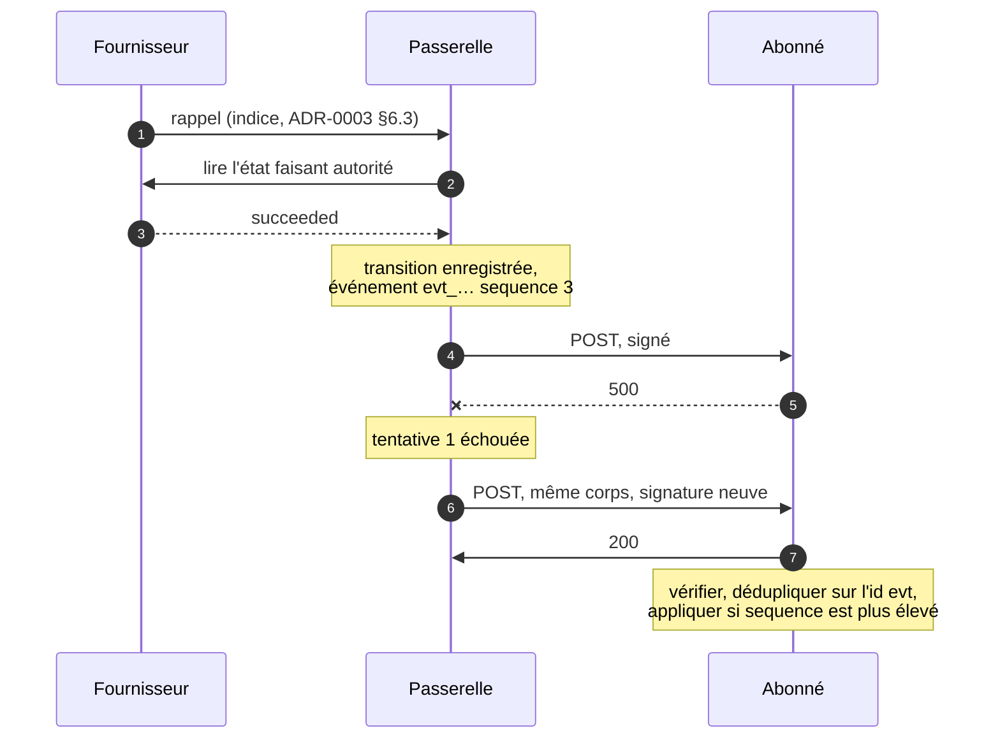

# ADR-0008 : Webhooks et livraison d'événements

- Voie : Standards
- Statut : Brouillon
- Créée : 2026-09-06
- Dépend de : ADR-0001, ADR-0002, ADR-0003, ADR-0004, ADR-0005, ADR-0006

## Résumé

Cette ADR spécifie comment une passerelle dit à un client qu'un paiement a changé : l'objet
**event**, l'ensemble fermé des types d'événement, le contrat de livraison, et la signature
qui rend une requête entrante prouvablement celle de la passerelle.

Trois choses y sont porteuses. La livraison est **au moins une fois et non ordonnée**, donc
chaque événement porte un `sequence` par ressource et chaque abonné doit pouvoir recevoir
deux fois le même événement. Chaque livraison est signée avec les HTTP Message Signatures de
la RFC 9421 sur une clé Ed25519 que la passerelle publie, de sorte que l'abonné peut rejeter
une contrefaçon au lieu de simplement la soupçonner. Et un événement est une
**notification, pas une autorité** : le sondage
([ADR-0006 §6](0006-gateway-http-api-payments.md)) reste le chemin de récupération, et un
client sans chemin de sondage n'est pas conforme.

## Motivation

Un marchand qui a créé un paiement doit maintenant découvrir ce qu'il en est advenu.
Aujourd'hui, la seule réponse que donne cette spécification est de continuer à demander
([ADR-0006 §6.1](0006-gateway-http-api-payments.md)), et le sondage a un plancher : un
tunnel d'achat qui sonde toutes les deux secondes montre encore au payeur un indicateur de
chargement pendant deux secondes après que l'argent a bougé, et une passerelle servant mille
paiements en attente répond à mille questions par minute pour rapporter que rien n'a changé.

Le coût de la spécification manquante n'est pourtant pas le sondage. C'est que chaque
intégration invente sa propre réponse. Un fournisseur poste un corps de formulaire avec un
secret partagé dans un paramètre de requête. Un autre poste du JSON avec un HMAC sur une
concaténation de champs, dans un ordre documenté nulle part. Un troisième ne poste rien du
tout et attend du marchand qu'il sonde. Le marchand qui en intègre trois écrit trois
routines de vérification, se trompe subtilement sur l'une d'elles, et le découvre quand
quelqu'un poste un `succeeded` fabriqué au point d'accès qu'il a publié dans sa
documentation d'API.

Cette dernière défaillance est celle que cette ADR existe pour rendre impossible. Une
signature qu'un marchand peut vérifier avec une clé publique, sur des composants incluant le
condensé du corps, transforme « une requête HTTP est arrivée affirmant qu'un paiement a
réussi » en « la passerelle a dit que ce paiement a réussi ». Rien d'autre dans le chemin de
livraison ne compte autant, ce qui est pourquoi les §5 et §6 sont les sections les plus
longues ici.

Il y a une seconde motivation, moins évidente.
[ADR-0007 §2.2](0007-capability-discovery.md) réserve `webhooks.verify` pour un
fournisseur qui signe ses rappels, et [ADR-0003 §6.3](0003-payment-lifecycle.md) exige de
la passerelle qu'elle traite un rappel non signé comme un indice. L'asymétrie est délibérée
et mérite d'être dite clairement : la passerelle ne peut pas réparer ce qu'un fournisseur
n'offre pas, mais elle peut refuser de transmettre cette faiblesse au marchand. Quoi qu'il
soit arrivé du fournisseur, et de quelque façon qu'il ait été corroboré, ce qui quitte la
passerelle est signé.

## Hors périmètre

- **Aucun remplacement du sondage.** Le §10 exige le contraire. Une livraison d'événement
  qui n'arrive jamais doit coûter au marchand de la latence, jamais de la correction.
- **Aucune API de gestion des abonnements.** La façon dont un point d'accès est enregistré,
  quels types il veut, et comment il est désactivé relèvent de la configuration de
  déploiement d'une passerelle auto-hébergée, pas du protocole sur le fil. Le §7.1 énonce la
  surface de configuration qu'une passerelle doit offrir sans dire par quelle interface elle
  est offerte.
- **Aucun point d'accès de liste ni de rejeu d'événements.** Tentant, et différé : le
  sondage couvre déjà la récupération, et une API de rejeu est un second chemin de lecture
  authentifié sur les mêmes données, avec sa propre pagination et ses propres questions
  d'autorisation. Si l'expérience opérationnelle montre que le sondage ne suffit pas, c'est
  l'ADR à écrire.
- **Aucun événement pour des ressources autres que les paiements.** Remboursements,
  transferts et demandes de confirmation arrivent chacun avec leur propre ADR, et chacun
  ajoutera des types au registre du §3.2 selon la règle du §3.5.
- **Aucun rappel entrant de fournisseur.** La façon dont la passerelle reçoit et corrobore
  le rappel d'un fournisseur est un comportement d'adaptateur, régi par
  [ADR-0003 §6.3](0003-payment-lifecycle.md). Cette ADR ne régit que ce que la passerelle
  émet.
- **Aucune livraison à un tiers.** Un événement va vers un point d'accès que l'opérateur du
  déploiement a configuré. La diffusion vers des abonnés arbitraires est un autre produit.

## Spécification

Les mots-clés MUST, MUST NOT, REQUIRED, SHALL, SHALL NOT, SHOULD, SHOULD NOT, RECOMMENDED,
MAY et OPTIONAL sont à interpréter comme décrit dans les RFC 2119 et RFC 8174, lorsque, et
seulement lorsque, ils apparaissent en capitales.

### 1. Ce qu'est un événement, et ce qu'il n'est pas

**1.1.** Un **événement** est une affirmation de la passerelle selon laquelle une ressource
qu'elle détient a atteint un état donné à un moment donné. Une **livraison** est une requête
HTTP portant un événement vers un point d'accès. Un même événement peut être livré plusieurs
fois ; chaque livraison porte le même événement.

**1.2.** Un événement fait autorité quant à l'**origine** : une livraison dont la signature
se vérifie au titre du §5 a été émise par la passerelle détenant la clé privée
correspondante, et son corps n'a pas été altéré en transit.

**1.3.** Un événement ne fait **pas** autorité quant à l'actualité. Il décrit la ressource
telle qu'elle se présentait quand l'événement a été émis, et la ressource a pu évoluer
depuis. Là où un client détient un événement et une lecture de la ressource qui se
contredisent, la lecture gouverne.

**1.4.** En pratique le §1.3 mord dans exactement une direction, à cause de
[ADR-0003 §3.1](0003-payment-lifecycle.md) : un état terminal n'est jamais quitté, de
sorte qu'une lecture ne peut être qu'*en avance* sur un événement, jamais en retard d'une
façon qui le défasse. Un client qui applique le §8.3 et refuse de faire reculer une
ressource est déjà correct sans relire. La relecture existe pour le cas où le client ne peut
pas dire lequel est le plus récent.

**1.5.** Une passerelle MUST NOT émettre d'événement pour un état que la ressource n'est pas
entrée. Un événement est l'enregistrement d'une transition qui a eu lieu, non une
prédiction, une intention, ou un indice de reprise.

### 2. L'objet event

Un corps de livraison est un objet JSON unique. Ce n'est pas un tableau, et ce n'est pas une
enveloppe contenant plusieurs événements : le groupage est discuté et rejeté dans
*Alternatives envisagées*.

```json
{
  "id": "evt_01J9ZK4T2A0YHQ8F3W6N5R7B1C",
  "type": "payment.succeeded",
  "created_at": "2026-08-17T14:36:11.208Z",
  "sequence": 3,
  "resource_type": "payment",
  "resource_id": "pay_01J9ZK3QF8XN2M7VYB4C6D8E0G",
  "reference": "INV-2026-00184",
  "previous_status": "pending",
  "data": {
    "id": "pay_01J9ZK3QF8XN2M7VYB4C6D8E0G",
    "reference": "INV-2026-00184",
    "status": "succeeded",
    "amount": { "amount": 125000, "currency": "HTG" },
    "provider": "moncash",
    "provider_reference": "MC-8837421",
    "payer": { "phone_number": "+50934567890" },
    "description": "Invoice 184",
    "next_action": null,
    "created_at": "2026-08-17T14:32:07.412Z",
    "updated_at": "2026-08-17T14:36:11.190Z",
    "expires_at": "2026-08-17T15:02:07Z",
    "completed_at": "2026-08-17T14:36:11.190Z",
    "failure_reason": null,
    "failure_detail": null,
    "fee": { "amount": { "amount": 1250, "currency": "HTG" }, "bearer": "merchant" },
    "metadata": { "order_id": "184" }
  }
}
```

**2.1. Champs.**

| Champ | Type | Présence | Notes |
|---|---|---|---|
| `id` | `ResourceId` | REQUIRED | Identifie l'événement, pas la ressource. Opaque. Stable sur chaque livraison de cet événement. |
| `type` | chaîne | REQUIRED | Tiré du registre fermé du §3.2. |
| `created_at` | `Timestamp` | REQUIRED | Quand la passerelle a enregistré la transition, non quand elle a tenté la livraison. |
| `sequence` | entier | REQUIRED | Ordinal par ressource. Voir §8. |
| `resource_type` | chaîne | REQUIRED | `payment` dans cette ADR. |
| `resource_id` | `ResourceId` | REQUIRED | La ressource dont traite l'événement. |
| `reference` | `Reference` | REQUIRED | La clé propre au marchand ([ADR-0002 §6.2](0002-core-data-model.md)). |
| `previous_status` | chaîne | conditionnel | REQUIRED quand `type` rapporte un changement de statut. Le statut que la ressource a quitté. |
| `data` | objet | REQUIRED | La ressource complète à `created_at`, dans la représentation de [ADR-0006 §3](0006-gateway-http-api-payments.md). |

**2.2. `id` est un identifiant d'événement et rien d'autre.** Il obéit à
[ADR-0002 §6.1](0002-core-data-model.md) : la passerelle l'assigne, le client MUST NOT en
construire ni en analyser un, et l'UUIDv7 reste RECOMMENDED. C'est la clé de déduplication
du §8.4, ce qui est pourquoi il MUST être identique sur chaque tentative de livraison du
même événement.

**2.3. `reference` est dupliquée délibérément.** Elle est déjà dans `data`, et elle est
remontée au niveau supérieur parce que c'est le champ sur lequel un marchand indexe
([ADR-0002 §6.2.3](0002-core-data-model.md)). Un abonné qui aiguille dessus ne devrait pas
avoir à aller chercher dans un objet imbriqué dont une ADR ultérieure peut étendre la forme.

**2.4. `data` est un instantané, pas un différentiel.** La ressource entière est envoyée, non
les champs modifiés. Un abonné qui reçoit un événement et rate le précédent est alors encore
correct, ce qu'un différentiel ne serait pas, et le §1.3 interdit déjà de traiter le contenu
comme courant.

**2.5.** Un abonné MUST tolérer les membres non reconnus dans l'objet event et dans `data`,
selon [ADR-0002 §2.3](0002-core-data-model.md). Une passerelle MUST NOT retirer un membre
de l'objet event sans une ADR qui la remplace.

**2.6. `previous_status` existe pour rendre un événement autovérifiant.** Un abonné qui avait
stocké `pending` et reçoit un événement dont le `previous_status` est `pending` sait qu'il
n'a rien raté entre-temps ; celui dont le statut stocké diverge sait qu'il a raté un
événement et peut relire. C'est un diagnostic, jamais une autorisation : un client MUST NOT
rejeter un événement au seul motif que `previous_status` ne correspond pas à ce qu'il
détient. Son propre enregistrement peut simplement être périmé.

### 3. Types d'événement

**3.1.** `type` est une chaîne en minuscules séparée par des points, `resource_type` suivi de
la transition, correspondant à `^[a-z][a-z0-9_]*(\.[a-z][a-z0-9_]*)+$`.

**3.2. Le registre.** Cette ADR définit ces types et aucun autre.

| Type | Émis quand | `previous_status` |
|---|---|---|
| `payment.created` | Un paiement est créé et entre en `pending` ([ADR-0003 §2](0003-payment-lifecycle.md)). | absent |
| `payment.succeeded` | Un paiement entre en `succeeded`. | REQUIRED |
| `payment.failed` | Un paiement entre en `failed`. | REQUIRED |
| `payment.expired` | Un paiement entre en `expired`. | REQUIRED |
| `payment.canceled` | Un paiement entre en `canceled`. | REQUIRED |

**3.3.** Un abonné MUST ignorer un événement dont il ne reconnaît pas le `type`, et MUST
néanmoins retourner un statut de succès pour lui (§4.3). Rejeter un type inconnu ferait de
l'ajout d'un type une rupture de compatibilité, et une passerelle qui continue de rejouer une
livraison que l'abonné n'acceptera jamais a inventé une file qui ne se vide pas.

**3.4. Il n'y a pas de `payment.updated`.** Un paiement change de façons qui ne sont pas des
transitions : un `provider_reference` arrive, un `next_action` est rafraîchi. Aucune ne
change ce que le marchand devrait faire, et chacune serait un événement qu'un abonné doit
recevoir, vérifier, stocker puis jeter. Un type est ajouté au §3.2 parce qu'un marchand
agirait différemment en conséquence, jamais parce que quelque chose a changé et qu'un
événement pourrait être émis. C'est la même règle que
[ADR-0003 §7.4.1](0003-payment-lifecycle.md) applique à `failure_reason`.

**3.5.** Ajouter un type exige une ADR acceptée. Parce que le §3.3 rend un type inconnu
inoffensif, un ajout n'est pas une rupture de compatibilité et n'exige pas d'incrément de
version au titre de [ADR-0006 §1.2](0006-gateway-http-api-payments.md).

**3.6. Les types ne sont pas des filtres sur l'état.** Un abonné qui ne veut que de l'argent
réglé s'abonne à `payment.succeeded` ; il ne s'abonne pas à tout pour filtrer sur
`data.status`. Le filtrage est de la configuration (§7.1), et une passerelle MUST NOT émettre
un événement d'un type qu'un point d'accès n'a pas demandé.

### 4. Livraison

**4.1.** Une livraison est un `POST` HTTP vers l'URL de point d'accès configurée, avec
`Content-Type: application/json` et les en-têtes de signature du §5.

**4.2. En-têtes.** Au-delà des en-têtes de signature, une livraison porte :

| En-tête | Valeur |
|---|---|
| `Content-Digest` | Condensé SHA-256 du corps, selon la RFC 9530. Couvert par la signature. |
| `OpenFSP-Event-Id` | L'`id` de l'événement. Couvert par la signature. |
| `OpenFSP-Event-Type` | Le `type` de l'événement, pour l'aiguillage. Couvert par la signature. |
| `OpenFSP-Delivery-Attempt` | L'ordinal de la tentative, à partir de `1`. **Non** couvert par la signature. |

Un abonné MUST NOT prendre de décision de confiance sur un en-tête non listé comme couvert.
`OpenFSP-Delivery-Attempt` reste hors signature parce que sa valeur change à chaque
tentative ; il sert à lire un journal, jamais à décider. Les valeurs faisant autorité vivent
dans le corps, dont la signature protège l'intégrité.

**4.3. Succès.** Une livraison a réussi si l'abonné a retourné un statut `2xx` dans le délai
du §4.5. Le corps de la réponse est ignoré, et une passerelle MUST NOT l'analyser, MUST NOT
agir dessus, et MUST NOT le journaliser en entier.

**4.4.** Tout autre statut, un échec de connexion, un échec TLS, ou une expiration est une
livraison échouée, rejouée au titre du §9. L'unique exception est `410 Gone`, qu'une
passerelle MUST traiter comme permanent : elle cesse de rejouer cet événement et SHOULD
cesser de livrer à ce point d'accès, en consignant le fait au titre du §9.5.

**4.5. Délais.** Une passerelle MUST borner à la fois la connexion et la réponse, et le total
MUST NOT dépasser **10 secondes**. C'est une borne, pas un budget : on attend d'un abonné
qu'il réponde en millisecondes (§7.4).

**4.6. Les redirections ne sont pas suivies.** Une passerelle MUST traiter un `3xx` comme une
livraison échouée. Une redirection suivie est une destination choisie par un attaquant pour
une charge utile signée, et la signature couvre `@target-uri`, de sorte qu'une redirection
suivie échouerait de toute façon à la vérification à l'autre bout.

**4.7. Le corps est identique octet pour octet entre les tentatives.** Rejouer un événement
MUST renvoyer les mêmes octets, afin que `Content-Digest` et la clé de déduplication du §8.4
tiennent. Seule la signature est recalculée, parce que ses paramètres `created`, `expires` et
`nonce` changent (§5.6).

**4.8. L'ordre n'est pas garanti.** Une passerelle MAY livrer concurremment et dans le
désordre les événements d'une même ressource, et MUST NOT bloquer les livraisons d'une
ressource derrière celles d'une autre. Le §8 est la façon dont un abonné s'en accommode ; une
passerelle qui a livré dans l'ordre n'a pas pour autant fait de l'ordre une garantie sur
laquelle quiconque peut compter.



### 5. Signature et vérification

**5.1.** Chaque livraison MUST porter une HTTP Message Signature selon la RFC 9421, dans les
en-têtes `Signature-Input` et `Signature`. Une passerelle MUST NOT émettre de livraison non
signée dans aucun mode, y compris le mode de développement.

**5.2. Composants couverts.** La base de signature MUST couvrir exactement ceux-ci, dans cet
ordre :

```
("@method" "@target-uri" "content-type" "content-digest" "openfsp-event-id"
 "openfsp-event-type")
```

`@method` et `@target-uri` lient la signature à ce point d'accès et à ce verbe, de sorte
qu'une livraison capturée chez un abonné ne peut pas être rejouée chez un autre.
`content-digest` la lie au corps, qui est ce qui porte le paiement. `openfsp-event-id` est
couvert afin que la clé de déduplication du §8.4 ne puisse pas être réécrite en vol pour faire
traiter deux fois le même argent par un abonné. `openfsp-event-type` est couvert pour qu'un
répartiteur de charge puisse aiguiller sur l'en-tête sans qu'un tiers puisse substituer un
type d'événement à un autre, par exemple `payment.succeeded` à `payment.failed`.

**5.3. Paramètres de signature.** `keyid`, `created`, `expires`, `nonce` et `alg` sont
REQUIRED. `tag` MUST valoir `openfsp-webhook`.

```
Signature-Input: sig1=("@method" "@target-uri" "content-type" "content-digest" \
  "openfsp-event-id" "openfsp-event-type");created=1755441371;expires=1755441671;\
  keyid="gw-2026-08";nonce="Zk9tQ1p2WXhLbFEyNw";alg="ed25519";tag="openfsp-webhook"
Signature: sig1=:MEUCIQDf…:
```

**5.4. Algorithmes.** Une passerelle MUST prendre en charge `ed25519` et MUST l'utiliser par
défaut. Une passerelle MAY offrir en outre `ecdsa-p256-sha256`, et MUST NOT offrir d'autre
algorithme que ces deux-là. Les algorithmes HMAC sont exclus à dessein : voir *Alternatives
envisagées*.

**5.5. `Content-Digest`.** REQUIRED, selon la RFC 9530, avec `sha-256`. Un vérificateur MUST
calculer le condensé du corps reçu et le comparer à l'en-tête avant, ou dans le cadre de,
l'acceptation de la signature. Une signature qui se vérifie sur un condensé que personne n'a
confronté au corps ne prouve rien sur le corps.

**5.6. Fraîcheur.** `created` MUST être l'heure de cette tentative, et `expires` MUST valoir
`created` plus au plus **300 secondes**. Un vérificateur MUST rejeter une signature dont
l'`expires` est passé, ou dont le `created` est à plus de 300 secondes dans le futur, en
tolérant la dérive d'horloge dans la seule direction qui n'est pas exploitable.

**5.7. Nonce.** `nonce` MUST valoir au moins 128 bits de valeur imprévisible, encodés en
base64url, et MUST être frais à chaque tentative, y compris pour les reprises du même
événement. Un vérificateur MUST tenir un cache de rejeu des nonces acceptés couvrant au moins
la fenêtre de fraîcheur du §5.6, et MUST rejeter un nonce répété.

**5.8.** Un cache de nonces ne remplace pas le §8.4. Le nonce arrête un rejeu *réseau* d'une
tentative signée ; l'id d'événement arrête qu'une relivraison *légitime* soit traitée deux
fois. Ils protègent des choses différentes, et un abonné a besoin des deux.

**5.9. Ordre de vérification.** Un abonné MUST vérifier avant d'agir : résoudre `keyid`,
rejeter un `keyid` inconnu, contrôler `alg` contre ce pour quoi cette clé est enregistrée,
contrôler la fraîcheur, contrôler le nonce, recalculer le condensé, vérifier la signature, et
seulement ensuite analyser `data` et changer quoi que ce soit. Analyser avant vérification est
toléré parce qu'un analyseur JSON doit tourner pour lire le corps ; *agir* avant vérification
ne l'est pas.

**5.10.** Un vérificateur MUST NOT prendre l'algorithme à utiliser du seul `alg`. La clé
détermine l'algorithme, et `alg` est contrôlé pour concordance avec la clé. Faire confiance
au nom d'algorithme fourni par l'attaquant est le plus vieux bogue de signature qui soit.

**5.11.** Les comparaisons de condensés et de signatures MUST être à temps constant.

**5.12. En cas d'échec**, un abonné MUST rejeter la livraison, MUST NOT agir sur une
quelconque partie d'elle, et SHOULD retourner `400`. Il MUST NOT retourner `2xx` : écarter
silencieusement une livraison ayant échoué à la vérification cache une attaque aux opérateurs
des deux côtés, puisqu'une passerelle qui voit un succès cesse de rejouer et ne journalise
rien. Une livraison rejetée qui était en fait authentique est rejouée au titre du §9 et, à
défaut, récupérée par sondage au titre du §10.

### 6. Gestion des clés

**6.1.** Une passerelle MUST publier ses clés de vérification sous forme de JWK Set à
`GET /v1/webhooks/keys`, en suivant l'enveloppe de collection de
[ADR-0006 §1.12](0006-gateway-http-api-payments.md).

```json
{
  "data": [
    {
      "kid": "gw-2026-08",
      "kty": "OKP",
      "crv": "Ed25519",
      "alg": "EdDSA",
      "use": "sig",
      "x": "11qYAYKxCrfVS_7TyWQHOg7hcvPapiMlrwIaaPcHURo",
      "openfsp_status": "active"
    }
  ]
}
```

**6.2.** `kid` MUST être égal au `keyid` du §5.3. Le membre JWK `alg` utilise le nom JOSE
(`EdDSA`) tandis que le paramètre de signature utilise le nom de la RFC 9421 (`ed25519`) ; ils
dénotent le même algorithme, et un vérificateur MUST accepter l'appariement plutôt que de
traiter la différence comme une discordance. L'écart vient des deux normes sources, pas de
cette spécification ; il est signalé ici parce qu'une bibliothèque qui compare les deux
chaînes rejette toutes les livraisons valides.

**6.3. `openfsp_status`** vaut `active` pour une clé qui peut être utilisée pour signer, ou
`retired` pour une clé qui doit encore être acceptée en vérification mais ne signe plus rien
de nouveau. Une passerelle MUST NOT publier une clé qu'elle a entièrement retirée du service.

**6.4. Rotation.** Une nouvelle clé MUST être publiée avec `openfsp_status` à `retired` au
moins **24 heures** avant qu'elle ne signe quoi que ce soit, et une clé MUST rester publiée
au moins **24 heures** après sa dernière utilisation. Le recouvrement existe pour qu'un
abonné qui met en cache l'ensemble de clés ne rencontre jamais un `keyid` qu'il ne peut pas
résoudre.

**6.5.** Un abonné SHOULD mettre en cache l'ensemble de clés et SHOULD le rafraîchir en
rencontrant un `keyid` inconnu, sous réserve d'une limitation de débit. Il MUST NOT le
rafraîchir inconditionnellement à chaque livraison, ce qui transforme un `keyid` contrefait
en amplificateur de requêtes visant la passerelle.

**6.6.** Un abonné MUST ne récupérer les clés que depuis l'URL de base de la passerelle avec
laquelle il a été configuré. Il MUST NOT prendre une URL de clé, une clé, ou un certificat
dans quoi que ce soit issu de la livraison. Une signature vérifiée contre une clé que la
requête a elle-même fournie ne vérifie rien.

**6.7.** Le point d'accès n'est pas authentifié. Les clés publiques sont publiques par
construction, et exiger des identifiants pour les récupérer ferait dépendre la rotation des
clés du même chemin d'identifiants qu'un abonné compromis a peut-être perdu. Une passerelle
MAY en limiter le débit au titre de [ADR-0005](0005-error-taxonomy.md).

**6.8.** Les clés privées sont détenues par l'opérateur de la passerelle, qui est le marchand
([ADR-0001](0001-architecture-and-scope.md)). Le projet n'exploite aucun service hébergé
et ne détient aucune clé. Une passerelle MUST NOT journaliser une clé privée, et MUST NOT en
émettre une par un quelconque point d'accès.

### 7. Exigences sur le point d'accès

**7.1. Surface de configuration.** Une passerelle MUST permettre à son opérateur de
configurer, par point d'accès, au moins : l'URL, l'ensemble des types d'événement (§3.6), et
si le point d'accès est actif. La façon dont cette configuration est exprimée est hors
périmètre (*Hors périmètre*).

**7.2. HTTPS uniquement.** Une passerelle MUST refuser une URL de point d'accès dont le
schéma n'est pas `https`, en dehors du mode de développement explicitement signalé de
[ADR-0006 §1.1](0006-gateway-http-api-payments.md).

**7.3.** Une passerelle MUST valider le certificat TLS du point d'accès et MUST NOT offrir
d'option pour sauter la validation. Livrer un événement de paiement signé à un pair TLS non
authentifié fuite les identifiants du payeur vers quiconque a répondu.

**7.4. Répondre d'abord, travailler ensuite.** Un abonné SHOULD vérifier, persister
l'événement, et retourner un `2xx`, en faisant le reste de son travail de façon asynchrone.
Garder la connexion ouverte pendant qu'un système en aval est appelé convertit la latence de
ce système en échecs de livraison, puis en reprises, puis en doublons.

**7.5.** Un abonné MUST NOT prendre de décision d'autorisation au motif qu'une requête a
atteint son point d'accès de webhook. Le point d'accès est une URL publique. Le §5 est la
seule chose qui distingue la passerelle de quiconque d'autre l'a trouvée.

**7.6.** Un abonné MUST pouvoir recevoir n'importe quel type d'événement du §3.2 à tout
moment, y compris pour une ressource qu'il ne reconnaît pas. Une passerelle ne garde aucune
connaissance de ce que contient la base de données d'un abonné.

### 8. Ordre, séquencement et doublons

**8.1. `sequence`** est un entier, commençant à `1` pour le premier événement concernant une
ressource et croissant d'exactement un pour chaque événement suivant concernant cette même
ressource. Il est par ressource, et MUST NOT être supposé ordonner les événements entre
ressources.

**8.2.** Une passerelle MUST assigner `sequence` au moment où l'événement est enregistré,
jamais à la livraison, et MUST NOT réutiliser une valeur pour une ressource.

**8.3. Règle d'ordre.** Un abonné MUST ignorer un événement dont le `sequence` est inférieur
ou égal au plus élevé qu'il a déjà traité pour ce `resource_id`. C'est ce qui rend sûre la
livraison dans le désordre (§4.8), et c'est ce qui empêche un `payment.created` retardé
d'écraser un `payment.succeeded` qui l'a doublé.

**8.4. Règle de déduplication.** Un abonné MUST traiter `id` comme la clé de déduplication et
MUST pouvoir traiter deux fois le même `id` sans second effet. La livraison au moins une fois
est ce que cette spécification offre ; tout ce qui est plus fort est discuté et rejeté dans
*Alternatives envisagées*.

**8.5.** Les §8.3 et §8.4 sont deux devoirs distincts. Le séquencement traite des événements
qui sont différents et arrivent dans le mauvais ordre ; la déduplication traite d'un
événement qui arrive plus d'une fois. N'en implémenter qu'un laisse une défaillance réelle
ouverte.

**8.6. La terminalité gouverne toujours.** Un abonné MUST NOT sortir une ressource d'un état
terminal sur la foi d'un quelconque événement, quel que soit son `sequence`. Si un événement
semble l'exiger, l'abonné a un bogue, la passerelle a un bogue, ou la livraison était
contrefaite, et la réponse correcte est de relire la ressource (§10) et de lever une alerte,
jamais de l'appliquer.

**8.7. Un trou dans `sequence` signifie qu'un événement a été raté**, non qu'un événement est
perdu pour toujours. Un abonné SHOULD relire la ressource en détectant un trou, et SHOULD NOT
attendre l'événement manquant, qui peut déjà avoir épuisé ses reprises au titre du §9.4.

### 9. Reprises, retrait et désactivation

**9.1.** Une livraison échouée (§4.4) MUST être rejouée avec un retrait exponentiel et une
gigue.

**9.2. Calendrier.** Une passerelle MUST implémenter au moins ce calendrier, mesuré depuis la
première tentative :

| Tentative | Délai |
|---|---|
| 1 | immédiat |
| 2 | 30 secondes |
| 3 | 2 minutes |
| 4 | 10 minutes |
| 5 | 1 heure |
| 6 | 6 heures |
| 7 | 24 heures |

**9.3.** Chaque délai MUST porter une gigue aléatoire d'au moins plus ou moins 20 pour cent,
afin qu'un abonné qui se rétablit d'une panne ne soit pas accueilli par toutes les livraisons
en attente au même instant. Une passerelle MAY étaler davantage ; elle MUST NOT rejouer plus
tôt que le calendrier.

**9.4. Abandon.** Après la dernière tentative, la passerelle MUST s'arrêter, MUST consigner
l'abandon sous une forme que l'opérateur peut trouver, et MUST NOT supprimer l'événement. Elle
MUST NOT altérer la ressource : une livraison qui n'a pas pu être faite ne dit absolument rien
sur le paiement.

**9.5. `Retry-After`.** Une passerelle MUST honorer `Retry-After` sur une réponse `429` ou
`503`, jusqu'à une borne qu'elle fixe, et MUST NOT laisser un abonné reporter une livraison
indéfiniment.

**9.6. Désactiver un point d'accès.** Une passerelle MAY désactiver un point d'accès dont
toutes les livraisons ont échoué pendant une période soutenue, et si elle le fait elle MUST
consigner la raison de façon visible pour l'opérateur. Elle MUST NOT désactiver un point
d'accès silencieusement. Une intégration qui a cessé de recevoir les notifications sans le
signaler continue d'encaisser sans livrer, et l'exploitant l'apprend par les réclamations.

**9.7.** Une passerelle MUST borner sa file de livraisons en attente et MUST délester en
refusant de nouvelles livraisons vers le point d'accès défaillant plutôt qu'en abandonnant
des événements. Les événements sont l'enregistrement ; les livraisons sont des tentatives sur
l'enregistrement.

### 10. Le sondage reste le chemin de récupération

**10.1.** Les événements complètent le sondage. Ils ne le remplacent pas, et cette section
rappelle normativement [ADR-0006 §6.3](0006-gateway-http-api-payments.md).

**10.2.** Un client MUST disposer d'un chemin vers l'état courant d'un paiement qui ne dépend
pas de l'arrivée d'un événement. Lire le paiement
([ADR-0006 §5.2](0006-gateway-http-api-payments.md)) le satisfait ; le synchroniser
([ADR-0006 §5.3](0006-gateway-http-api-payments.md)) aussi.

**10.3.** Un client SHOULD rapprocher tout paiement encore `pending` après une période qu'il
choisit, qu'il ait attendu un événement ou non. Tous les mécanismes du §9 peuvent échouer en
même temps : l'abonné peut être hors service plus de 31 heures, un pare-feu peut abandonner
silencieusement les livraisons, une rotation de clés peut être mal configurée. Aucun de ces
cas n'est exotique, et chacun est survivable si et seulement si le client peut demander.

**10.4.** Une suite de conformité teste le §10.2 en retenant chaque événement et en exigeant
du client qu'il atteigne quand même le dénouement correct. Une intégration qui échoue à ce
test ne fonctionne que tant que rien ne va de travers.

### 11. Conformité

**11.1.** Une passerelle est conforme à cette ADR si elle émet chaque type du §3.2, signe
chaque livraison selon le §5, publie les clés selon le §6, rejoue selon le §9, et n'émet
jamais d'événement pour une transition qui n'a pas eu lieu (§1.5).

**11.2.** Un abonné est conforme s'il vérifie selon le §5.9, rejette selon le §5.12,
déduplique selon le §8.4, séquence selon le §8.3, refuse de quitter un état terminal selon le
§8.6, et dispose d'un chemin de sondage selon le §10.2.

**11.3.** L'émission de webhooks ne fait pas partie de la capacité de base de
[ADR-0006 §2](0006-gateway-http-api-payments.md). Elle est annoncée sous le nom de
capacité `webhooks.emit`, ajouté au registre de
[ADR-0007 §2.2](0007-capability-discovery.md) par cette ADR. Il est distinct de
`webhooks.verify`, qui est une affirmation sur le *fournisseur*, non sur la passerelle.

## Compatibilité

Rien ne casse. Cette ADR ajoute un mécanisme de livraison et un nom de capacité ; elle ne
change aucun point d'accès existant, aucun champ existant, et aucun état existant.

Un client écrit contre la seule ADR-0006 continue de fonctionner inchangé, par sondage. Ce
n'est pas un accommodement transitoire : le §10 en fait le plancher permanent.

Un client détecte la prise en charge à l'exécution par la découverte de capacités, à la
présence de `webhooks.emit` ([ADR-0007 §4](0007-capability-discovery.md)). Une passerelle
qui ne l'annonce pas MUST NOT émettre d'événements, selon
[ADR-0007 §1.3](0007-capability-discovery.md).

`GET /v1/webhooks/keys` est un nouveau chemin sous la base `/v1` existante et ne change pas la
version majeure ([ADR-0006 §1.2](0006-gateway-http-api-payments.md)).

## Considérations de sécurité

**Les événements contrefaits sont toute la menace.** Un point d'accès de webhook est une URL
publique qui change la compréhension qu'a un marchand d'avoir été payé. Un attaquant qui peut
lui faire croire un `payment.succeeded` fabriqué a obtenu des marchandises gratuitement, et
l'a fait sans toucher au système de paiement du tout. Chaque exigence du §5 existe pour cela,
et celles qu'il est facile de sauter sont celles qui comptent : vérifier avant d'agir (§5.9),
rejeter plutôt qu'écarter silencieusement (§5.12), prendre l'algorithme de la clé plutôt que
d'`alg` (§5.10), et confronter le condensé au corps réellement reçu (§5.5).

**Rejeu.** Une livraison signée authentique capturée sur le fil peut être renvoyée. Le nonce
et la fenêtre de fraîcheur (§5.6, §5.7) ferment le rejeu réseau ; `@target-uri` dans les
composants couverts (§5.2) empêche que la même livraison soit visée vers un autre abonné ; et
l'id d'événement (§8.4) empêche qu'une relivraison, authentique ou rejouée, ait un second
effet. Un abonné qui n'implémente qu'un des trois est exposé aux deux autres.

**Falsification de requête côté serveur.** La passerelle émet une requête HTTP sortante vers
une URL que son opérateur a configurée, ce qui est une primitive SSRF pointée vers tout ce que
la passerelle peut atteindre. Une passerelle MUST refuser une URL de point d'accès qui se
résout vers une adresse de bouclage, de lien local, ou privée, ou vers l'adresse de métadonnées
de l'infonuagique, en dehors du mode de développement ; MUST résoudre et contrôler à nouveau
au moment de la livraison plutôt que faire confiance à un contrôle fait à la configuration,
parce que le DNS peut changer entre les deux ; et MUST NOT suivre les redirections (§4.6). Le
corps signé contient des données de paiement, de sorte qu'une SSRF réussie ici est un canal
d'exfiltration et pas seulement un scanner de ports.

**Compromission de clé.** Qui détient la clé de signature peut fabriquer des événements que
tout abonné acceptera. La clé vit chez l'opérateur de la passerelle (§6.8), la rotation est
spécifiée (§6.4), et le recouvrement de 24 heures est assez court pour qu'une rotation
d'urgence soit une option réelle plutôt que théorique. Une passerelle SHOULD prendre en charge
la signature avec une nouvelle clé immédiatement quand une compromission est soupçonnée, en
acceptant que les abonnés qui mettent l'ensemble de clés en cache rejettent des livraisons
jusqu'à leur rafraîchissement (§6.5).

**Données en transit et au repos chez l'abonné.** L'événement porte le paiement complet, y
compris `payer.phone_number`, vers une URL hors de la passerelle. TLS avec validation de
certificat est obligatoire (§7.2, §7.3). Un abonné qui journalise les corps de livraison bruts
a créé un magasin d'identifiants de payeurs sans aucun des contrôles dont dispose
l'enregistrement de paiement. Un abonné SHOULD journaliser l'id d'événement, le type et le
`sequence`, et SHOULD NOT journaliser le corps.

**Ce qui ne doit jamais être journalisé.** Les clés privées (§6.8), les valeurs de signature,
les nonces, et le corps de réponse d'une livraison (§4.3). Les valeurs de signature et les
nonces ne sont pas secrets, mais les journaliser invite à écrire un vérificateur qui compare
contre un journal au lieu de recalculer.

**Déni de service, dans les deux directions.** Une passerelle qui rejoue assez fort est un
générateur de charge visant son propre abonné, ce que les §9.3 et §9.5 bornent. Un abonné qui
rafraîchit l'ensemble de clés à chaque `keyid` inconnu est un amplificateur visant la
passerelle, ce que le §6.5 borne. Aucune des deux parties ne devrait pouvoir aggraver la panne
de l'autre en se comportant comme spécifié.

**Le cas du fournisseur non signant n'est pas amélioré par cette ADR, et n'est pas aggravé.**
[ADR-0003 §6.3](0003-payment-lifecycle.md) régit ce que la passerelle peut conclure d'un
rappel de fournisseur qu'elle ne peut pas vérifier. Quoi qu'elle conclue, ce qu'elle émet est
signé. Cette ADR ne blanchit pas un rappel de fournisseur non vérifié en un événement digne de
confiance : elle rend attribuable l'affirmation propre de la passerelle, ce qui est une
affirmation différente et plus modeste.

## Considérations réglementaires

La circulaire 121 de la BRH du 6 décembre 2021 porte sur cette ADR en trois endroits.

Sa section 13.1 exige que chaque transaction soit traçable. Un événement porte `id`,
`sequence`, `resource_id` et `reference`, et le §9.4 interdit de supprimer un événement dont
la livraison a été abandonnée, de sorte que l'enregistrement émis survit à la défaillance du
canal qui le portait. La traçabilité ne dépend pas de ce que l'abonné ait répondu.

Sa section 13.4 exige un registre des opérations. Le journal d'événements est une vue dérivée,
en ajout seul, des transitions de ce registre, et le §1.5 interdit une entrée pour une
transition qui n'a pas eu lieu. C'est une vue et non le registre lui-même : la ressource est
l'enregistrement, et un déploiement MUST NOT traiter une livraison réussie comme un substitut
à la tenue d'un registre.

Sa section 15 régit la protection des données en transmission et en stockage. Les §7.2 et §7.3
répondent à la moitié transmission dans la portée de cette ADR. La moitié stockage incombe à
l'abonné, et les recommandations de journalisation des *Considérations de sécurité* en sont la
part que cette spécification peut énoncer.

La signature a une valeur réglementaire secondaire qui mérite d'être nommée. Un événement
qu'un marchand peut vérifier contre une clé publiée est une preuve de ce que la passerelle a
affirmé et quand, ce qu'un schéma à secret partagé ne peut pas être : avec un secret
symétrique, le marchand aurait pu produire le message lui-même, de sorte qu'il ne prouve rien
à un tiers. Sous un audit externe du type que la section 5 de la circulaire 121 exige tous les
trois ans, cette différence est toute la différence entre un journal et une attestation.

**La notification d'incident a une base légale au-dessus des circulaires.** L'article 84 de
`HT-LAW-2012` exige d'une institution qu'elle notifie à la BRH « tout incident significatif »
dès qu'elle en a connaissance [HT-LAW-2012, p. 30], et `BRH-131` exige la notification d'un
incident de sécurité aux consommateurs touchés et à la BRH « sans délai », avec les faits, les
conséquences et les mesures correctives documentés [BRH-131, p. 19, s. 6.10.7]. Le refus du
§9.4 de supprimer un événement abandonné, et le refus du §9.6 de désactiver un point d'accès
silencieusement, sont ce qui laisse une institution capable de dire ce qui s'est passé. Une
intégration qui a discrètement cessé de recevoir les notifications de paiement est exactement
l'incident dont traitent ces dispositions.

**Les données qui quittent la passerelle sont des données transférées.** Le §2.4 envoie le
paiement entier, y compris `payer.phone_number`, vers une URL hors de la passerelle. `BRH-131`
n'autorise le transfert de données personnelles à des tiers que vers des entités offrant une
protection équivalente ou supérieure, et laisse l'institution responsable de tout traitement
confié à un sous-traitant [BRH-131, p. 18-19, s. 6.10.4]. Les §7.2 et §7.3, HTTPS avec
validation obligatoire de certificat et sans option pour la sauter, sont le minimum qui rend
un tel transfert défendable ; la discipline de journalisation de l'abonné en est le reste, et
c'est la responsabilité du marchand plutôt que celle de la passerelle.

## Alternatives envisagées

**Un HMAC avec un secret partagé.** La pratique courante, et la raison pour laquelle la
vérification des webhooks est si souvent fausse. Rejetée sur deux plans.
Cryptographiquement, un secret partagé signifie que les deux parties peuvent produire
n'importe quel message, de sorte qu'un événement ne prouve rien à personne d'autre qu'à elles
deux, ce qui renonce à la valeur d'audit décrite ci-dessus. Pratiquement, chaque schéma de
webhook HMAC de ce marché définit sa propre chaîne à signer, et se tromper sur cette
concaténation est silencieux : la signature se vérifie sur les mauvais octets et personne ne
s'en aperçoit jusqu'à ce que quelqu'un attaque la différence. La RFC 9421 définit la base de
signature une fois, et un implémenteur peut utiliser une bibliothèque plutôt que reconstruire
une chaîne depuis de la prose.

**Un en-tête `X-Signature` sur mesure.** Plus simple à implémenter pour la passerelle, et
cela déplace toute la complexité sur chaque abonné, dans chaque langage, pour toujours. La
RFC 9421 existe, a des implémentations, et couvre `@target-uri` et le condensé sans que
personne n'ait à y penser. Là où une norme existe et convient, inventer à côté est un coût
payé par tous en aval.

**Un TLS mutuel au lieu d'une signature de charge utile.** Rejeté comme mécanisme unique. Il
authentifie la connexion, pas le message, de sorte que rien ne survit à un mandataire
terminant, et un abonné derrière un répartiteur de charge quelconque perd la garantie sans
s'en apercevoir. Un déploiement MAY ajouter du mTLS par-dessus ; il MUST NOT le substituer au
§5.

**Une livraison exactement une fois.** Non offerte, parce qu'elle ne peut pas l'être. Sur un
réseau non fiable, l'émetteur ne peut pas distinguer une requête perdue d'une réponse perdue,
de sorte qu'au moins une fois avec une clé de déduplication est le contrat honnête. Prétendre
à l'exactement une fois déplacerait le traitement des doublons du §8.4, où il est spécifié et
testable, vers les hypothèses de chaque abonné, où il n'est ni l'un ni l'autre. C'est le même
raisonnement que [ADR-0004](0004-idempotency-and-retries.md) applique aux requêtes, dans
l'autre sens.

**Des événements minces, ne portant que l'identifiant.** Réellement attrayants : cela élimine
la péremption du §1.3, cela ne fuite aucune donnée de payeur vers les journaux de l'abonné, et
cela force la relecture que le §10 veut de toute façon. Rejetés parce que cela fait de chaque
événement un aller-retour obligatoire vers la passerelle, ce qui transforme une tempête de
livraisons en tempête de lectures au moment où la passerelle est le moins capable d'en servir
une, et que l'abonné a alors besoin d'un chemin d'identifiants fonctionnel pour
apprendre quoi que ce soit, de sorte qu'un problème d'identifiants devient indiscernable d'une
panne. L'instantané avec les §8.3 et §1.3 obtient l'essentiel de la sûreté sans rien de ce
coût. Une ADR future pourrait ajouter un mode mince comme option par point d'accès ; il ne
devrait pas être le seul mode.

**Grouper plusieurs événements par livraison.** Rejeté pour l'instant. Cela complique le
succès partiel, puisqu'un abonné qui a traité trois événements sur cinq n'a aucun moyen de le
dire dans un seul code de statut, et la reprise qui en résulte relivre les trois qu'il a déjà
traités. Le gain est la surcharge de connexion, dont le maintien en vie HTTP récupère déjà
l'essentiel.

**Une livraison ordonnée par ressource.** Rejetée. La garantir exige de la passerelle qu'elle
bloque la file d'une ressource sur une livraison défaillante, de sorte qu'un événement lent
retarde tous les suivants pour ce paiement, et la garantie s'évapore de toute façon dès qu'un
abonné traite deux livraisons concurremment. `sequence` donne à l'abonné ce à quoi servait
l'ordre, au prix d'une comparaison.

**Un point d'accès de rejeu d'événements.** Différé plutôt que rejeté ; voir *Hors périmètre*.

## Questions non résolues

**Combien de temps un événement abandonné est conservé.** Le §9.4 exige qu'il ne soit pas
supprimé et ne fixe aucun plancher. Un plancher relève des règles de conservation de la
ressource elle-même, qu'aucune ADR n'a encore énoncées, et l'énoncer ici seulement mettrait
la conservation du journal d'événements en décalage avec celle du paiement.

**Si `webhooks.emit` devrait être par fournisseur.** Les capacités sont annoncées par
fournisseur dans [ADR-0007 §3](0007-capability-discovery.md), mais l'émission d'événements
est une propriété de la passerelle, non du fournisseur par lequel elle a acheminé. La réponse
actuelle est qu'elle est annoncée à l'échelle de la passerelle, et il n'est pas évident que
cela survive au premier déploiement qui émet des événements pour un fournisseur et pas pour un
autre.

**Si un abonné devrait pouvoir acquitter un `sequence` plutôt qu'un événement.** Cela
permettrait à une passerelle de sauter des livraisons qu'un abonné a manifestement dépassées.
Cela ajoute aussi une entrée de confiance de l'abonné vers l'état de livraison de la
passerelle, qui a besoin de sa propre histoire d'authentification. Laissé ouvert jusqu'à ce
qu'il y ait des preuves que les livraisons économisées comptent.

**L'interaction avec les demandes de confirmation.** Le flux de paiement de proximité de la
feuille de route a besoin d'une notification vers le marchand en quelques secondes, et un
calendrier de reprises commençant à 30 secondes lui est inutile. Ce flux peut avoir besoin
d'un profil de livraison différent sur le même schéma de signature, et cette ADR ne préjuge
pas des parties qu'il réutilise.

## Références

Citations complètes dans [`references.md`](references.md).

**Normatives.** `RFC9421` pour la signature de message HTTP, `RFC9530` pour
`Content-Digest`, `RFC9110` pour la sémantique HTTP, `RFC3339` pour les horodatages,
`RFC9562` pour les identifiants, `RFC2119` et `RFC8174` pour les mots-clés d'exigence.

**Informatives.** `HT-LAW-2012` article 84, `BRH-121` sections 13.1 et 13.4, `BRH-131`
sections 6.10.4 et 6.10.7.

## Implémentation de référence

Aucune pour l'instant.

## Errata

Aucun.
