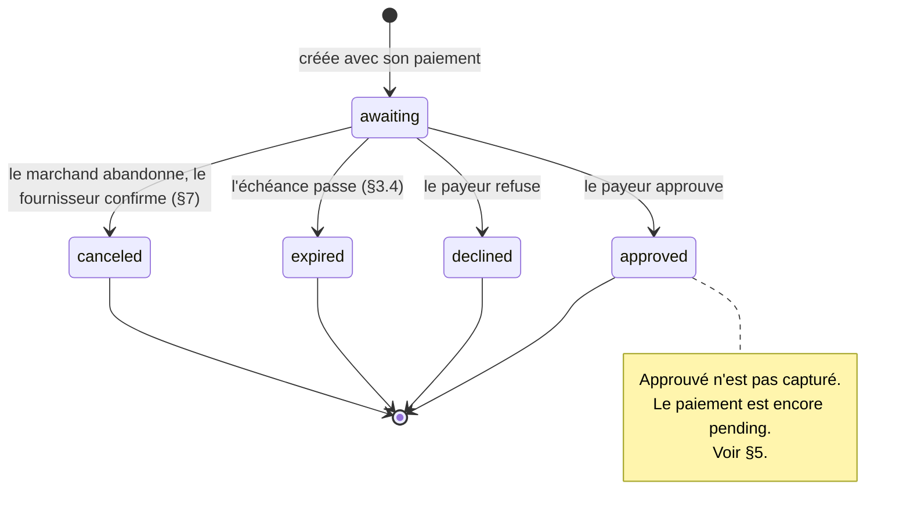

# ADR-0011 : Demandes de confirmation

- Voie : Standards
- Statut : Brouillon
- Créée : 2026-09-06
- Dépend de : ADR-0001, ADR-0002, ADR-0003, ADR-0004, ADR-0005, ADR-0006, ADR-0007

## Résumé

Cette ADR spécifie la **demande de confirmation** : un objet de courte durée représentant
une décision que le payeur doit prendre en quelques secondes, sur son propre appareil,
pendant que quelqu'un attend.

C'est une ressource séparée avec sa propre machine à états, suivant le précédent que pose
[ADR-0003 §8.5](0003-payment-lifecycle.md) pour les remboursements : les cinq états du
paiement sont intouchés, et une demande de confirmation référence un paiement plutôt que de
devenir un état de celui-ci. Elle ajoute un type de `next_action` à
[ADR-0006 §4.2](0006-gateway-http-api-payments.md), trois codes au catalogue d'erreurs de
[ADR-0005 §9](0005-error-taxonomy.md), et un nom de capacité.

Sa règle centrale est le §5.1, et c'est la raison pour laquelle cette ADR existe au lieu
d'être fondue dans le flux qui en a besoin : **une approbation n'est pas un reçu**. Le payeur
qui approuve est le payeur qui consent ; le fournisseur qui capture est l'argent qui bouge. À
un comptoir, avec des marchandises dessus, la distance entre ces deux faits est là où se
trouvent les pertes.

## Motivation

[ADR-0006 §4.2](0006-gateway-http-api-payments.md) a déjà `payer_approval` : le payeur
approuve sur son combiné, et le client attend. Pour un tunnel d'achat, cela suffit. Le payeur
est chez lui, personne ne fait la queue derrière lui, et un indicateur de chargement ne coûte
rien.

Placez la même interaction à un comptoir de marché et cela cesse de suffire, pour des raisons
qui tiennent toutes à la personne qui se tient là.

Un vendeur a besoin de savoir **combien de temps attendre**. `payer_approval` ne porte aucun
champ ([ADR-0006 §4.6](0006-gateway-http-api-payments.md)) et aucune échéance propre, de
sorte qu'une application de comptoir peut afficher un indicateur de chargement et rien
d'autre. L'`expires_at` propre au paiement peut être à quinze minutes, ce qui n'est pas une
réponse à « est-ce que je retiens ce client ici ou est-ce que je lui demande de réessayer ».

Un vendeur a besoin de distinguer **refusé** de **expiré**. Les deux laissent le paiement
inachevé, et l'action suivante du vendeur diffère complètement : un refus signifie demander
un autre moyen de paiement, une expiration signifie que le combiné du client n'a pas reçu
l'invite et qu'un essai de plus vaut la peine. Aujourd'hui les deux sont `pending` jusqu'à ce
que le paiement atteigne un état terminal, ce qui ne dit rien au vendeur pendant que cela
compte.

Un vendeur a besoin de pouvoir **abandonner le premier**. Le client dit tant pis et s'en va.
La caisse est maintenant occupée par un paiement qui restera `pending` aussi longtemps que le
fournisseur le permet, et le client suivant attend. Il n'y a aucune opération dans la
spécification qui dise « celui-ci est fini, je commence une nouvelle vente ».

Et le flux qui produit tout cela, un jeton présenté par le payeur et scanné à un comptoir, a
des modes de défaillance auxquels rien dans la spécification ne répond actuellement : le même
jeton scanné deux fois, un jeton expiré entre son affichage et son scan, un marchand dont le
réseau est tombé entre la soumission et la réponse. Chacun a un comportement correct, chacun
en a un faux qui est attrayant, et aucun n'est écrit.

Cet ensemble de besoins est un seul objet. Il a une échéance, des états terminaux sur
lesquels une personne agit différemment, une opération d'abandon explicite, et des réponses
déterministes au fait d'être interrogé deux fois sur la même question. Tenter de l'exprimer
comme une variante de `next_action` revient à inventer des expirations, une annulation et une
sémantique de doublon à l'intérieur d'un champ conçu pour être un indice à une interface
utilisateur.

## Hors périmètre

- **Aucun jeton, et aucun flux de proximité.** La façon dont un payeur se présente, l'aspect
  d'un jeton éphémère, et la façon dont un marchand en soumet un relèvent de
  [ADR-0012](0012-proximity-payments-cpm.md). Cette ADR spécifie l'objet dont ce flux a
  besoin, et le spécifie de sorte qu'il puisse être réutilisé par tout flux qui a besoin
  d'une décision minutée.
- **Aucun nouvel état de paiement.** [ADR-0003 §8.4](0003-payment-lifecycle.md) interdit
  d'altérer la machine centrale, et le §4 s'y tient. Un paiement portant une demande de
  confirmation est `pending`, exactement comme tout autre.
- **Aucune adaptation sur des fournisseurs qui ne l'ont pas.** Ce n'est pas une capacité
  qu'une passerelle peut faire exister par traduction. Le §9 dit ce que cela signifie pour la
  conformité.
- **Aucun fonctionnement hors ligne.** Les deux parties sont en ligne au moment de la
  décision. Un comptoir sans connectivité est un autre problème avec une autre réponse, et
  prétendre le contraire ici produirait une spécification que personne ne pourrait
  implémenter sans danger.
- **Aucune authentification du payeur.** La façon dont le fournisseur s'assure que la
  personne qui approuve est le titulaire du compte est l'affaire du fournisseur, pas de ce
  protocole.

## Spécification

Les mots-clés MUST, MUST NOT, REQUIRED, SHALL, SHALL NOT, SHOULD, SHOULD NOT, RECOMMENDED,
MAY et OPTIONAL sont à interpréter comme décrit dans les RFC 2119 et RFC 8174, lorsque, et
seulement lorsque, ils apparaissent en capitales.

### 1. La ressource

**1.1.** Une **demande de confirmation** représente une décision soumise à un payeur au sujet
d'un paiement, avec une échéance.

```json
{
  "id": "cnf_01J9ZM8W4B7XKQ2R5T3N6P0V9D",
  "payment_id": "pay_01J9ZK3QF8XN2M7VYB4C6D8E0G",
  "reference": "POS-2026-09-06-0042",
  "status": "awaiting",
  "amount": { "amount": 45000, "currency": "HTG" },
  "provider": "moncash",
  "created_at": "2026-09-06T13:04:19.882Z",
  "updated_at": "2026-09-06T13:04:19.882Z",
  "expires_at": "2026-09-06T13:05:19.882Z",
  "resolved_at": null,
  "outcome_reason": null,
  "outcome_detail": null
}
```

**1.2. Champs.**

| Champ | Type | Présence | Notes |
|---|---|---|---|
| `id` | `ResourceId` | REQUIRED | [ADR-0002 §6.1](0002-core-data-model.md). |
| `payment_id` | `ResourceId` | REQUIRED | Le paiement dont traite cette décision. Immuable. |
| `reference` | `Reference` | REQUIRED | La référence du paiement, copiée. Voir 1.4. |
| `status` | chaîne | REQUIRED | §2. |
| `amount` | `Money` | REQUIRED | Le montant soumis au payeur. Égal à celui du paiement. Voir 1.5. |
| `provider` | chaîne | REQUIRED | Comme en [ADR-0006 §3.2](0006-gateway-http-api-payments.md). |
| `created_at` | `Timestamp` | REQUIRED | Quand la demande a été soumise au payeur. |
| `updated_at` | `Timestamp` | REQUIRED | |
| `expires_at` | `Timestamp` | REQUIRED | §3. Jamais absent. |
| `resolved_at` | `Timestamp` | conditionnel | REQUIRED une fois terminal. |
| `outcome_reason` | chaîne | conditionnel | REQUIRED quand `declined`. §6. |
| `outcome_detail` | objet | OPTIONAL | Relais du fournisseur, comme en [ADR-0003 §7.4](0003-payment-lifecycle.md). |

**1.3.** Un paiement a au plus une demande de confirmation. Une passerelle MUST NOT en créer
une seconde pour un paiement qui en a déjà une, quel que soit l'état de la première, et MUST
rejeter la tentative avec `state-conflict` ([ADR-0005 §9](0005-error-taxonomy.md)).

**1.4. `reference` est copiée, non choisie.** C'est celle du paiement, afin que le chemin de
récupération de [ADR-0006 §5.2.3](0006-gateway-http-api-payments.md) atteigne aussi la
demande de confirmation : un marchand qui a perdu toutes les réponses détient encore la
référence, et peut interroger les deux objets avec elle.

**1.5. `amount` est le montant qui a été montré au payeur**, et une passerelle MUST NOT créer
une demande de confirmation dont le montant diffère de celui de son paiement. Il est dupliqué
sur cette ressource parce que c'est le fait unique sur lequel porte un litige, et qu'un
marchand qui affiche un compte à rebours à une caisse affiche le montant à côté, depuis un
seul objet.

**1.6.** Une demande de confirmation n'est jamais créée directement par un client. Elle vient
à l'existence dans le cadre de la création d'un paiement dans un flux qui en exige une, ce
qui est [ADR-0012](0012-proximity-payments-cpm.md) aujourd'hui. Cette ADR ne définit aucun
point d'accès de création.

### 2. États

| État | Terminal | Signification |
|---|---|---|
| `awaiting` | non | Soumise au payeur. Pas encore de réponse. |
| `approved` | **oui** | Le payeur a approuvé. L'argent n'a pas nécessairement bougé. §5. |
| `declined` | **oui** | Le payeur a refusé, ou le fournisseur a refusé en son nom. |
| `expired` | **oui** | L'échéance est passée sans réponse. |
| `canceled` | **oui** | Abandonnée avant réponse du payeur, de façon autoritaire. §7. |



**2.1.** Il y a exactement un état non terminal, pour la raison que donne
[ADR-0003 §1.1](0003-payment-lifecycle.md) : `awaiting` signifie que la réponse n'est pas
encore connue, et couvre le payeur qui n'a pas regardé son combiné, le fournisseur qui ne l'a
pas dit à la passerelle, et la passerelle qui a demandé et n'a rien entendu.

**2.2. L'invariant de terminalité de [ADR-0003 §3.1](0003-payment-lifecycle.md)
s'applique inchangé.** Un état terminal de demande de confirmation n'est entré que sur une
information faisant autorité et n'est jamais quitté. Une passerelle MUST NOT sortir de l'un
d'eux, et un client MUST rejeter un `status` qu'il ne reconnaît pas plutôt que de le traiter
comme non terminal.

**2.3.** Un client MUST NOT déduire l'état d'un paiement de l'état d'une demande de
confirmation, dans un sens ou dans l'autre, sauf comme le §4 le permet. Ce sont des objets
différents répondant à des questions différentes.

### 3. L'échéance

**3.1.** `expires_at` est REQUIRED et est fixé à la création de la demande. Une passerelle
MUST NOT créer une demande de confirmation sans échéance.

**3.2.** La valeur est celle du fournisseur, non une invention de la passerelle. Là où le
fournisseur déclare une fenêtre, la passerelle la rapporte. Là où le fournisseur n'en déclare
aucune, la passerelle MUST appliquer la sienne, et MUST NOT rapporter une fenêtre plus longue
que ce que le fournisseur honorera.

**3.3.** La fenêtre SHOULD être de **60 secondes** par défaut et MUST NOT dépasser
**300 secondes**. La borne supérieure est normative parce que cet objet existe pour une
personne debout à un comptoir, et qu'une attente de cinq minutes n'est plus cette situation.
Un flux qui a besoin de plus long utilise `payer_approval`
([ADR-0006 §4.2](0006-gateway-http-api-payments.md)) et devrait le dire.

**3.4. L'expiration est confirmée, non supposée.** Une passerelle MUST NOT faire passer une
demande de confirmation à `expired` au seul motif qu'`expires_at` est passé sur sa propre
horloge. La règle de [ADR-0003 §5](0003-payment-lifecycle.md) s'applique : la transition
est enregistrée quand le fournisseur confirme que la demande a expiré, ou quand la passerelle
a relu l'état faisant autorité après l'échéance et que le fournisseur ne rapporte aucune
approbation.

**3.5.** Le §3.4 est le point gênant, et c'est le point correct. L'alternative, traiter
l'horloge comme autorité, signifie une passerelle qui déclare `expired` au moment même où le
fournisseur enregistre une approbation, ce qui produit un comptoir qui dit « expiré » au
sujet d'un payeur dont l'argent est parti. Un client qui veut cesser d'attendre à l'échéance
utilise le §7, qui est honnête sur le fait d'être une demande.

**3.6.** Un client MAY montrer le temps restant au payeur depuis `expires_at` et SHOULD
cesser de compter à zéro plutôt qu'afficher un dénouement. Tant que le §3.4 n'est pas
satisfait, le dénouement n'est pas connu, et l'affichage du comptoir SHOULD le dire.

### 4. Rapport au paiement

**4.1.** Le paiement porte un `next_action` de type `confirmation_request` tant que sa
demande de confirmation est `awaiting`. Cela ajoute une ligne à l'énumération fermée de
[ADR-0006 §4.2](0006-gateway-http-api-payments.md) :

| `type` | Signification | Champs supplémentaires |
|---|---|---|
| `confirmation_request` | Le payeur doit approuver une demande qui lui a déjà été poussée, dans un délai que le marchand peut afficher. | `confirmation_request_id`, `expires_at` |

**4.2.** `next_action.expires_at` est égal à l'`expires_at` de la demande de confirmation, en
cohérence avec [ADR-0006 §4.5](0006-gateway-http-api-payments.md).

**4.3.** Le paiement est `pending` aussi longtemps que sa demande de confirmation est
`awaiting`. Aucun état de paiement n'est ajouté, et aucun n'est redéfini.

**4.4. Les dénouements terminaux se projettent sur le paiement comme suit**, et une
passerelle MUST appliquer cette projection.

| La demande de confirmation atteint | Le paiement |
|---|---|
| `approved` | reste `pending` jusqu'à ce que le fournisseur confirme la capture, puis devient `succeeded`. §5. |
| `declined` | devient `failed`, avec un `failure_reason` de `payer_canceled`. |
| `expired` | devient `expired`. |
| `canceled` | devient `canceled`. |

**4.5.** Trois des quatre lignes sont immédiates : l'affirmation autoritaire du fournisseur
sur la décision est aussi une affirmation autoritaire sur le paiement, parce qu'un paiement
que personne n'a approuvé ne peut pas réussir. La première ligne ne l'est pas, et le §5
explique pourquoi.

**4.6.** Une passerelle MUST NOT faire passer un paiement à un état terminal sur la foi d'un
dénouement de demande de confirmation qu'elle n'a pas elle-même enregistré comme terminal au
titre du §2.2. La chaîne d'autorité va du fournisseur, puis à la demande de confirmation,
puis au paiement, et sauter l'étape intermédiaire est la façon dont un comptoir finit en
avance sur l'argent.

### 5. Une approbation n'est pas un reçu

**5.1.** `approved` signifie que le payeur a consenti. Cela ne signifie pas que les fonds ont
bougé. Un client MUST NOT remettre de marchandises, imprimer un reçu, ni rapporter un succès
à quiconque sur la seule foi d'`approved`, et MUST établir le dénouement depuis le `status`
du paiement.

**5.2.** C'est la même règle, dans les mêmes termes, que celle que
[ADR-0006 §7](0006-gateway-http-api-payments.md) énonce sur l'URL de retour, et elle est
répétée parce que la défaillance a un autre visage ici et est plus tentante. Le vendeur tient
les marchandises. Le client vient de dire, à voix haute, qu'il a approuvé. L'écran dit
`approved`. Remettre les marchandises à cet instant est ce que tout le monde voudra faire, et
c'est faux exactement dans les cas qui coûtent de l'argent : une approbation dont la capture
échoue ensuite pour fonds insuffisants au règlement, un fournisseur qui annule sur un contrôle
de risque, une course entre l'approbation et l'expiration.

**5.3.** L'intervalle entre `approved` et le `succeeded` du paiement est habituellement
court. Un client SHOULD montrer au payeur et au vendeur que le paiement est en train de
s'achever plutôt qu'il est achevé, et SHOULD NOT concevoir un flux de comptoir dont le seul
chemin rapide est le mauvais.

**5.4.** Là où un marchand juge que le risque commercial d'attendre excède le risque de
remettre tôt, c'est une décision d'affaires qu'il a le droit de prendre. Ce n'est pas une
décision que cette spécification peut prendre pour lui, et un client qui la livre par défaut
l'a prise pour chaque marchand qui n'a jamais lu cette section.

### 6. `outcome_reason`

**6.1.** Quand `status` vaut `declined`, `outcome_reason` est REQUIRED et MUST valoir l'une
de ces valeurs :

| Valeur | Signification |
|---|---|
| `payer_declined` | Le payeur a refusé la demande. |
| `insufficient_funds` | Le fournisseur a refusé parce que le solde du payeur était insuffisant. |
| `limit_exceeded` | Une limite du fournisseur ou réglementaire a été dépassée. |
| `rejected_by_provider` | Refusé pour une raison côté fournisseur telle que le risque ou la conformité. |
| `unspecified` | Le fournisseur a rapporté un refus sans raison exploitable. |

**6.2.** Les valeurs reflètent délibérément un sous-ensemble de `failure_reason`
([ADR-0003 §7.2](0003-payment-lifecycle.md)), et une passerelle SHOULD reporter la valeur
correspondante sur le `failure_reason` du paiement là où le fournisseur les distingue, à la
place du `payer_canceled` du §4.4. `payer_declined` correspond à `payer_canceled`.

**6.3.** L'énumération est fermée, et la règle de tolérance de
[ADR-0003 §7.5](0003-payment-lifecycle.md) s'applique : un client MUST traiter une valeur
non reconnue comme `unspecified` et MUST NOT échouer à traiter le dénouement.

**6.4.** `outcome_detail` porte le code et le message propres du fournisseur mot pour mot,
pour la raison que donne [ADR-0003 §7.4](0003-payment-lifecycle.md), et est soumis à
l'exigence de caviardage de
[ADR-0009 §9.5](0009-authentication-and-credentials.md).

**6.5. Il n'y a pas de valeur `expired` ici.** Une demande qui a expiré est `expired`, un
état, non une demande refusée avec une raison. Fondre les deux perdrait exactement la
distinction dont la *Motivation* dit que le vendeur a besoin.

### 7. Annuler

**7.1.** Un client demande d'abandonner une demande de confirmation :

```
POST /v1/confirmation_requests/{id}/cancel
```

Exige la portée `payments:write`
([ADR-0009 §6.2](0009-authentication-and-credentials.md)).

**7.2.** L'opération porte `Idempotency-Key` et est régie par
[ADR-0004](0004-idempotency-and-retries.md).

**7.3. L'annulation est une demande, pas un changement d'état.** La passerelle demande au
fournisseur de retirer la demande. La demande de confirmation atteint `canceled` seulement
quand le fournisseur confirme de façon autoritaire qu'elle a été retirée sans avoir été
approuvée.

**7.4.** Une passerelle MUST NOT rapporter `canceled` sur la foi d'avoir envoyé l'annulation.
Là où le fournisseur ne répond pas, la demande reste `awaiting` et les chemins normaux
s'appliquent.

**7.5.** L'annulation court contre le payeur, et MAY perdre. Un payeur qui approuve dans la
même seconde produit `approved`, et l'annulation du marchand n'a eu aucun effet. Un client
MUST traiter ce dénouement, et MUST NOT traiter une réponse `202` à l'annulation comme preuve
de quoi que ce soit sur le résultat.

**7.6.** La réponse est un `202 Accepted` avec la demande de confirmation telle qu'elle se
présente. `202` plutôt que `200` parce que la demande a été acceptée pour traitement et que le
dénouement n'est pas encore connu, ce qui est le §7.3.

**7.7.** Annuler une demande de confirmation déjà terminale retourne `state-conflict`
([ADR-0005 §9](0005-error-taxonomy.md)) et ne change rien.

**7.8.** Un fournisseur qui n'offre aucune opération de retrait ne peut pas soutenir ceci. Une
passerelle servant un tel fournisseur MUST NOT annoncer la capacité du §9.1, et MUST retourner
`capability-not-supported` plutôt qu'accepter une annulation qu'elle n'effectuera pas et ne
signalera pas.

**7.9. Ce qu'un vendeur fait quand l'annulation est indisponible** est de commencer la vente
suivante et de laisser la demande abandonnée expirer d'elle-même. C'est pourquoi le §3.3
borne la fenêtre : une expiration que personne ne peut raccourcir est le plancher du temps
pendant lequel une caisse peut être bloquée, et cinq minutes est déjà trop long.

### 8. Lecture

**8.1.** `GET /v1/confirmation_requests/{id}` retourne la ressource. Exige `payments:read`.

**8.2.** Une demande de confirmation est aussi atteignable depuis son paiement, dont le
`next_action` porte `confirmation_request_id` tant qu'elle est `awaiting` (§4.1). Une fois le
paiement terminal, le `next_action` est absent, selon
[ADR-0006 §4.1](0006-gateway-http-api-payments.md), et la demande de confirmation est
atteinte par son propre identifiant ou par la référence du paiement (§1.4).

**8.3.** Le sondage s'applique comme partout ailleurs
([ADR-0006 §6](0006-gateway-http-api-payments.md)). Une application de comptoir qui attend
une décision SHOULD sonder à intervalle court fixe plutôt qu'avec un retrait, parce que toute
la fenêtre fait 60 secondes et que le retrait est une optimisation pour la longue attente que
cet objet n'a pas.

**8.4.** Des événements sont émis pour les demandes de confirmation au titre de
[ADR-0008](0008-webhooks-and-event-delivery.md), ajoutant ces types à son registre :
`confirmation_request.approved`, `confirmation_request.declined`,
`confirmation_request.expired`, `confirmation_request.canceled`. `resource_type` vaut
`confirmation_request`.

**8.5.** Il n'y a pas d'événement `confirmation_request.created`. Le marchand l'a créée et n'a
pas besoin qu'on le lui dise, et personne d'autre n'est abonné.

**8.6.** Une application de comptoir SHOULD NOT dépendre d'un événement pour la décision. Un
webhook qui arrive en 400 millisecondes est une bonne optimisation et un mauvais contrat, et
[ADR-0008 §10.2](0008-webhooks-and-event-delivery.md) exige un chemin de sondage quoi
qu'il en soit.

### 9. Capacité et conformité

**9.1.** Le nom de capacité est `confirmation_requests`, ajouté au registre de
[ADR-0007 §2.2](0007-capability-discovery.md). Une passerelle MUST NOT l'annoncer à moins
que le fournisseur n'offre réellement une confirmation minutée répondue par le payeur, et MUST
NOT l'annoncer sur la foi de pouvoir en simuler une.

**9.2.** L'annulation (§7) est annoncée séparément sous `confirmation_requests.cancel`, parce
qu'un fournisseur peut offrir la confirmation et pas le retrait, et que le §7.8 exige que la
différence soit visible plutôt que découverte à une caisse.

**9.3. Cette capacité ne peut pas être faite exister par adaptation.** Une passerelle ne peut
pas poser une demande sur le combiné d'un payeur si le fournisseur n'a aucun mécanisme pour le
faire. C'est le cas qu'a en tête
[ADR-0001](0001-architecture-and-scope.md#principes-de-conception) : l'absent est déclaré absent,
jamais émulé. La cible de conformité est donc une implémentation native du fournisseur ou la
simulation, non un adaptateur.

**9.4.** La suite de conformité exerce, au minimum : une approbation, un refus, une
expiration, une annulation qui gagne, une annulation qui perd contre une approbation dans la
même seconde, et une approbation dont le paiement échoue ensuite. La dernière est le test du
§5.1, et un client qui réussit tous les autres cas et échoue à celui-là a le défaut que cette
ADR a été écrite pour prévenir.

## Compatibilité

Additive. Une passerelle qui n'annonce pas `confirmation_requests` se comporte exactement
comme avant, et un client qui n'a pas négocié la capacité ne voit jamais un next action
`confirmation_request`, ce que [ADR-0003 §8.3](0003-payment-lifecycle.md) garantit.

Trois énumérations gagnent des entrées, et aucune des trois n'est une rupture de
compatibilité. `next_action` gagne un type (§4.1), et
[ADR-0006 §1.9](0006-gateway-http-api-payments.md) rend les réponses tolérantes. Le
catalogue d'erreurs ne gagne aucun code dans cette ADR ; les codes dont le flux a besoin sont
ajoutés par [ADR-0012](0012-proximity-payments-cpm.md), où le jeton qu'ils décrivent est
défini. Le registre de types de
[ADR-0008](0008-webhooks-and-event-delivery.md) en gagne quatre (§8.4), et son §3.3 rend un
type inconnu inoffensif.

Aucun état de paiement n'est ajouté, de sorte que la rupture de compatibilité décrite dans la
section de compatibilité propre à [ADR-0003](0003-payment-lifecycle.md) est évitée. C'était
la contrainte de conception, et le §4 est ce qui la satisfait.

## Considérations de sécurité

**Approuver, c'est autoriser, et la demande est la chose autorisée.** Un payeur qui approuve
une demande de confirmation consent à un montant précis vers un marchand précis. Tout ce qui
rend le montant ambigu est un chemin de fraude : une demande dont le montant diffère de celui
du paiement (le §1.5 l'interdit), une demande réutilisée pour une seconde vente (le §1.3
l'interdit), une demande dont le montant affiché à la caisse diffère de ce que le fournisseur
a montré au payeur (un défaut du client que cette spécification ne peut pas prévenir, et que
la duplication du §1.5 vise à rendre moins probable).

**La fenêtre `approved` est l'exposition.** Entre l'approbation et la capture, un marchand qui
suit le §5.1 est en sûreté et celui qui ne le suit pas a remis des marchandises contre un
consentement plutôt que contre de l'argent. L'attaque n'est pas sophistiquée : approuver,
prendre les marchandises, et laisser la capture échouer. Elle n'exige aucune compétence
technique, seulement un marchand qui fait confiance au mauvais champ, ce qui est pourquoi le
§5 est une section et non une phrase.

**L'annulation n'est pas un mécanisme de sûreté.** Le §7.5 rend explicite qu'elle court une
course et peut perdre. Un client qui traite l'annulation comme une façon de garantir
qu'aucun argent ne bouge l'a mal lue, et un marchand malveillant qui traiterait l'annulation
répétée comme une façon de harceler le combiné d'un payeur est borné par la limitation de
débit ordinaire ([ADR-0004](0004-idempotency-and-retries.md)).

**Énumération.** Un identifiant de demande de confirmation est un `ResourceId` et est donc
indevinable ([ADR-0002 §6.1.4](0002-core-data-model.md)). Le `GET` du §8.1 est cloisonné
au principal authentifié comme toute autre lecture, et il n'y a aucun chemin non authentifié
vers une demande de confirmation.

**Nuisance au payeur.** Un marchand peut poser une demande sur le combiné d'un payeur en
soumettant son jeton. La borne sur la fréquence est celle du fournisseur, non celle de ce
protocole, et cela mérite d'être nommé parce qu'une spécification qui rendrait les demandes
bon marché et illimitées serait une spécification pour harceler les payeurs.
[ADR-0012](0012-proximity-payments-cpm.md) contraint le côté entrée.

**Ce qui ne doit pas être journalisé.** `outcome_detail` est un relais du fournisseur et est
soumis à [ADR-0009 §9.5](0009-authentication-and-credentials.md). Une application de
comptoir qui journalise les corps complets des demandes de confirmation stocke l'historique
des décisions du payeur à une caisse, ce qui est un problème de protection des données avant
d'être un problème de sécurité.

## Considérations réglementaires

La section 13.5 de la circulaire 121 de la BRH du 6 décembre 2021 rend un ordre de paiement
irrévocable. Le §7 se place directement contre cette phrase et ne la contredit pas :
l'annulation agit sur une demande qui n'a pas été approuvée, ce qui n'est pas encore un ordre.
Une fois que le payeur approuve, rien dans cette ADR ne retire quoi que ce soit, et le §7.7
fait de l'annulation d'une demande terminale une erreur plutôt qu'un revirement.

La section 8 exige un reçu. Le §5.1 régit quand un reçu peut honnêtement être produit : après
que le paiement a réussi, non après que la demande a été approuvée. Un reçu imprimé à
l'approbation atteste de quelque chose qui n'avait pas encore eu lieu, et le marchand remet la
marchandise sur la foi d'un document qui n'atteste rien.

La section 13.1 exige la traçabilité. La demande de confirmation porte la `reference` du
paiement (§1.4), son propre `ResourceId`, et `resolved_at`, de sorte que la décision est
attribuable et horodatée indépendamment du paiement auquel elle appartient. Que la décision du
payeur soit un événement enregistré séparément, plutôt qu'une étape non journalisée dans un
paiement, est une amélioration pour la supervision et pas seulement pour l'ingénierie.

## Alternatives envisagées

**Une variante de `next_action` avec une expiration, et rien de plus.** Le plus petit
changement : ajouter `expires_at` à `payer_approval` et s'arrêter là. Rejeté parce que cela
répond à un des quatre besoins de la *Motivation* et à aucun des autres. Il n'y aurait
toujours aucun moyen de distinguer refusé d'expiré avant que le paiement ne se dénoue, aucune
opération d'abandon, et aucun objet auquel rattacher l'horodatage et la raison propres d'une
décision. Un champ ne peut pas porter une machine à états.

**Un nouvel état de paiement, `awaiting_confirmation`.** Superficiellement la modélisation
naturelle : le paiement attend réellement quelque chose de précis. Rejeté parce que
[ADR-0003](0003-payment-lifecycle.md) est explicite qu'ajouter un état est une rupture de
compatibilité et que la petitesse de la machine est le point, et que l'état serait
invisible à tout client n'ayant pas négocié la capacité, ce que
[ADR-0003 §8.3](0003-payment-lifecycle.md) permet mais qui multiplie les cas qu'une
bibliothèque cliente partagée doit traiter. Les remboursements posent le précédent d'une
ressource séparée ([ADR-0003 §8.5](0003-payment-lifecycle.md)) et il tient ici.

**Faire signifier « capturé » à `approved`.** Cela supprimerait entièrement le §5 et rendrait
chaque application de comptoir plus simple et fausse. Les deux faits sont réellement
différents, les fournisseurs les rapportent séparément, et l'écart entre eux est là où
survient une perte réelle. Un modèle qui le cache ne supprime pas le risque, il le déplace
dans l'hypothèse d'un marchand.

**Laisser la passerelle faire expirer une demande sur sa propre horloge.** Plus simple, et
rejeté aux §3.4 et §3.5. Cela optimise pour une machine à états propre plutôt que pour une
machine correcte, et le cas incorrect est un client dont l'argent est parti face à une caisse
qui disait qu'il n'était pas parti.

**Rendre l'annulation synchrone et autoritaire.** Attrayant à un comptoir, et impossible : le
fournisseur possède la décision du payeur, une passerelle ne peut donc que demander. La
spécifier comme si elle faisait autorité produirait des clients qui font confiance à une
garantie que rien ne fournit.

**Fondre ceci dans l'ADR du flux de proximité.** C'est de là que vient l'exigence, et c'était
le plan d'origine. Séparé parce que l'objet n'est pas spécifique à un jeton scanné : tout flux
ayant besoin d'une décision minutée du payeur, une confirmation dans l'application ou une
notification initiée par numéro de téléphone parmi eux, veut exactement cette ressource, et
l'enfouir dans une spécification de code QR la rendrait inutilisable ailleurs et plus
difficile à relire.

## Questions non résolues

**Si le payeur devrait pouvoir faire une contre-proposition.** Certains flux de comptoir
laissent un payeur approuver un montant différent, pour un pourboire ou un arrondi. Cela
transformerait l'approbation en négociation, `amount` en deux montants, et le §1.5 en quelque
chose de considérablement plus faible. Hors périmètre ici, et le bon endroit pour l'envisager
est le moment où le pourboire sera demandé.

**Si `expires_at` devrait pouvoir être prolongé.** Un vendeur qui voit le client tâtonner avec
son combiné aimerait trente secondes de plus. C'est un second chemin d'écriture dans une
décision vivante et une façon de garder une caisse bloquée indéfiniment, et les deux arguments
vont contre. Laissé non spécifié plutôt qu'interdit, parce qu'un fournisseur qui offre
nativement une prolongation ne viole rien ici.

**Si un paiement devrait pouvoir avoir plusieurs demandes de confirmation dans le temps.** Le
§1.3 dit une seule, jamais plus, ce qui signifie qu'un payeur qui a laissé la première expirer
a besoin d'un nouveau paiement. C'est propre et c'est aussi légèrement dispendieux en
références. Permettre une nouvelle tentative à l'intérieur d'un paiement exigerait une règle
empêchant une ancienne approbation de s'appliquer à une nouvelle demande, et personne ne l'a
écrite.

**Ce qu'un comptoir fait sans connectivité.** Exclu dans *Hors périmètre*, et c'est la
question ouverte la plus importante commercialement de ce document. Un vendeur de marché dont
la connexion tombe a un client devant lui, et toute réponse impliquant un règlement différé
entre en conflit avec la section 13.5 de la circulaire 121.

## Références

Citations complètes dans [`references.md`](references.md).

**Normatives.** `RFC3339` pour les horodatages, `RFC9110` pour le `202` du §7.6, `RFC2119`
et `RFC8174` pour les mots-clés d'exigence.

**Informatives.** `BRH-121` section 13.5, contre la règle d'irrévocabilité de laquelle le §7
est écrit : une demande que le payeur n'a pas approuvée n'est pas encore un ordre. `BRH-121`
section 8 pour le reçu dont le §5.1 régit le moment. `BRH-131` section 6.9 c) pour la
répartition claire des responsabilités entre parties que soutient le vocabulaire de
dénouements du §6.

## Implémentation de référence

Aucune pour l'instant. Le serveur simulé est la première implémentation envisagée, puisque le
§9.3 exclut d'atteindre ceci par un adaptateur.

## Errata

Aucun.
