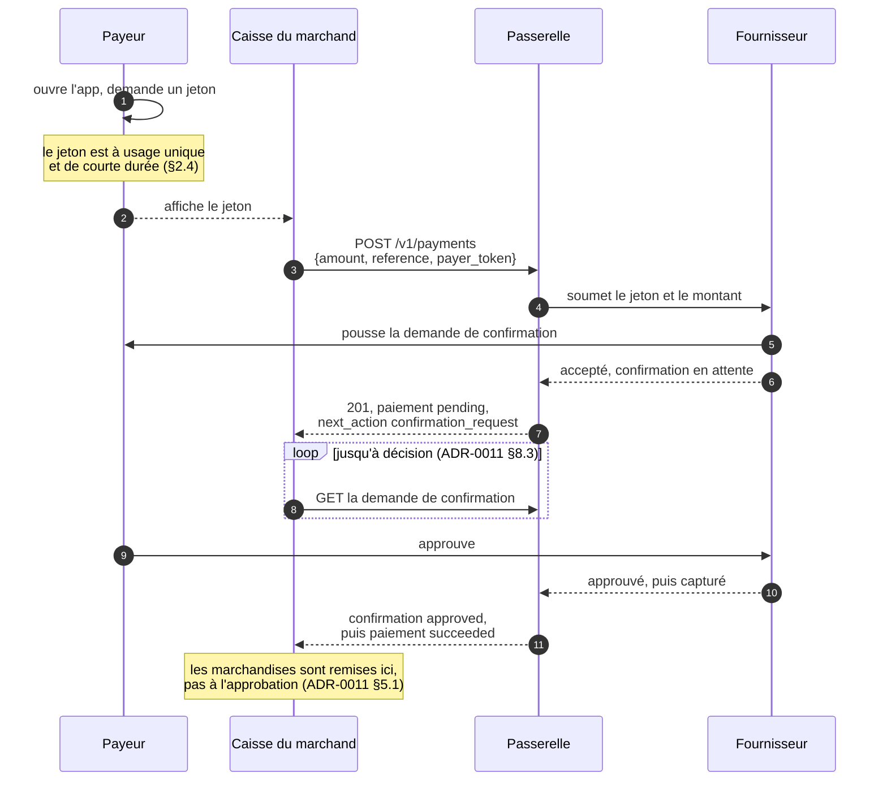

# ADR-0012 : Paiements de proximité, mode présenté par le client

- Voie : Standards
- Statut : Brouillon
- Créée : 2026-09-06
- Dépend de : ADR-0001, ADR-0002, ADR-0003, ADR-0004, ADR-0005, ADR-0006, ADR-0007, ADR-0009, ADR-0011

## Résumé

Cette ADR spécifie un paiement au comptoir : le payeur affiche un jeton éphémère à usage
unique, le marchand le lit et le soumet avec le montant, le fournisseur demande au payeur de
confirmer, et le paiement se dénoue. C'est le flux derrière l'expression *customer-presented
mode*, et c'est la première chose dans OpenFSP qu'aucune passerelle ne peut atteindre en
traduisant une API de fournisseur existante.

Elle définit le jeton (§2), la requête de création qui en porte un (§3), le comportement
déterministe des quatre défaillances qui surviennent réellement à une caisse (§5), trois
codes d'erreur pour [ADR-0005 §9](0005-error-taxonomy.md) (§6), et les noms de capacité
(§8). La décision que prend le payeur est une demande de confirmation, spécifiée dans
[ADR-0011](0011-confirmation-requests.md).

Le jeton est tout le problème de conception. Il est affiché sur l'écran d'un payeur dans un
marché, en plein jour, pour être lu par l'appareil d'un inconnu, et il autorise de l'argent.
Le §2 et les *Considérations de sécurité* constituent l'essentiel de ce document pour cette
raison.

## Motivation

Le chemin de paiement spécifié jusqu'ici suppose un marchand qui peut atteindre un payeur à
travers le fournisseur : un numéro de téléphone vers lequel pousser, ou un navigateur vers
lequel rediriger. Les deux fonctionnent quand le marchand sait qui est le payeur avant que le
paiement ne commence.

À un comptoir, ils ne le savent pas. Un client se présente avec des marchandises. Le marchand
n'a pas son numéro, ne devrait pas le lui demander, et ne peut pas lui demander d'en taper un
pendant qu'une file se forme. Demander un numéro de téléphone à une caisse est aussi la
mauvaise forme pour le marché : cela transforme une transaction de deux secondes en exercice
de collecte de données, cela échoue pour un client qui se trompe de touche, et cela remet au
marchand une liste de numéros de téléphone de clients qu'il n'a aucune raison de détenir.

Pendant ce temps, l'interaction existe déjà en pratique. C'est ce que fait chaque agent de
mobile money à Port-au-Prince avec un code lu à voix haute, et ce que fait un code QR
électroniquement partout où le modèle a été déployé. L'appareil du payeur produit quelque
chose que le marchand peut lire ; l'appareil du marchand produit le montant ; le fournisseur
les joint.

La raison pour laquelle cela exige une spécification, plutôt qu'un adaptateur, est que cela
ne peut pas être adapté. [ADR-0001](0001-architecture-and-scope.md) cadre le pari central
d'OpenFSP comme une traduction : une passerelle parle un protocole vers l'extérieur et le
dialecte de chaque fournisseur vers l'intérieur. La traduction fonctionne parce que
l'opération sous-jacente existe des deux côtés. Ici, elle n'existe pas. Une passerelle ne
peut pas fabriquer un jeton éphémère qu'un fournisseur ne résoudra pas, ne peut pas poser une
confirmation sur le combiné d'un payeur pour un fournisseur sans un tel mécanisme, et
[ADR-0007](0007-capability-discovery.md) interdit de prétendre le contraire. Cette ADR
s'adresse donc aux fournisseurs, et sa cible de conformité est une implémentation native.

Cela change ce à quoi sert le document. Tout ce qui précède spécifiait comment parler aux
fournisseurs tels qu'ils sont. Ceci spécifie quelque chose qu'un fournisseur devrait
construire, ce qui signifie que cela doit valoir la peine d'être construit : assez petit pour
être implémenté, assez précis pour être interopérable, et honnête sur les cas qui tournent
mal, parce qu'un paiement de comptoir qui est faux est faux devant deux personnes qui se
regardent.

## Hors périmètre

- **Aucun mode présenté par le marchand.** Le QR statique au mur, que le payeur scanne et
  dans lequel il tape un montant, est un flux différent avec des risques différents, et c'est
  celui qui existe déjà dans plusieurs déploiements. Il mérite sa propre ADR et n'a pas
  besoin de celle-ci d'abord.
- **Aucun objet de demande de confirmation.** [ADR-0011](0011-confirmation-requests.md)
  spécifie la décision, son échéance, ses états et son annulation. Cette ADR en produit une
  et ne la redéfinit pas.
- **Aucune génération de jeton.** La façon dont l'application d'un payeur produit un jeton
  est l'affaire du fournisseur. Le §2 spécifie ce que le marchand lit et soumet, et contraint
  les propriétés du jeton, non sa construction.
- **Aucun support.** QR, NFC, Bluetooth ou un code lu à voix haute sont tous des façons de
  faire passer une chaîne d'un appareil à un autre. Le §2.7 dit pourquoi cette ADR spécifie la
  chaîne et non le médium.
- **Aucun règlement hors ligne.** Comme dans [ADR-0011](0011-confirmation-requests.md),
  les deux parties sont en ligne au moment du paiement.
- **Aucun pourboire, partage, ni montant partiel.** Un montant, un payeur, un paiement.

## Spécification

Les mots-clés MUST, MUST NOT, REQUIRED, SHALL, SHALL NOT, SHOULD, SHOULD NOT, RECOMMENDED,
MAY et OPTIONAL sont à interpréter comme décrit dans les RFC 2119 et RFC 8174, lorsque, et
seulement lorsque, ils apparaissent en capitales.

### 1. Le flux



**1.1.** Le marchand n'apprend jamais le numéro de téléphone du payeur, et le payeur ne tape
jamais rien appartenant au marchand. Cette propriété est l'objet du flux et est préservée par
le §2.9.

**1.2.** Le flux ajoute exactement une entrée à la création de paiement, `payer_token`, et une
sortie, une demande de confirmation. Tout le reste est
[ADR-0006](0006-gateway-http-api-payments.md) inchangée.

### 2. Le jeton

**2.1.** Un `PayerToken` est une chaîne de 8 à 128 points de code correspondant à
`^[A-Za-z0-9._~-]+$`.

**2.2.** Il est **opaque au marchand et à la passerelle**. Ni l'un ni l'autre MUST l'analyser,
en inférer une structure, ou en dériver quoi que ce soit. Seul le fournisseur émetteur
l'interprète. C'est la règle que [ADR-0002 §6.1.2](0002-core-data-model.md) applique à un
`ResourceId`, et elle compte davantage ici, parce qu'un appareil marchand qui apprendrait à
lire les jetons serait un appareil marchand capable de reconnaître un client qui revient.

**2.3.** Un jeton MUST être **à usage unique**. Un fournisseur MUST rejeter la seconde
soumission d'un jeton qu'il a déjà résolu, et la passerelle rapporte `payer-token-used` (§6).

**2.4.** Un jeton MUST être **de courte durée**. La durée de vie est celle du fournisseur, et
SHOULD NOT dépasser **180 secondes**. Un jeton affiché sur un écran est lisible par quiconque
voit l'écran, et un jeton de longue durée est un identifiant porteur posé sur un comptoir.

**2.5.** Un jeton MUST NOT être devinable. Il MUST porter au moins **64 bits** de valeur
imprévisible, et un fournisseur MUST NOT en construire un à partir d'un identifiant de compte,
d'un numéro de téléphone, d'un compteur, ou d'un horodatage.

**2.6.** 64 bits plutôt que 128 est une concession délibérée au médium : cette chaîne peut
devoir être lue à voix haute ou tapée par un vendeur de marché avec un téléphone basique, et
la longueur a un coût d'usage que les autres secrets de cette spécification ne paient pas.
L'exposition est bornée par les §2.3 et §2.4 ensemble, un usage unique en trois minutes, d'une
façon dont celle d'une clé d'API ne l'est pas.

**2.7. Cette ADR spécifie la chaîne, pas le support.** Un code QR est le médium attendu et
n'est pas exigé. Un jeton peut être transféré par QR, NFC, un code numérique lu à voix haute,
ou tout autre moyen, parce que l'alphabet du §2.1 est choisi pour survivre à tous : il est sûr
pour les URL, il n'a aucun caractère qu'un mode alphanumérique QR ne peut porter, et il
n'exclut rien qu'un humain puisse dicter.

**2.8.** Un fournisseur qui n'offre qu'une représentation QR est tout de même conforme, pourvu
que le contenu décodé soit un `PayerToken` selon le §2.1 et rien d'autre. Une charge utile QR
portant une URL, un document JSON, ou une enveloppe propriétaire n'est pas conforme, et une
application marchande MUST NOT être tenue de déballer quoi que ce soit pour obtenir le jeton.

**2.9. Un jeton MUST NOT encoder ni révéler l'identité du payeur.** Ni le numéro de
téléphone, ni un numéro de compte, ni un identifiant client stable, en clair ou sous une
forme que le marchand pourrait corréler d'une visite à l'autre. Un jeton stable par payeur
défait le §1.1 et transforme chaque caisse en dispositif de pistage.

**2.10.** Une passerelle MUST NOT stocker un `payer_token` après le retour de la création de
paiement qui l'a utilisé, MUST NOT le journaliser, et MUST NOT le retourner dans une réponse.
C'est un identifiant en transit, et les *Considérations de sécurité* le traitent comme tel.

### 3. Créer le paiement

**3.1.** Le flux utilise `POST /v1/payments`
([ADR-0006 §5.1](0006-gateway-http-api-payments.md)) avec un membre supplémentaire :

```json
{
  "reference": "POS-2026-09-06-0042",
  "amount": { "amount": 45000, "currency": "HTG" },
  "provider": "moncash",
  "payer_token": "8mQ2xR7vK4nZ",
  "description": "Counter sale"
}
```

**3.2. `payer_token`** est un `PayerToken` selon le §2, REQUIRED pour ce flux et interdit
ailleurs. Une passerelle MUST rejeter une requête portant à la fois `payer_token` et `payer`
([ADR-0006 §3.3](0006-gateway-http-api-payments.md)) avec `invalid-field` : le jeton
identifie le payeur, et une seconde identification est soit redondante soit une
contradiction, et trancher laquelle n'appartient pas à la passerelle.

**3.3.** `Idempotency-Key` est REQUIRED, comme sur tout POST mutant
([ADR-0006 §1.7](0006-gateway-http-api-payments.md)). Le §5.1 explique pourquoi il porte
plus de poids ici que partout ailleurs dans la spécification.

**3.4.** En cas de succès la réponse est un `201` avec le paiement, un `status` de `pending`,
et un `next_action` de type `confirmation_request`
([ADR-0011 §4.1](0011-confirmation-requests.md)).

```json
{
  "id": "pay_01J9ZK3QF8XN2M7VYB4C6D8E0G",
  "reference": "POS-2026-09-06-0042",
  "status": "pending",
  "amount": { "amount": 45000, "currency": "HTG" },
  "provider": "moncash",
  "payer": null,
  "next_action": {
    "type": "confirmation_request",
    "confirmation_request_id": "cnf_01J9ZM8W4B7XKQ2R5T3N6P0V9D",
    "expires_at": "2026-09-06T13:05:19.882Z"
  },
  "created_at": "2026-09-06T13:04:19.882Z",
  "updated_at": "2026-09-06T13:04:19.882Z",
  "expires_at": "2026-09-06T13:05:19.882Z",
  "completed_at": null,
  "failure_reason": null,
  "failure_detail": null,
  "fee": null,
  "metadata": {}
}
```

**3.5. `payer` est null et le reste.** Une passerelle MUST NOT le renseigner depuis le jeton,
même là où le fournisseur divulgue le numéro, et MUST NOT retourner l'identité du payeur au
marchand à aucun moment de ce flux. Le §1.1 est une propriété du flux, non un effet
secondaire du fait que le fournisseur serait peu coopératif.

**3.6.** L'`expires_at` du paiement SHOULD être égal à celui de la demande de confirmation.
Un paiement de comptoir qui survit à la décision qu'il attend ne sert personne.

**3.7.** Un jeton est résolu à la création, de sorte qu'une création qui réussit signifie que
le fournisseur a accepté le jeton et soumis la demande au payeur. Une création qui échoue sur
le jeton produit une erreur (§6) et aucun paiement. Il n'existe pas de paiement dans un état
de « jeton pas encore vérifié ».

**3.8.** Le §3.7 est ce qui rend le flux de caisse supportable : le vendeur apprend en un
aller-retour si le scan valait quelque chose, plutôt que de l'apprendre plus tard d'un
paiement échoué qu'il faut maintenant expliquer au client.

### 4. Décider, et se dénouer

**4.1.** La décision est une demande de confirmation et est entièrement régie par
[ADR-0011](0011-confirmation-requests.md). Son échéance, ses états, sa projection
terminale sur le paiement, et son annulation y sont spécifiés et ne sont pas répétés ici.

**4.2.** La seule règle qui mérite d'être répétée, parce que c'est le flux pour lequel elle a
été écrite : une approbation n'est pas un reçu
([ADR-0011 §5.1](0011-confirmation-requests.md)). Les marchandises sont remises quand le
paiement est `succeeded`.

**4.3.** Une application marchande SHOULD afficher, tout du long, le montant et le temps
restant depuis l'`expires_at` de la demande de confirmation, et SHOULD montrer l'appareil du
payeur comme l'endroit où la décision se prend. Un vendeur qui comprend que c'est le client
qu'on attend explique mieux l'attente qu'une barre de progression.

### 5. Les quatre défaillances

Ce sont les cas qu'un comptoir rencontre. Chacun a un comportement exigé, et chacun a une
réponse fausse confortable que cette section existe pour écarter.

**5.1. Le même jeton scanné deux fois.**

**5.1.1.** Un marchand scanne, le réseau cale, le vendeur scanne à nouveau. Ce n'est pas une
seconde vente et MUST NOT en devenir une.

**5.1.2.** Un client qui rejoue une soumission dont il n'est pas sûr MUST réutiliser la même
`Idempotency-Key`, et la passerelle rejoue la réponse enregistrée
([ADR-0004 §3.2](0004-idempotency-and-retries.md)). Le jeton n'est jamais resoumis au
fournisseur, et un seul paiement existe.

**5.1.3.** Un véritable second scan, une nouvelle vente au même client, porte une nouvelle
`Idempotency-Key` et une nouvelle `reference`. Le fournisseur rejette le jeton consommé au
titre du §2.3 et la passerelle retourne `payer-token-used`. Le client affiche un jeton neuf.

**5.1.4.** C'est la protection à deux couches de
[ADR-0004](0004-idempotency-and-retries.md) qui fait exactement ce pour quoi elle a été
spécifiée : la clé d'idempotence protège la requête, la référence protège le paiement, et ici
le jeton à usage unique du fournisseur protège le payeur en troisième couche. Un client qui
omet la clé d'idempotence obtient `idempotency-key-required` et n'atteint jamais le cas
ambigu.

**5.1.5.** Une passerelle MUST NOT résoudre un double scan en comparant les jetons entre
requêtes, et MUST NOT tenir un index jeton-vers-paiement à cette fin. Cela exigerait de
conserver les jetons contre le §2.10, et cela ferait diverger la déduplication de la
passerelle de celle du fournisseur.

**5.2. Le jeton a expiré entre l'affichage et le scan.**

**5.2.1.** Le fournisseur le rejette et la passerelle retourne `payer-token-expired`. Aucun
paiement n'est créé.

**5.2.2.** Une passerelle MUST NOT rejouer la soumission, MUST NOT retenir la requête pendant
qu'elle demande un autre jeton au payeur, et MUST NOT créer un paiement dans l'espoir qu'un
jeton frais arrive. Le vendeur demande au client de rafraîchir son écran, ce qui prend une
seconde et est l'interaction correcte.

**5.2.3.** `payer-token-expired` est distinct de `payer-token-invalid` parce que l'action du
vendeur diffère : expiré signifie réessayez tel quel, invalide signifie que quelque chose ne
va pas avec ce qui a été lu. Un code unique rendrait une récupération de deux secondes
indiscernable d'un problème.

**5.3. Le payeur s'en va.**

**5.3.1.** La demande de confirmation expire à son échéance et le paiement devient `expired`
([ADR-0011 §4.4](0011-confirmation-requests.md)).

**5.3.2.** Là où le marchand veut récupérer la caisse plus tôt, il annule la demande de
confirmation ([ADR-0011 §7](0011-confirmation-requests.md)), et MUST traiter le cas où
l'annulation perd contre une approbation arrivant dans la même seconde.

**5.3.3.** Un client MUST NOT rapporter un échec au vendeur tant que la demande de
confirmation est `awaiting`, quelle qu'en soit la durée. La distinction entre un paiement
abandonné et un paiement lent n'appartient pas au client
([ADR-0011 §3.4](0011-confirmation-requests.md)).

**5.4. Le réseau du marchand tombe après la soumission.**

**5.4.1.** Le vendeur n'a pas de réponse, et le payeur est peut-être en train d'approuver en
ce moment. Le chemin de récupération est celui que
[ADR-0006 §5.2.3](0006-gateway-http-api-payments.md) spécifie déjà : le marchand a choisi
la `reference` avant de soumettre, il peut donc la demander.

**5.4.2.** Un client MUST NOT resoumettre le jeton sur une nouvelle vente dans cette
situation, et MUST d'abord lire par référence. Resoumettre est la façon dont un client paie
deux fois.

**5.4.3.** Là où la lecture par référence ne retourne rien, aucun paiement n'a été créé et la
vente peut être relancée avec un jeton frais.

**5.4.4.** Là où elle retourne un paiement, la vente est en cours et le client reprend son
attente sur la demande de confirmation.

**5.4.5.** C'est le cas qui récompense le plus une application de comptoir conçue autour de
la référence plutôt qu'autour de la réponse. Une caisse qui génère sa référence à l'ouverture
de la vente, et la stocke avant le premier appel réseau, se remet d'une connexion morte en
une lecture. Une caisse qui attend que la passerelle lui dise comment s'appelle le paiement ne
le peut pas.

### 6. Erreurs

Ces trois codes sont ajoutés au catalogue fermé de
[ADR-0005 §9](0005-error-taxonomy.md).

| Code | Statut | `retryable` | `effect` | Condition |
|---|---|---|---|---|
| `payer-token-invalid` | 422 | false | `none` | Le jeton n'a pas été reconnu par le fournisseur. |
| `payer-token-expired` | 422 | false | `none` | Le jeton a été reconnu et sa durée de vie était passée (§2.4). |
| `payer-token-used` | 409 | false | `none` | Le jeton a été reconnu et avait déjà été résolu (§2.3). |

**6.1.** Les trois portent un `effect` de `none` : aucun paiement n'a été créé, rien n'a été
débité, et un client peut le dire au client final avec assurance.

**6.2.** Les trois sont `retryable: false`. Resoumettre le même jeton ne peut pas réussir, et
un client qui rejoue sur ces erreurs rejoue la seule chose dont il est certain qu'elle ne
marchera pas. La récupération est un nouveau jeton, qui est une nouvelle requête avec une
nouvelle clé d'idempotence.

**6.3.** Une passerelle MUST NOT retourner `payer-token-invalid` pour un jeton bien formé
selon le §2.1 mais qu'elle n'a pas pu soumettre parce que le fournisseur était injoignable.
Cela relève de `provider-unavailable` ([ADR-0005 §9](0005-error-taxonomy.md)), et
confondre les deux dit à un vendeur que le téléphone du client est cassé alors que le problème
est la connexion du marchand.

**6.4.** Une passerelle MUST rejeter un `payer_token` qui échoue à la syntaxe du §2.1 avec
`invalid-field` avant tout appel au fournisseur. Un jeton malformé est un défaut de requête,
pas une condition du payeur.

**6.5.** Aucun de ces codes ne distingue « pas de tel jeton » de « un jeton appartenant à un
autre fournisseur », et c'est délibéré. Les deux sont `payer-token-invalid`, parce que les
distinguer laisserait un appareil marchand apprendre à quel fournisseur appartient le jeton
d'un inconnu en le soumettant, ce qui est un sondage auquel le payeur n'a jamais consenti.

### 7. Ce que l'application du payeur doit faire

Cette ADR régit un protocole entre un marchand et une passerelle, et l'application du payeur
est de l'autre côté du fournisseur. Voici les propriétés dont dépend le flux, énoncées pour
qu'un fournisseur qui l'implémente sache ce que sa propre application doit.

**7.1.** Produire des jetons satisfaisant les §2.3, §2.4, §2.5 et §2.9.

**7.2.** Montrer au payeur, avant qu'il n'approuve, le montant, la devise, et le nom du
marchand. Un écran de confirmation qui ne montre qu'un montant demande au payeur d'autoriser
un paiement à personne en particulier.

**7.3.** Rendre le refus aussi facile que l'approbation, et minuté dans les deux cas.

**7.4.** Ne pas réutiliser un jeton affiché après une résolution quelconque, réussie ou non.

**7.5.** Ce ne sont pas des exigences que cette spécification peut tester, et le §9 ne
prétend pas les tester. Elles sont consignées parce qu'un fournisseur qui implémente
correctement le fil et le §7.2 négligemment a construit un flux techniquement conforme et
dangereux pour ses propres clients.

### 8. Capacités et conformité

**8.1.** Le nom de capacité est `payments.proximity_cpm`, ajouté au registre de
[ADR-0007 §2.2](0007-capability-discovery.md). Une passerelle MUST NOT l'annoncer à moins
que le fournisseur ne résolve nativement les jetons présentés par le payeur.

**8.2.** Elle exige `confirmation_requests`
([ADR-0011 §9.1](0011-confirmation-requests.md)). Une passerelle MUST NOT annoncer
`payments.proximity_cpm` sans elle.

**8.3. Il n'y a pas de repli, et l'absence est déclarée.** Un payeur avec un téléphone
basique et sans application ne peut pas présenter de jeton. Le comportement correct est que
le marchand utilise un paiement ordinaire
([ADR-0006 §5.1](0006-gateway-http-api-payments.md)) avec un numéro de téléphone, et le
comportement protocolaire correct est que `payments.proximity_cpm` n'est simplement pas
annoncée pour un fournisseur qui ne sait pas le faire. Une passerelle MUST NOT synthétiser un
flux par jeton par-dessus un flux par numéro de téléphone et l'appeler paiement de proximité,
ce qui est l'émulation que
[ADR-0001](0001-architecture-and-scope.md#principes-de-conception) interdit et que
[ADR-0007 §1.3](0007-capability-discovery.md) rend testable.

**8.4.** La cible de conformité est une implémentation native du fournisseur ou le serveur
simulé. Aucun adaptateur sur une API de fournisseur existante ne peut passer, et c'est un
constat sur le monde plutôt que sur les tests.

**8.5.** La suite exerce, au minimum : un paiement de comptoir réussi de bout en bout ; le
même jeton soumis deux fois avec la même clé d'idempotence, qui doit donner un seul paiement ;
le même jeton soumis deux fois avec des clés différentes, qui doit donner `payer-token-used` ;
un jeton expiré ; un jeton malformé, qui doit échouer avant tout appel au fournisseur ; un
jeton rejeté alors que le fournisseur est injoignable, qui doit donner `provider-unavailable`
et non `payer-token-invalid` ; et un paiement lu par référence après une perte de réseau
simulée.

## Compatibilité

Additive, et invisible à quiconque ne l'a pas demandée. Une passerelle qui n'annonce pas
`payments.proximity_cpm` se comporte exactement comme
[ADR-0006](0006-gateway-http-api-payments.md) le spécifie, et rejette `payer_token` comme
champ inconnu au titre de [ADR-0006 §1.9](0006-gateway-http-api-payments.md), ce qui est
la réponse correcte plutôt qu'un défaut.

Le catalogue d'erreurs gagne trois codes, ce que
[ADR-0005 §3.6](0005-error-taxonomy.md) rend non cassant. Aucun état de paiement n'est
ajouté, aucun champ existant ne change de sens, et aucune opération existante ne se comporte
différemment.

La seule nouvelle exigence sur les clients existants est négative : un client qui ignore
aujourd'hui les types de `next_action` qu'il ne reconnaît pas continue de fonctionner, et un
client qui traitait un type inconnu comme une erreur était déjà non conforme à
[ADR-0006 §1.9](0006-gateway-http-api-payments.md).

## Considérations de sécurité

**Le jeton est un identifiant porteur affiché en public.** Tout le §2 découle de cette phrase.
Il est sur un écran, dans un marché, incliné vers un inconnu, et quiconque le voit peut le
lire. L'usage unique (§2.3) et la courte durée (§2.4) sont ce qui rend cela acceptable : un
jeton volé vaut un paiement, à qui le présente le premier, en trois minutes. Aucune des deux
propriétés ne suffit seule, et un fournisseur qui implémente l'une et pas l'autre a construit
un identifiant qui vaut d'être volé.

**Le regard par-dessus l'épaule est l'attaque réaliste, pas l'interception.** Un attaquant qui
photographie l'écran d'un client dans une file et soumet le jeton depuis sa propre caisse
avant le marchand légitime est une attaque bon marché, sans compétence, et difficile à
distinguer d'une course. L'atténuation n'est pas cryptographique : c'est que le payeur voit la
demande de confirmation, avec le montant et le nom du marchand (§7.2), et la refuse. C'est
pourquoi le §7.2 est dans ce document alors même qu'il est hors du protocole, et pourquoi un
fournisseur qui ne montre qu'un montant a retiré la seule défense dont dispose le payeur.

**Le pistage du payeur est un risque réel et le §2.9 est la réponse.** Un jeton stable par
payeur, ou qui encode quoi que ce soit de dérivable jusqu'à lui, laisserait chaque marchand
utilisant ce flux constituer un relevé de qui fait ses courses où. Le marchand n'apprend rien
du payeur dans une implémentation conforme (§1.1, §3.5), et cette propriété doit être défendue
à la construction du jeton parce que rien en aval ne peut la restaurer.

**La passerelle ne doit pas devenir un magasin de jetons.** Le §2.10 interdit de conserver,
journaliser ou retourner un jeton. Une passerelle qui journaliserait les soumissions pour le
débogage détiendrait un flux d'identifiants de payeurs de courte durée, et une passerelle qui
les indexerait pour la déduplication (§5.1.5) les détiendrait assez longtemps pour que cela
compte.

**Nuisance et sondage.** Un marchand peut poser une demande de confirmation sur le combiné
d'un inconnu en soumettant un jeton qu'il a lu. Le §6.5 supprime un sondage, apprendre à quel
fournisseur appartient un jeton, et le reste est borné par la limitation de débit et par les
contrôles propres du fournisseur sur la fréquence à laquelle un payeur peut être sollicité.
Une spécification qui rendrait cela bon marché et illimité serait une spécification pour
harceler les payeurs, et un fournisseur qui l'implémente devrait traiter le débit de demandes
par payeur comme un contrôle de premier rang.

**Le chemin du double débit est celui à tester.** Les §5.1 et §5.4 existent parce qu'un
comptoir est l'endroit où les paiements en double sont les plus probables et les moins
pardonnables : le client est là, le vendeur est sous pression, et la récupération évidente
d'une réponse incertaine est de réessayer. Chaque mécanisme qui l'empêche est déjà dans
[ADR-0004](0004-idempotency-and-retries.md) ; la contribution de cette ADR est de dire
exactement comment il s'applique quand quelqu'un scanne deux fois.

**Ce qui ne doit pas être journalisé.** Le jeton (§2.10). Au-delà, les règles sur les demandes
de confirmation de [ADR-0011](0011-confirmation-requests.md) s'appliquent, et les journaux
d'une application de caisse sont un risque particulier parce qu'ils se trouvent sur un
appareil dans une boutique plutôt que dans un centre de données.

## Considérations réglementaires

La section 8 de la circulaire 121 de la BRH du 6 décembre 2021 exige un reçu portant, entre
autres, les parties. Ce flux ne divulgue délibérément pas le payeur au marchand (§3.5), ce qui
est une tension à nommer plutôt qu'à cacher. La lecture que prend cette ADR est que le payeur
est identifié auprès du fournisseur, qui est la partie tenant le registre au titre de la
section 13.4, et qu'un reçu de marchand identifie le payeur comme le titulaire du compte qui a
payé sans reproduire un identifiant que le marchand n'a jamais reçu. Savoir si cela satisfait
la section appartient à l'autorité, et c'est consigné dans *Questions non résolues* plutôt que
supposé.

La section 13.1 exige que chaque transaction soit traçable et chaque client identifié de façon
unique. La traçabilité n'est pas affectée : le paiement porte sa `reference` et son `id`, la
demande de confirmation porte les siens, et le fournisseur détient le lien vers le payeur.
L'identification se fait chez le fournisseur, qui est là où se trouve la relation agréée.

La section 13.5 exige un règlement en temps réel, qui est ce pour quoi ce flux existe.
L'écart entre l'approbation et la capture sur lequel insiste
[ADR-0011 §5](0011-confirmation-requests.md) se mesure en secondes et ne la contredit pas ;
une spécification qui prétendrait que l'écart n'existe pas serait moins exacte sur le temps
réel, non plus exacte.

**La propriété de confidentialité n'est pas qu'un choix de conception.** Les §1.1 et §2.9
gardent l'identité du payeur hors de portée du marchand, ce qui va au-delà de ce que `BRH-121`
exige elle-même. `BRH-131` réduit cet écart : elle exige la minimisation des données, « seules
les données strictement nécessaires doivent être recueillies » [BRH-131, p. 18, s. 6.10.2 c)],
et le consentement pour toute collecte ou communication de données personnelles à des tiers
[BRH-131, p. 18, s. 6.10.3]. Un marchand n'a pas besoin du numéro du payeur pour être payé, et
un jeton qui le révélerait ferait collecter au marchand un identifiant dont il n'a aucune
finalité. Ce que le §2.9 interdit pour des raisons de conception, la minimisation l'interdit
pour des raisons réglementaires, et les deux s'accordent.

Il reste moins coûteux de faire ce choix maintenant que de le rétrofiter une fois que des
marchands auront construit sur des jetons qui fuitent.

**Une mise en garde sur la trace de données du flux présenté au comptoir.** `BRH-131` exige un
registre des traitements consignant, par catégorie, la nature des données, la finalité, la base
légale et la durée de conservation [BRH-131, p. 19, s. 6.10.5 c)]. Le §2.10 interdit à la
passerelle de conserver un jeton, ce qui maintient le jeton entièrement hors de ce registre.
Une application de caisse qui journaliserait les corps de livraison mettrait les décisions du
payeur dans un magasin qui doit être enregistré et justifié, ce qui est une seconde raison aux
recommandations de journalisation des *Considérations de sécurité*.

## Alternatives envisagées

**Le mode présenté par le marchand à la place.** Le QR statique au mur est plus simple,
n'exige aucun jeton, et est déjà déployé sur plusieurs marchés. Il n'a pas été choisi en
premier parce qu'il met le montant entre les mains du payeur, ce qui déplace la surface
d'erreur sur le client et rend le rapprochement du marchand plus difficile, et qu'il ne
résout pas la file : le payeur tape un montant pendant que le vendeur attend. Les deux modes
valent la peine d'exister, et celui-ci est celui qui ne peut pas être approximé par quoi que
ce soit de déjà présent dans la spécification.

**Un jeton qui encode le numéro de téléphone du payeur, chiffré pour le fournisseur.** Cela
permettrait à une passerelle d'acheminer sans consulter un registre et s'intégrerait au modèle
de données existant. Rejeté au titre du §2.9 : un identifiant chiffré reste stable, et une
chaîne stable est une clé de pistage que le marchand puisse la déchiffrer ou non.

**Spécifier un format de charge utile QR.** Une charge utile structurée de style EMVCo serait
familière à quiconque en a implémenté une, et permettrait à une charge utile de porter le
montant, un identifiant marchand et une devise. Rejeté parce qu'il s'agit du mode présenté par
le client, de sorte que la charge utile ne porte que le jeton du payeur et que tout le reste
vient de la requête du marchand, et que lier la spécification à un support (§2.7)
exclurait le code lu à voix haute, qui est la façon dont cette interaction fonctionne
réellement dans une grande partie du pays aujourd'hui.

**Laisser le marchand soumettre le jeton sans montant, et faire saisir un montant au payeur.**
Cela retire entièrement la caisse du jeu. Rejeté parce que le marchand ne peut alors pas
rapprocher, que le client peut payer le mauvais montant devant lui, et que le litige qui en
résulte n'a aucun artefact pour le résoudre.

**Créer le paiement avant de résoudre le jeton.** Cela permettrait à une passerelle de
répondre plus vite et de résoudre de façon asynchrone. Rejeté au §3.7 : cela produit un
paiement qui est peut-être sur le point d'échouer pour une raison que le vendeur aurait pu
corriger en une seconde, et cela transforme une erreur de scan en enregistrement de paiement
échoué.

**Un point d'accès dédié, `POST /v1/proximity_payments`.** Plus net à certains égards, et
rejeté parce que le résultat est un paiement, indiscernable de tout autre une fois créé, et
qu'un second point d'accès de création retournant la même ressource doublerait la surface
qu'un client et une suite de conformité doivent traiter. Un membre sur le point d'accès
existant l'exprime.

**Attendre qu'un fournisseur le demande.** L'alternative honnête, puisque rien ici ne peut
être implémenté sans un fournisseur. Rejetée parce que la spécification est la chose à avoir
prête quand la conversation aura lieu, et que l'écrire a fait émerger l'objet de demande
de confirmation, qui est réutilisable bien au-delà de ce flux.

## Questions non résolues

**Si un reçu sans identifiant du payeur satisfait la section 8 de la circulaire 121.** Exposé
dans les *Considérations réglementaires*. C'est une question pour l'autorité, et c'est celle
qui pourrait invalider le plus facilement une décision de conception prise ici.

**Si le marchand devrait pouvoir obtenir un identifiant de payeur masqué.** Les quatre
derniers chiffres d'un numéro, pour un reçu et pour un litige. Cela affaiblit le §2.9 d'une
quantité mesurable et répond à un besoin opérationnel réel, et ce document n'a pas les
éléments pour les peser l'un contre l'autre.

**Ce qu'un fournisseur fait du débit de demandes par payeur.** Les *Considérations de
sécurité* le nomment comme un contrôle de premier rang et cette ADR n'en spécifie aucun, parce
que la bonne limite dépend du comportement de l'application propre du fournisseur. Cela méritera
peut-être une recommandation une fois qu'une implémentation existera.

**Si 64 bits d'entropie de jeton est le bon choix.** Le §2.6 l'argumente, et l'argument est un
arbitrage contre l'ergonomie plutôt qu'une dérivation de sécurité. Un fournisseur qui n'émet
jamais que des codes QR n'a aucune raison de ne pas utiliser 128, et une recommandation en ce
sens a peut-être sa place ici.

**Les payeurs à téléphone basique.** Le §8.3 refuse d'inventer un repli, à juste titre, et
laisse une population réelle non servie par ce flux. Savoir si un équivalent médié par USSD
est une variante de cette ADR ou une autre ADR est ouvert, et la réponse pèse plus lourd sur
ce marché qu'elle ne le ferait ailleurs.

## Références

Citations complètes dans [`references.md`](references.md).

**Normatives.** `E164` pour les numéros de téléphone que ce flux n'utilise délibérément pas,
`RFC2119` et `RFC8174` pour les mots-clés d'exigence, et les ADR OpenFSP nommées dans
`requires`.

**Informatives.** `BRH-121` section 8 pour l'exigence de reçu discutée sous *Considérations
réglementaires*, et section 13.4 pour le registre tenu par le fournisseur. `BRH-131` pour la
minimisation des données et le registre des traitements. `GSMA-MMAPI` spécifie les paiements
marchands parmi ses cas d'usage et est le comparateur le plus proche pour le flux ordinaire,
mais pas pour celui-ci.

## Implémentation de référence

Aucune pour l'instant. Le serveur simulé est la première implémentation envisagée, puisque le
§8.4 exclut d'atteindre ceci par un adaptateur.

## Errata

Aucun.
